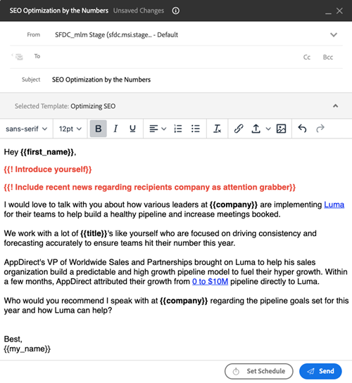

# Eingabeaufforderungen für Felder {#field-prompts}

Mit Eingabeaufforderungen im Feld können Sie eine Textzeichenfolge zu E-Mails hinzufügen, die entfernt oder ersetzt werden müssen, bevor die E-Mail gesendet werden kann. Dies ist eine hervorragende Möglichkeit, Benutzer daran zu erinnern, zusätzliche Personalisierungen hinzuzufügen.

Um eine Eingabeaufforderung hinzuzufügen, geben Sie den gewünschten Text ein. Stellen Sie ein Ausrufezeichen voran und schließen Sie es an geschweifte Klammern an (siehe unten).

**Beispiele:**

`{{! Introduce yourself}}`

`{{! Insert name of Account Executive}}`

`{{! Add sentence that references their industry and role}}`

Benutzer müssen diesen Text durch ihre eigene Personalisierung ersetzen, bevor die E-Mail gesendet werden kann.

>[!NOTE]
>
>Wenn Sie Eingabeaufforderungen mit Verkaufskampagnen verwenden, ist es am besten, sie mit manuellen E-Mail-Schritten zu verwenden. Mit diesen Schritten wird einem Benutzer eine Erinnerungsaufgabe zum Senden der E-Mail zugewiesen, sodass er die Eingabeaufforderungen durch benutzerdefinierten Text ersetzen kann. Automatische E-Mail-Schritte in Verkaufskampagnen versuchen automatisch zu senden, ohne dass der Benutzer die Eingabeaufforderungen ersetzen kann. Eingabeaufforderungen, die nicht ersetzt werden, führen dazu, dass die E-Mails nicht gesendet werden.
