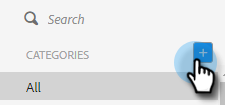

# Vorlagenkategorien verwalten {#manage-template-categories}

## Erstellen einer Kategorie {#create-a-category}

1. Klicken Sie auf **Registerkarte** Vorlagen“.

   

1. Klicken Sie auf das Symbol **+** neben **Kategorien**.

   

1. Geben Sie einen Namen für Ihre neue Kategorie ein und klicken Sie dann auf **Erstellen**.

   

## Umbenennen einer Vorlagenkategorie {#rename-a-template-category}

1. Klicken Sie auf **Registerkarte** Vorlagen“.

   

1. Bewegen Sie den Mauszeiger über die Vorlage, die Sie umbenennen möchten, und klicken Sie auf die Punkte (drei Punkte). Wählen Sie **Umbenennen** aus.

   

1. Geben Sie den neuen Namen ein. Drücken Sie die Eingabetaste (oder klicken Sie auf eine andere Stelle auf dem Bildschirm), um zu speichern.

   

## Löschen einer Vorlagenkategorie {#delete-a-template-category}

1. Klicken Sie auf **Registerkarte** Vorlagen“.

   

1. Bewegen Sie den Mauszeiger über die Vorlage, die Sie umbenennen möchten, und klicken Sie auf die Punkte (drei Punkte). Wählen Sie **Löschen** aus.

   

1. Klicken Sie **Löschen** zur Bestätigung.

   

>[!NOTE]
>
>Kategorien können nicht gelöscht werden, wenn sie Vorlagen enthalten. Verschieben oder Löschen aller Vorlagen, bevor eine Kategorie gelöscht wird.
