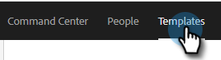

# Verwalten von Vorlagenkategorien {#manage-template-categories}

## Erstellen einer Kategorie {#create-a-category}

1. Klicken Sie auf **Vorlagen** Registerkarte.

   

1. Klicken Sie auf **+** Symbol neben **Kategorien**.

   

1. Geben Sie einen Namen für die neue Kategorie ein und klicken Sie auf **Erstellen**.

   

## Umbenennen einer Vorlagenkategorie {#rename-a-template-category}

1. Klicken Sie auf **Vorlagen** Registerkarte.

   

1. Bewegen Sie den Mauszeiger über die Vorlage, die Sie umbenennen möchten, und klicken Sie auf die Daten (drei Punkte). Auswählen **Umbenennen**.

   

1. Geben Sie den neuen Namen ein. Drücken Sie zum Speichern die Eingabetaste (oder klicken Sie einfach an eine andere Stelle auf dem Bildschirm).

   

## Löschen von Vorlagenkategorien {#delete-a-template-category}

1. Klicken Sie auf **Vorlagen** Registerkarte.

   

1. Bewegen Sie den Mauszeiger über die Vorlage, die Sie umbenennen möchten, und klicken Sie auf die Daten (drei Punkte). Auswählen **Löschen**.

   

1. Klicken **Löschen** zur Bestätigung.

   

>[!NOTE]
>
>Kategorien können nicht gelöscht werden, wenn sie noch Vorlagen enthalten. Verschieben oder löschen Sie alle Vorlagen, bevor Sie eine Kategorie löschen.
