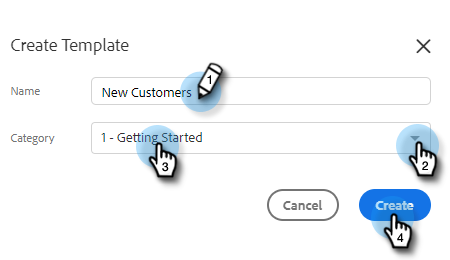

# Vorlagen verwalten {#manage-templates}

## Erstellen einer Vorlage {#create-a-new-template}

1. Navigieren Sie zur Registerkarte **[!UICONTROL Vorlagen]**.

   

1. Klicken Sie **[!UICONTROL Vorlage erstellen]**.

   

1. Wählen Sie **[!UICONTROL E]** Mail-Vorlage „Name“ und **[!UICONTROL Kategorie]** aus und klicken Sie dann auf **[!UICONTROL Erstellen]**.

   

1. Erstellen Sie im Vorlageneditor eine Betreffzeile für Ihre E-Mail und geben Sie die gewünschte Nachricht ein. Verwenden Sie die Bearbeitungswerkzeuge (Schriftart, Textgröße usw.), um das Erscheinungsbild anzupassen. Klicken Sie **[!UICONTROL Speichern]**, um Ihre Änderungen abzuschließen.

   

>[!TIP]
>
>Geben Sie Text immer direkt in die Vorlage ein oder kopieren Sie ihn aus einem Texteditor (z. B. [!DNL Notepad] oder [!DNL TextEdit]). Das Kopieren und Einfügen aus einem Rich-Text-Editor (z. B. MS [!DNL Word]) kann zu Formatierungsunregelmäßigkeiten führen.

## Vorlagendetails anzeigen {#view-template-details}

Der Bereich Vorlagendetails enthält mehrere Registerkarten.

<table>
 <tr>
  <td><strong>[!UICONTROL-Vorlage]</strong></td>
  <td>Prüfen und bearbeiten, Kriterien einrichten, um die Vorlage zu einer empfohlenen Vorlage zu machen, Anmerkungen hinzufügen</td>
 </tr>
 <tr>
  <td><strong>Analytics</strong></td>
  <td>Überprüfen Sie die Interaktionsanalyse für die Vorlage. Durchführen einer gefilterten Suche.</td>
 </tr>
 <tr>
  <td><strong>[!UICONTROL E-Mails]</strong></td>
  <td>Alle mit dieser Vorlage gesendeten E-Mails anzeigen. Durchführen einer gefilterten Suche.</td>
 </tr>
 <tr>
  <td><strong>[!UICONTROL Kampagnen]</strong></td>
  <td>Ermitteln Sie, in welchen Kampagnen die Vorlage verwendet wird.</td>
 </tr>
</table>

## Freigeben einer Vorlage {#share-a-template}

Wenn Sie eines unserer Team-Konten verwenden, sind alle Ihre Vorlagen standardmäßig weiterhin privat.

1. Navigieren Sie zur Registerkarte **[!UICONTROL Vorlagen]**.

   

1. Suchen und wählen Sie die gewünschte Vorlage aus.

   

1. Klicken Sie auf die **[!UICONTROL Freigeben]**.

   

   >[!NOTE]
   >
   >Vorlagen, die für Sie freigegeben wurden, werden unter der Kopfzeile **[!UICONTROL Team-Vorlagen]** auf der linken Seite der Seite [!UICONTROL Vorlagen] angezeigt. Teams sind nur für Premium-Benutzer verfügbar.

1. Klicken Sie auf [!UICONTROL Freigeben für] und wählen Sie die Teams aus, für die Sie freigeben möchten.

   

1. Sie haben die Möglichkeit, die Vorlage in der aktuellen Kategorie zu belassen oder in eine andere zu verschieben. In diesem Beispiel behalten wir sie im aktuellen Modell. Klicken Sie abschließend **[!UICONTROL Freigeben]**.

   

## Favorisieren einer Vorlage {#favorite-a-template}

Sie können Vorlagen aus jeder Kategorie zu Ihrer Favoritenliste hinzufügen. Dadurch wird automatisch eine neue Kategorie oben in Ihrer Liste generiert, sodass Sie schnell auf die am häufigsten verwendeten Vorlagen zugreifen können.

1. Navigieren Sie zur Registerkarte **[!UICONTROL Vorlagen]**.

   

1. Suchen Sie die gewünschte Vorlage und bewegen Sie den Mauszeiger darüber. Klicken Sie auf den Stern, der links neben dem Vorlagennamen angezeigt wird.

   

   Nach der Favoritenstellung bleibt der Stern erhalten.

   

## Vorlagenansicht anpassen {#customize-template-view}

Aus der **[!UICONTROL Ansicht]** können Sie Folgendes auswählen: Alle Vorlagen, Ihre Vorlagen, Favoriten-Vorlagen, freigegebene Vorlagen, nicht freigegebene Vorlagen oder nicht verwendete Vorlagen (Vorlagen, die in den letzten 90 Tagen nicht verwendet wurden).

>[!NOTE]
>
>Darüber hinaus können Sie Spalten in Ihrer Vorlagenansicht hinzufügen/entfernen, indem Sie auf das Einstellungssymbol rechts neben der Dropdown-Liste „Ansicht“ klicken.

## Archivieren einer Vorlage {#archive-a-template}

Archivieren Sie Vorlagen, um Ihren Verkaufsinhalt zu organisieren und fokussieren, ohne Vorlagendaten zu verlieren.

1. Aktivieren Sie das Kontrollkästchen neben der Vorlage, die Sie archivieren möchten.

   

1. Klicken Sie auf **[!UICONTROL Archivieren]**.

   

1. Klicken Sie **[!UICONTROL Archivieren]** zur Bestätigung.

   

>[!NOTE]
>
>Nachdem eine Vorlage archiviert wurde, kann sie nicht mehr bearbeitet oder verwendet werden. Um sie erneut zu verwenden, verschieben Sie die Vorlage aus dem Archiv in eine andere Kategorie.

Sie können auch den Filter Unused auswählen, um Vorlagen anzuzeigen und zu archivieren, die seit mehr als 90 Tagen nicht verwendet wurden.

## Löschen einer Vorlage {#delete-a-template}

Gehen Sie wie folgt vor, um eine Vorlage zu löschen.

>[!CAUTION]
>
>Durch das Löschen einer Vorlage werden auch ALLE damit verbundenen Tracking- und Analysefunktionen gelöscht.

1. Aktivieren Sie das Kontrollkästchen neben der Vorlage, die Sie löschen möchten.

   

1. Klicken Sie auf **[!UICONTROL Löschen]**.

   

1. Klicken Sie **[!UICONTROL Löschen]** zur Bestätigung.

   
