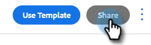

# Vorlagen verwalten {#manage-templates}

## Erstellen einer Vorlage {#create-a-new-template}

1. Navigieren Sie zur Registerkarte **Vorlagen** .

   

1. Klicken Sie auf **Vorlage erstellen**.

   

1. Wählen Sie einen **Namen** und eine **Kategorie** für Ihre E-Mail-Vorlage aus und klicken Sie dann auf **Erstellen**.

   

1. Erstellen Sie im Vorlageneditor eine Betreffzeile für Ihre E-Mail und geben Sie die gewünschte Nachricht ein. Verwenden Sie die Bearbeitungswerkzeuge (Schriftart, Textgröße usw.) , um das Erscheinungsbild anzupassen. Klicken Sie auf **Speichern** , um die Änderungen abzuschließen.

   

>[!TIP]
>
>Geben Sie Text immer direkt in die Vorlage ein oder kopieren Sie ihn aus einem Texteditor (z. B. Notepad oder TextEdit). Das Kopieren und Einfügen aus einem Rich-Text-Editor (z. B. MS Word) kann zu Formatierungsfehlern führen.

## Vorlagendetails anzeigen {#view-template-details}

Der Bereich &quot;Vorlagendetails&quot;enthält mehrere Registerkarten.

<table>
 <tr>
  <td><strong>Vorlage</strong></td>
  <td>Überprüfen und bearbeiten Sie, richten Sie Kriterien ein, um die Vorlage zu einer empfohlenen Vorlage zu machen, und fügen Sie Notizen hinzu.</td>
 </tr>
 <tr>
  <td><strong>Analytics</strong></td>
  <td>Überprüfen Sie die Interaktionsanalyse für die Vorlage. Führen Sie eine gefilterte Suche durch.</td>
 </tr>
 <tr>
  <td><strong>E-Mails</strong></td>
  <td>Zeigen Sie alle mit dieser Vorlage gesendeten E-Mails an. Führen Sie eine gefilterte Suche durch.</td>
 </tr>
 <tr>
  <td><strong>Kampagnen</strong></td>
  <td>Ermitteln Sie, in welchen Kampagnen die Vorlage verwendet wird.</td>
 </tr>
</table>

## Vorlage freigeben {#share-a-template}

Wenn Sie eines unserer Team-Konten verwenden, sind alle Ihre Vorlagen standardmäßig noch privat.

1. Navigieren Sie zur Registerkarte **Vorlagen** .

   

1. Suchen und wählen Sie die gewünschte Vorlage aus.

   

1. Klicken Sie auf die Schaltfläche **Freigabe** .

   

   >[!NOTE]
   >
   >Vorlagen, die für Sie freigegeben wurden, werden auf der linken Seite der Seite &quot;Vorlagen&quot;unter der Kopfzeile **Team-Vorlagen** angezeigt. Teams sind nur für Premium-Benutzer verfügbar.

1. Klicken Sie auf das Dropdown-Menü Freigeben mit und wählen Sie die Teams aus, für die Sie freigeben möchten.

   

1. Sie haben die Möglichkeit, die Vorlage in der aktuellen Kategorie zu belassen oder in eine andere Kategorie zu verschieben. In diesem Beispiel behalten wir es im aktuellen. Klicken Sie abschließend auf **Freigabe** .

   

## Vorlage favorisieren {#favorite-a-template}

Sie können Ihrer Favoritenliste Vorlagen jeder Kategorie hinzufügen. Dadurch wird oben in Ihrer Liste automatisch eine neue Kategorie erstellt, damit Sie schnell auf die Vorlagen zugreifen können, die Sie am häufigsten verwenden.

1. Navigieren Sie zur Registerkarte **Vorlagen** .

   

1. Suchen Sie die gewünschte Vorlage und bewegen Sie den Mauszeiger darüber. Klicken Sie auf den Stern links neben dem Vorlagennamen.

   

   Wenn es zu Gunsten ist, bleibt der Stern.

   

## Anpassen der Vorlagenansicht {#customize-template-view}

In der Dropdownliste **Ansicht** können Sie auswählen, ob alle Vorlagen, Ihre Vorlagen, Favoritenvorlagen, freigegebene Vorlagen, nicht freigegebene Vorlagen oder nicht verwendete Vorlagen (Vorlagen, die in den letzten 90 Tagen nicht verwendet wurden) angezeigt werden sollen.

>[!NOTE]
>
>Darüber hinaus können Sie Spalten in Ihrer Vorlagenansicht hinzufügen/entfernen, indem Sie auf das Einstellungssymbol rechts neben dem Dropdown-Menü &quot;Ansicht&quot;klicken.

## Eine Vorlage archivieren {#archive-a-template}

Archivieren Sie Vorlagen, um Ihre Verkaufsinhalte organisiert und fokussiert zu halten, ohne Vorlagendaten zu verlieren.

1. Aktivieren Sie das Kästchen neben der Vorlage, die Sie archivieren möchten.

   

1. Klicken Sie auf **Archivieren**.

   

1. Klicken Sie zur Bestätigung auf **Archivieren** .

   

>[!NOTE]
>
>Nach der Archivierung kann eine Vorlage nicht mehr bearbeitet oder verwendet werden. Um sie erneut zu verwenden, verschieben Sie die Vorlage aus dem Archiv in eine andere Kategorie.

Sie können auch den Filter Nicht verwendet auswählen, um Vorlagen anzuzeigen und zu archivieren, die seit mehr als 90 Tagen nicht mehr verwendet wurden.

## Eine Vorlage löschen {#delete-a-template}

Gehen Sie wie folgt vor, um eine Vorlage zu löschen.

>[!CAUTION]
>
>Durch das Löschen einer Vorlage werden auch ALLE damit verbundenen Tracking- und Analysefunktionen gelöscht.

1. Aktivieren Sie das Kästchen neben der Vorlage, die Sie löschen möchten.

   

1. Klicken Sie auf **Löschen**.

   

1. Klicken Sie zur Bestätigung auf **Löschen** .

   
