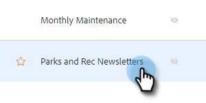
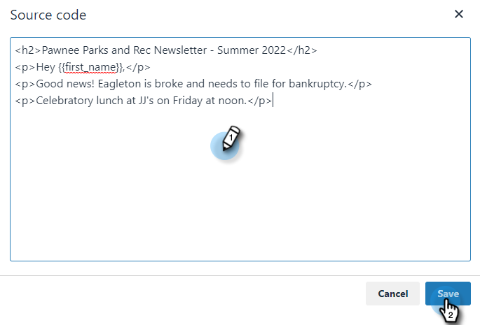

# Verwenden von HTML {#using-html}

1. Kopieren Sie den Quell-Code aus Ihren E-Mails in das Tool, das Sie zum Erstellen von E-Mails in HTML verwenden (z. B. E-Mail-Editor von Marketo).

1. Wählen Sie die Vorlage aus, der Sie die HTML hinzufügen möchten.

   

1. Klicken Sie auf der Karte Vorlageneditor auf **[!UICONTROL Bearbeiten]**.

   

1. Klicken Sie auf die Schaltfläche **Source** in Ihrem Vorlageneditor.

   

1. Fügen Sie den Quellcode ein und klicken Sie auf **[!UICONTROL Speichern]**.

   

>[!NOTE]
>
>Wenn der Fehler „Fehler - um die Stil-/Java-/HTML-Tags zu entfernen“ angezeigt wird, bedeutet dies, dass Sie einige Stile haben, die wir nicht unterstützen. Sie sollten den Source-Code nach dem Wortstil durchsuchen und alles von `` löschen.
