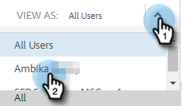

# Anzeigen der Vorlagenliste als anderer Benutzer {#view-template-list-as-another-user}

Als Administrator können Sie Vorlagen wie beliebige Benutzer anzeigen.

>[!NOTE]
>
>**Erforderliche Administratorberechtigungen**

1. Klicken Sie auf **Vorlagen**.

   

1. Klicken Sie auf die Dropdownliste **Anzeigen als** und wählen Sie den gewünschten Benutzer aus.

   

1. Jetzt werden Vorlagen als ausgewählter Benutzer angezeigt.

   

   >[!NOTE]
   >
   >Sie können auch Filter oder die Suchfunktion zusammen mit _Anzeigen als_ verwenden, um anzuzeigen, was für Sie am relevantesten ist.
