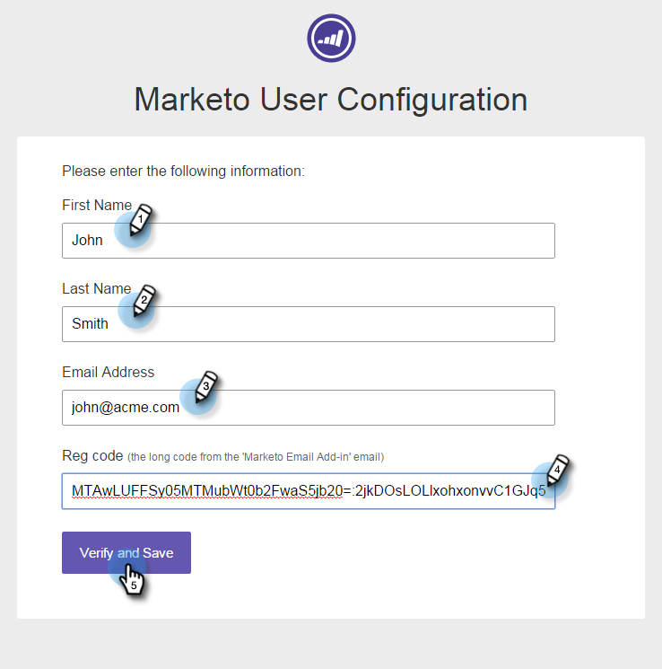

# Installieren von Marketo Insights für Google Chrome {#install-marketo-insights-for-google-chrome}

Führen Sie diese Schritte aus, um mit der Verwendung des leistungsstarken Chrome-Add-Ins zu beginnen. Sie müssen kein Marketo-Administrator sein, um die Erweiterung zu installieren.

>[!NOTE]
>
>Die Funktionen von Sales Insight-Aktionen, einschließlich &quot;E-Mail an Vertrieb senden&quot;, &quot;Zu Vertriebskampagne hinzufügen&quot;und &quot;Aufgaben&quot;, sind nicht in den Sales Insight-E-Mail-Plugins für Gmail und Outlook verfügbar. Derzeit können Benutzer von ihrem E-Mail-Client aus nur trackbare E-Mails mit oder ohne Marketo-E-Mail-Vorlage senden, wenn sie die Sales Insight-E-Mail-Plugins verwenden.

1. Installieren Sie die Erweiterung [Marketo Insights for Google Chrome Add in extension](https://chrome.google.com/webstore/detail/marketo-for-google-mail/jjkfbhajlmoeegbjgjipliamplidmbjb){target="_blank"} aus dem Chrome Web Store.

   

1. Klicken Sie mit der rechten Maustaste auf das Marketo-Logo in Chrome und wählen Sie **Optionen** aus.

   

1. Geben Sie Ihren **Reg-Code**, Ihre **E-Mail-Adresse**, Ihren **Vornamen** und Ihren **Nachnamen** ein. Klicken Sie auf **Überprüfen und Speichern**.

   

   >[!CAUTION]
   >
   >Verwenden Sie bei der Registrierung unbedingt Ihr **primäres E-Mail-Konto**, da wir die Verwendung von Alias für dieses Plug-in nicht unterstützen.

   >[!NOTE]
   >
   >Der Reg-Code wird in der E-Mail gesendet, die gesendet wird, nachdem ein Marketo-Administrator [Ihnen eine Marketo-E-Mail-Add-In-Lizenz ](/help/marketo/product-docs/marketo-sales-insight/msi-outlook-plugin/issue-a-marketo-email-add-in-license.md){target="_blank"} ausgestellt hat. **Sie läuft nach 14 Tagen ab**.

1. Klicken Sie auf **Zulassen** , um den Offline-Zugriff zuzulassen.

   

>[!MORELIKETHIS]
>
>[Verwenden von Marketo Insights für Google Chrome](/help/marketo/product-docs/marketo-sales-insight/msi-chrome-plugin/using-marketo-insights-for-google-chrome.md){target="_blank"}
