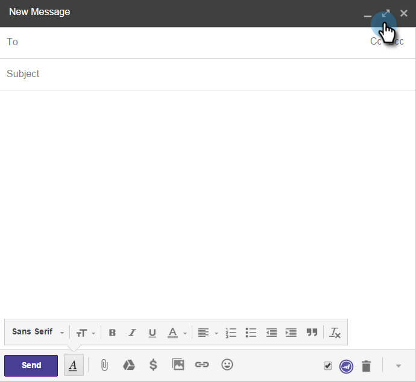

# Verwenden von Marketo Insights für Google Chrome {#using-marketo-insights-for-google-chrome}

Senden und verfolgen Sie alle Google-E-Mails mit den Marketing Insights for Google Chrome.

>[!NOTE]
>
>**Voraussetzungen**
>
>* [Installieren von Marketo Insights für Google Chrome](install-marketo-insights-for-google-chrome.md)

>

## E-Mail mit Marketing Insights senden {#send-an-email-with-marketo-insights}

1. Klicken Sie im Fenster Erstellen auf das Symbol Markieren.

   

1. Die Senden-Schaltfläche hat Marketo lila! Diese E-Mail wird nun mit Marketo gesendet, alle Links werden verfolgt und ein Pixel für die Verfolgung wird in die E-Mail eingefügt. Dies wird als E-Mail-Aktivität zum Versand aufgezeichnet.

   

   >[!NOTE]
   >
   >Ein Tracking-Pixel zeigt Ihnen, wer Ihre E-Mail geöffnet hat.

   >[!TIP]
   >
   >Optional können Sie auf den Pfeil für die Dublette klicken, um die Ansicht im Vollbildmodus zu erweitern.

1. Wenn Sie Ihre E-Mail mit einer veröffentlichten Marketing-Vorlage vorab ausfüllen möchten, klicken Sie auf **Mehr Optionen** und wählen Sie **Vorlage laden.**

   

1. Wählen Sie eine **verfügbare Vorlage** und klicken Sie auf **OK.**

   

1. Geben Sie Ihren Inhalt, eine E-Mail-Adresse und klicken Sie auf **Senden**.

   

   >[!NOTE]
   >
   >Nachrichten werden nur verfolgt, wenn die Schaltfläche &quot; **Senden** &quot;violett ist.

1. Die E-Mail erscheint in Kürze in Ihrem Marketo Sales Insight und alle geöffnet und Klicks werden nachverfolgt.

   

## E-Mail-Antworten mit Marketing protokollieren {#log-email-replies-with-marketo}

Sie können Antworten und alte Aktivitäten im Verlauf der Aktivität eines Interessenten protokollieren.

1. Klicken Sie im Bereich &quot;Vorschau&quot;von Google Mail auf **Mit Marketo** anmelden.

   

1. Das ist alles! Die E-Mail wird demnächst in Marketo Sales Insight erscheinen.

   

   >[!NOTE]
   >
   >**Verwandte Artikel**
   >
   >    
   >    
   >    * [Installieren von Marketo Insights für Google Chrome](install-marketo-insights-for-google-chrome.md)
   >    * [Ansicht Person und Kontoinformationen und Aktivitäten in Google Mail](view-person-and-account-information-and-activities-in-google-mail.md)

