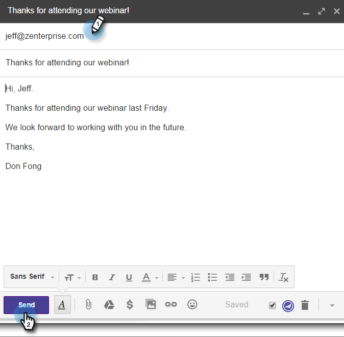

# Verwenden von Marketo Insights für [!DNL Google Chrome] {#using-marketo-insights-for-google-chrome}

Senden und verfolgen Sie alle Google-E-Mails mit Marketo Insights for [!DNL Google Chrome].

>[!PREREQUISITES]
>
>[Installieren von Marketo Insights für [!DNL Google Chrome]](/help/marketo/product-docs/marketo-sales-insight/msi-chrome-plugin/install-marketo-insights-for-google-chrome.md)

>[!NOTE]
>
>Die Aktionsfunktionen von Sales Insight, einschließlich „Verkaufs-E-Mail senden“, „Zu Verkaufskampagne hinzufügen“ und „Aufgaben“, sind in den E-Mail-Plug-ins von Sales Insight für Gmail und Outlook nicht verfügbar. Derzeit haben Benutzer nur die Möglichkeit, über ihren E-Mail-Client eine verfolgbare E-Mail mit oder ohne Marketo-E-Mail-Vorlage zu senden, wenn sie die E-Mail-Plug-ins für Sales Insight verwenden.

## Senden einer E-Mail mit Marketo Insights {#send-an-email-with-marketo-insights}

1. Klicken Sie im Fenster Erstellen auf das Marketo-Symbol.

   

1. Die Schaltfläche Senden ist jetzt lila in Marketo! Diese E-Mail wird jetzt mit Marketo gesendet, alle Links werden verfolgt und ein Tracking-Pixel wird in die E-Mail eingefügt. Dies wird als Aktivität „E-Mail an Kunden gesendet“ aufgezeichnet.

   

   >[!NOTE]
   >
   >Ein Tracking-Pixel informiert Sie darüber, wer Ihre E-Mail geöffnet hat.

   >[!TIP]
   >
   >Klicken Sie optional auf den Doppelpfeil, um die Ansicht im Vollbildmodus zu erweitern.

1. Wenn Sie Ihre E-Mail mit einer veröffentlichten Marketo-Vorlage vorbefüllen möchten, klicken Sie auf **Weitere Optionen** und wählen Sie **[!UICONTROL Marketo-Vorlage laden]**.

   

1. Wählen Sie eine **[!UICONTROL Verfügbare Vorlage]** und klicken Sie auf **[!UICONTROL OK]**.

   

1. Geben Sie Inhalt und E-Mail-Adresse ein und klicken Sie auf **[!UICONTROL Senden]**.

   

   >[!NOTE]
   >
   >Nachrichten werden nur nachverfolgt, wenn die Schaltfläche **[!UICONTROL Senden]** violett ist.

1. Die E-Mail wird bald in Ihrer Marketo Sales Insight angezeigt und alle Öffnungen und Klicks werden verfolgt.

   

## E-Mail-Antworten mit Marketo protokollieren {#log-email-replies-with-marketo}

Sie können Antworten und alte Aktivitäten im Aktivitätsverlauf eines Leads protokollieren.

1. Klicken Sie im Vorschaufenster von Google Mail auf **[!UICONTROL Mit Marketo]**.

   

1. Das ist alles! Die E-Mail wird bald in [!DNL Marketo Sales Insight] angezeigt.

   

   >[!MORELIKETHIS]
   >
   >* [Installieren von Marketo Insights für [!DNL Google Chrome]](/help/marketo/product-docs/marketo-sales-insight/msi-chrome-plugin/install-marketo-insights-for-google-chrome.md)
   >* [Anzeigen von Personen- und Kontoinformationen und Aktivitäten in Google Mail](/help/marketo/product-docs/marketo-sales-insight/msi-chrome-plugin/view-person-and-account-information-and-activities-in-google-mail.md)
