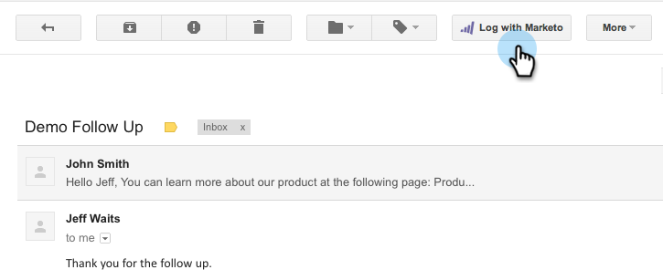

# Verwenden von Marketo Insights für Google Chrome {#using-marketo-insights-for-google-chrome}

Senden und verfolgen Sie alle Google-E-Mails mit Marketo Insights für Google Chrome.

>[!PREREQUISITES]
>
>[Installieren Sie Marketo Insights für Google Chrome](/help/marketo/product-docs/marketo-sales-insight/msi-chrome-plugin/install-marketo-insights-for-google-chrome.md)

## E-Mail mit Marketo Insights senden {#send-an-email-with-marketo-insights}

1. Klicken Sie im Fenster Erstellen auf das Symbol Marketo .

   

1. Die Schaltfläche Senden hat Marketo violett gemacht! Diese E-Mail wird jetzt mit Marketo gesendet, alle Links werden verfolgt und ein Tracking-Pixel wird in die E-Mail eingefügt. Dies wird als E-Mail-Aktivität &quot;Gesendete Verkäufe&quot;aufgezeichnet.

   

   >[!NOTE]
   >
   >Ein Tracking-Pixel gibt an, wer Ihre E-Mail geöffnet hat.

   >[!TIP]
   >
   >Klicken Sie optional auf den Doppelpfeil, um eine Vollbildansicht anzuzeigen.

1. Wenn Sie Ihre E-Mail mit einer veröffentlichten Marketo-Vorlage vorab ausfüllen möchten, klicken Sie auf **Weitere Optionen** und wählen Sie **Marketo-Vorlage laden**.

   

1. Wählen Sie eine **Verfügbare Vorlage** und klicken Sie auf **Ok**.

   

1. Geben Sie Ihren Inhalt, eine E-Mail-Adresse ein und klicken Sie auf **Senden**.

   

   >[!NOTE]
   >
   >Nachrichten werden nur verfolgt, wenn die **Senden** Schaltfläche ist violett.

1. Die E-Mail wird bald in Ihrem Marketo Sales Insight angezeigt und alle Öffnungen und Klicks werden verfolgt.

   

## E-Mail-Antworten mit Marketo protokollieren {#log-email-replies-with-marketo}

Sie können Antworten und alte Aktivitäten im Aktivitätsverlauf eines Leads protokollieren.

1. Klicken Sie im Vorschaufenster von Google Mail auf **Mit Marketo anmelden**.

   

1. Das ist alles! Die E-Mail wird bald in Marketo Sales Insight angezeigt.

   

   >[!MORELIKETHIS]
   >
   >* [Installieren Sie Marketo Insights für Google Chrome](/help/marketo/product-docs/marketo-sales-insight/msi-chrome-plugin/install-marketo-insights-for-google-chrome.md)
   >* [Anzeigen von Personen- und Kontoinformationen und -aktivitäten in Google Mail](/help/marketo/product-docs/marketo-sales-insight/msi-chrome-plugin/view-person-and-account-information-and-activities-in-google-mail.md)

