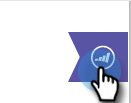

# Anzeigen von Personen- und Kontoinformationen und -aktivitäten in Google Mail {#view-person-and-account-information-and-activities-in-google-mail}

## Anzeigen von Aktivitäten in Google Mail {#view-activities-in-google-mail}

Verwenden Sie den kontextuellen Bereich Marketo Insights , um Kontoinformationen und aktuelle Aktivitäten anzuzeigen.

Der Bereich wird im normalen Google Mail-Lesebereich für die Elemente Posteingang und Gesendet angezeigt und zeigt Informationen und Aktivitäten für die Person an, die Ihnen die E-Mail gesendet hat, die Sie lesen (oder an die Sie die E-Mail für Elemente im Ordner Gesendet gesendet haben).

Auf der Registerkarte &quot;Personenaktivität&quot;werden relevante Informationen zur Person angezeigt, wie z. B. Name, Titel, Bild usw. Sie können auch die letzten Aktivitäten sehen, die nach dem Versand einer E-Mail aufgetreten sind, wie z. B. den Besuch einer Webseite, das Ausfüllen eines Formulars, das Klicken auf einen Link, die Teilnahme an einer Veranstaltung und das Öffnen einer E-Mail.

Auf der Registerkarte Kontoaktivität werden relevante Kontoinformationen wie Firmenname, Website-URL und Standort angezeigt. Auf der Registerkarte werden auch die neuesten Kontoaktivitäten angezeigt. Das Konto wird durch die Domäne der Person identifiziert. Aktivitäten werden in der Liste angezeigt, wenn ein Sales Insight-Benutzer in Ihrem Abonnement jemals mit ihnen übereinstimmt.

Wenn Ihr Team noch nie eine Verkaufs-E-Mail mit der Person ausgetauscht hat, werden keine Aktivitäten angezeigt.

Klicken Sie auf das Symbol, um den Bereich zu reduzieren.

Klicken Sie auf das Symbol Marketo , um den Bereich zu erweitern.

## Anzeigen von Aktivitäten in Google Chrome {#view-activities-in-google-chrome}

Sie können auch das Fenster &quot;Globale Aktivität&quot;in Google Chrome verwenden, um eine vollständige Liste der letzten Aktivitäten anzuzeigen, die für alle Personen aufgetreten sind, denen Sie kürzlich entsprochen haben. Dies ist ein in Echtzeit aktualisierter Feed, der kontinuierlich die Anzahl der ungelesenen Aktivitäten auf dem Symbol anzeigt.

Klicken Sie auf das Symbol Marketo , um den Bereich zu öffnen.

>[!MORELIKETHIS]
>
>[Verwenden von Marketo Insights für Google Chrome](/help/marketo/product-docs/marketo-sales-insight/msi-chrome-plugin/using-marketo-insights-for-google-chrome.md)
