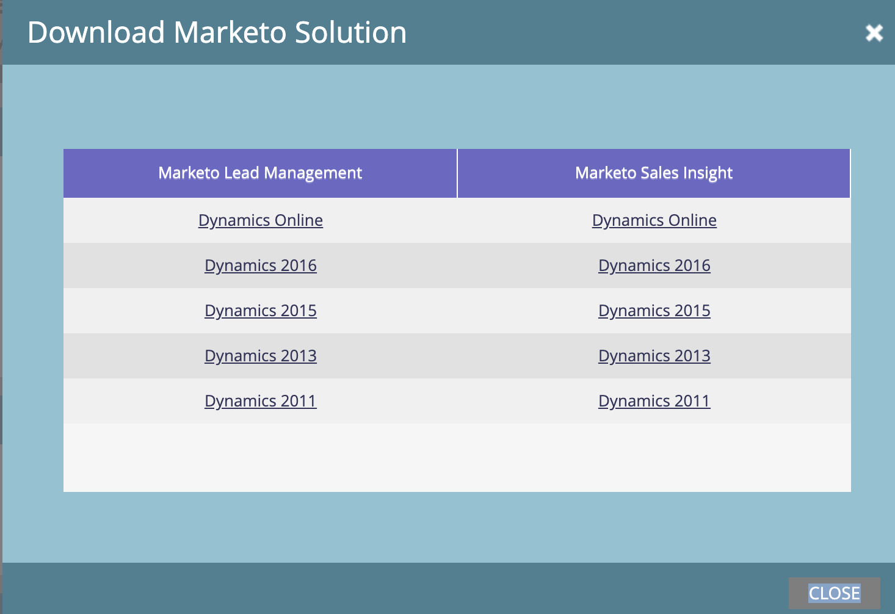

# Herunterladen der [!DNL Marketo Sales Insight] Lösung für [!DNL Microsoft Dynamics] {#download-the-marketo-sales-insight-solution-for-microsoft-dynamics}

>[!NOTE]
>
>**Administratorberechtigungen erforderlich**

>[!IMPORTANT]
>
>Das Plug-in auf dieser Seite ist für diejenigen vorgesehen, die mit der nativen CRM-Synchronisierungslösung von Marketo mit Marketo Engage synchronisieren[!DNL Dynamics 365]. Für diejenigen, die Folgendes haben: eine benutzerdefinierte Synchronisierung, [!DNL MS Dynamics 365 Online] (9.x und höher), und [!DNL Marketo Sales Insight] gekauft haben, [&#x200B; das Paket hier](https://mktg-cdn.marketo.com/community/MarketoSalesInsight_NonNative.zip){target="_blank"}.

1. Navigieren Sie zum Bereich **[!UICONTROL Admin]**.

   

1. Klicken Sie auf **CRM**.

   

1. **Microsoft**.

   

1. Wählen Sie **[!UICONTROL Marketo-Lösung herunterladen]** aus.

   

1. Wählen Sie die entsprechende Lösung für Ihre [!DNL Microsoft Dynamics] Version aus.

   

Sehr gut! Eine ZIP-Datei der Lösung wird auf Ihr Gerät heruntergeladen.
