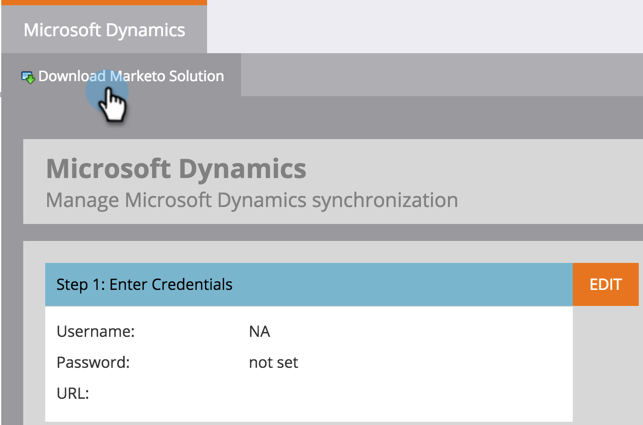

# Herunterladen der Marketo Sales Insight-Lösung für Microsoft Dynamics {#download-the-marketo-sales-insight-solution-for-microsoft-dynamics}

>[!NOTE]
>
>**Administratorberechtigungen erforderlich**

>[!IMPORTANT]
>
>Das Plug-in auf dieser Seite ist für diejenigen, die mit der nativen CRM-Synchronisierungslösung von Marketo für Dynamics 365 mit Marketo Engage synchronisieren. Für diejenigen, die Folgendes haben: eine benutzerdefinierte Synchronisierung, MS Dynamics 365 Online (9.x und höher), und Marketo Sales Insight erworben haben, [ das Paket hier](https://mktg-cdn.marketo.com/community/MarketoSalesInsight_NonNative.zip){target="_blank"}.

1. Navigieren Sie zum Bereich **Admin**.

   

1. Klicken Sie auf **CRM**.

   

1. **Microsoft**.

   

1. Wählen Sie **Marketo-Lösung herunterladen** aus.

   

1. Wählen Sie die entsprechende Lösung für Ihre Microsoft Dynamics-Version aus.

   

Sehr gut! Eine ZIP-Datei der Lösung wird auf Ihr Gerät heruntergeladen.
