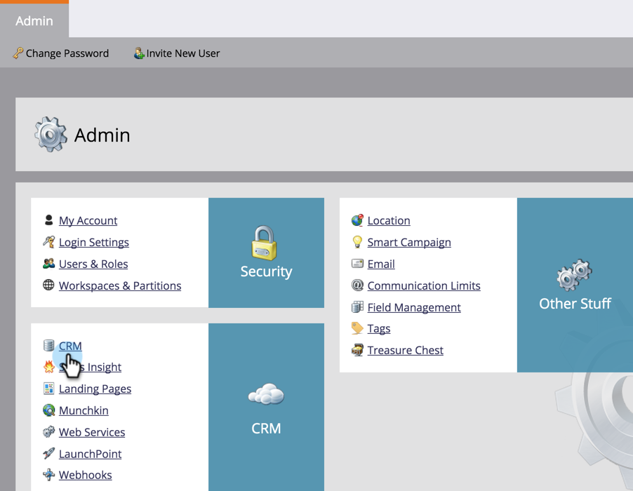

# Laden Sie die Marketing Sales Insight-Lösung für Microsoft Dynamics herunter. {#download-the-marketo-sales-insight-solution-for-microsoft-dynamics}

>[!NOTE]
>
>**Administratorberechtigungen erforderlich**

Um die Synchronisierung zu starten, müssen Sie eine Marketing Solution für Sales Insight in Ihr Microsoft Dynamics-Konto herunterladen und installieren.

1. Gehen Sie zum Bereich **Admin**.

   

1. Klicken Sie auf **CRM**.

   

1. Wählen Sie **Microsoft**.

   

1. Wählen Sie **Marketing-Lösung herunterladen**.

   

1. Wählen Sie die passende Lösung für Ihre Microsoft Dynamics Version.

   

Großartig! Eine ZIP-Datei der Lösung wird auf Ihr Gerät heruntergeladen.
