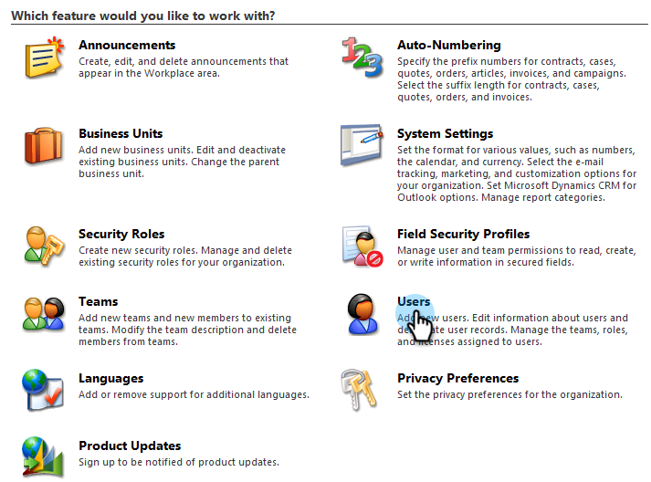

# Installieren und Konfigurieren von Marketo Sales Insight in Microsoft Dynamics 2011 {#install-and-configure-marketo-sales-insight-in-microsoft-dynamics}

Marketo Sales Insight ist ein fantastisches Tool für Ihr Verkaufsteam. Hier finden Sie die schrittweise Anleitung zum Installieren und Konfigurieren in Microsoft Dynamics 2011 On-Premises.

>[!PREREQUISITES]
>
>Schließen Sie Ihre Marketo-Microsoft-Integration ab.
>
>[Laden Sie die richtige Lösung herunter](/help/marketo/product-docs/marketo-sales-insight/msi-for-microsoft-dynamics/installing/download-the-marketo-sales-insight-solution-for-microsoft-dynamics.md) für Ihre Version von Microsoft Dynamics CRM.

## Importlösung {#import-solution}

1. Melden Sie sich bei Microsoft Dynamics CRM an. Klicken Sie unten links im Menü auf **Einstellungen** .

   

1. Wählen Sie **Lösungen** im Baum aus.

   

1. Klicken Sie auf **Import** ( ).

   

   >[!NOTE]
   >
   >Sie sollten die Marketo-Lösung bereits mit [installiert und konfiguriert](/help/marketo/product-docs/marketo-sales-insight/msi-for-microsoft-dynamics/installing/install-and-configure-marketo-sales-insight-in-microsoft-dynamics-2011.md) haben, bevor Sie fortfahren.

1. Klicken Sie auf **Durchsuchen**. Wählen Sie die Marketo Sales Insight-Lösung aus, die Sie [heruntergeladen](/help/marketo/product-docs/marketo-sales-insight/msi-for-microsoft-dynamics/installing/download-the-marketo-sales-insight-solution-for-microsoft-dynamics.md) haben. Klicken Sie auf **Weiter**.

   

1. Überprüfen Sie die Details der Lösung und klicken Sie auf **Weiter**.

   

1. Stellen Sie sicher, dass die Option SDK-Nachricht aktiviert ist. Klicken Sie auf **Weiter**.

   

1. Warten Sie nun, bis der Import abgeschlossen ist.

   

1. Klicken Sie auf **Schließen**.

   

1. Marketo Sales Insight wird nun in der Lösungsliste angezeigt. Ja!

   

1. Wählen Sie Marketo Sales Insight und klicken Sie auf **Publish All Customizations** ( ).

   

## Verbinden von Marketo und Sales Insight  {#connect-marketo-and-sales-insight}

>[!NOTE]
>
>**Erforderliche Administratorberechtigungen**

1. Melden Sie sich bei Marketo an und klicken Sie auf **Admin**.

   

1. Klicken Sie unter dem Abschnitt **Sales Insight** auf **API-Konfiguration bearbeiten**.

   

1. Kopieren Sie den **Marketo-Host**, die **API-URL** und die **API-Benutzer-ID** zur Verwendung in einem späteren Schritt. Geben Sie einen **API-geheimen Schlüssel** Ihrer Wahl ein und klicken Sie auf **Speichern**.

   >[!CAUTION]
   >
   >Verwenden Sie kein kaufmännisches Und-Zeichen (&amp;) in Ihrem API-geheimen Schlüssel.

   

   >[!NOTE]
   >
   >Die folgenden Felder müssen mit Marketo synchronisiert werden, damit _Lead und Kontakt_ funktionieren, damit Sales Insight funktioniert:
   >
   >* Priorität
   >* Dringlichkeit
   >* Relative Bewertung
   >
   >Wenn eines dieser Felder fehlt, wird in Marketo eine Fehlermeldung mit dem Namen der fehlenden Felder angezeigt. Um dies zu beheben, führen Sie [diesen Vorgang](/help/marketo/product-docs/marketo-sales-insight/msi-for-microsoft-dynamics/setting-up-and-using/required-fields-for-syncing-marketo-with-dynamics.md) aus.

1. Gehen Sie zurück zu Dynamics und wählen Sie **Einstellungen** aus.

   

1. Wählen Sie **Marketo API Config** im Baum aus.

   

1. Klicken Sie auf **Standardkonfiguration**.

   

1. Geben Sie die Informationen ein, die Sie zuvor aus Marketo erhalten haben.

   

1. Klicken Sie auf **Speichern**.

   

## Benutzerzugriff festlegen {#set-user-access}

Richten Sie Benutzerrollen ein, um bestimmten Benutzern Zugriff auf Sales Insight zu gewähren.

1. Wählen Sie **Einstellungen** aus.

   

1. Wählen Sie **Administration** im Baum aus.

   

1. Klicken Sie auf **Benutzer**.

   

1. Wählen Sie die Benutzer aus, denen Sie Zugriff gewähren möchten, und klicken Sie auf **Rollen verwalten**.

   

1. Wählen Sie die Rolle **Marketo Sales Insight** aus und klicken Sie auf **OK**.

   

   Und das ist es! Alle Benutzer, die Zugriff haben, können jetzt den Abschnitt mit den Einblicken aus dem Vertrieb in der Detailansicht des Leads/Kontakts sehen.

   

   Herzlichen Glückwunsch. Sie haben jetzt die Leistung von Marketo Sales Insight freigesetzt.

>[!MORELIKETHIS]
>
>[Einrichten von Sternen und Flammen für Lead-/Kontaktdatensätze](/help/marketo/product-docs/marketo-sales-insight/msi-for-microsoft-dynamics/setting-up-and-using/setting-up-stars-and-flames-for-lead-contact-records.md)
