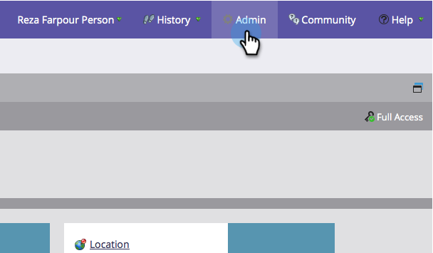

# Installieren und Konfigurieren von Marketo Sales Insight in Microsoft Dynamics 2011 {#install-and-configure-marketo-sales-insight-in-microsoft-dynamics}

Marketo Sales Insight ist ein fantastisches Tool für Ihr Vertriebsteam. Hier finden Sie eine schrittweise Anleitung, wie Sie es in Microsoft Dynamics 2011 On-Premises installieren und konfigurieren.

>[!PREREQUISITES]
>
>Füllen Sie die [Marketing-Microsoft-Integration](http://docs.marketo.com/x/DoA2) aus.
>
>[Laden Sie die richtige ](http://docs.marketo.com/x/LoJo) Lösung für Ihre Version von Microsoft Dynamics CRM herunter.

## Lösung {#import-solution} importieren

1. Melden Sie sich bei Microsoft Dynamics CRM an. Klicken Sie im Menü unten links auf **Einstellungen**.

   

1. Wählen Sie **Lösungen** in der Struktur.

   

1. Klicken Sie auf **Import** ( ).

   

   >[!NOTE]
   >
   >**Erinnerung**
   >
   >
   >Sie sollten [die Marketing-Lösung bereits installiert und konfiguriert haben, bevor Sie fortfahren.](install-and-configure-marketo-sales-insight-in-microsoft-dynamics-2011.md)

1. Klicken Sie auf **Durchsuchen**. Wählen Sie die Marketing Sales Insight-Lösung aus, die Sie [heruntergeladen haben. ](download-the-marketo-sales-insight-solution-for-microsoft-dynamics.md) Klicken Sie auf **Weiter**.

   

1. Überprüfen Sie die Details der Lösung und klicken Sie auf **Weiter**.

   

1. Stellen Sie sicher, dass die Option für die SDK-Meldung aktiviert ist. Klicken Sie auf **Weiter**.

   

1. Warten Sie jetzt, bis der Import abgeschlossen ist.

   

1. Klicken Sie auf **Schließen**.

   

1. Marketo Sales Insight wird nun in der Liste zur Lösung angezeigt. Jay!

   

1. Wählen Sie Marketing to Sales Insight und klicken Sie auf **Alle Anpassungen veröffentlichen** ( ).

   

## Connect Marketing and Sales Insight {#connect-marketo-and-sales-insight}

>[!NOTE]
>
>**Administratorberechtigungen erforderlich**

1. Melden Sie sich bei Marketing an und klicken Sie auf **Admin**.

   

1. Klicken Sie im Abschnitt **Sales Insight **auf **API-Konfiguration bearbeiten**.

   

1. Kopieren Sie die **Marketo-Host**, **API-URL** und **API-Benutzer-ID** zur Verwendung in einem späteren Schritt. Geben Sie einen **Geheimschlüssel der API** Ihrer Wahl ein und klicken Sie auf **SAVE**.

   >[!CAUTION]
   >
   >Verwenden Sie kein kaufmännisches Und-Zeichen (&amp;) in Ihrem API-geheimen Schlüssel.

   

   >[!NOTE]
   >
   >Die folgenden Felder müssen mit Marketo synchronisiert werden, damit *Lead und Kontakt* funktionieren:
   >
   >    
   >    
   >    * Priorität
   >    * Dringlichkeit
   >    * Relative Bewertung

   >    
   >    
   >Wenn eines dieser Felder fehlt, wird in Marketo eine Fehlermeldung mit dem Namen der fehlenden Felder angezeigt. Um dies zu beheben, führen Sie [dieses Verfahren](../../../../product-docs/marketo-sales-insight/msi-for-microsoft-dynamics/setting-up-and-using/required-fields-for-syncing-marketo-with-dynamics.md) durch.

1. Gehen Sie zurück zu Dynamik und wählen Sie **Einstellungen**.

   

1. Wählen Sie **Marketing-API-Konfiguration** in der Struktur.

   

1. Klicken Sie auf **Standardkonfiguration**.

   

1. Geben Sie die Informationen ein, die Sie zuvor von Marketo erhalten haben.

   

1. Klicken Sie auf **Speichern.**

   ** 

   **

## Benutzerzugriff einstellen {#set-user-access}

Richten Sie Benutzerrollen ein, um bestimmten Benutzern Zugriff auf Sales Insight zu gewähren.

1. Wählen Sie **Einstellungen**.

   

1. Wählen Sie **Administration** in der Struktur.

   

1. Klicken Sie auf **Benutzer**.

   

1. Wählen Sie die Benutzer aus, denen Sie Zugriff gewähren möchten, und klicken Sie auf **Rollen verwalten**.

   

1. Wählen Sie die Rolle **Marketo Sales Insight** und klicken Sie auf **OK**.

   

   Und das ist es! Alle Benutzer, die Zugriff haben, können nun den Abschnitt mit dem Sales Insight in der Ansicht der Interessenten-/Kontaktdetails sehen.

   

   Herzlichen Glückwunsch! Sie haben jetzt die Kraft von Marketo Sales Insight freigesetzt.

>[!NOTE]
>
>**Verwandte Artikel**
>
>[Einrichten von Sternen und Flammen für Lead-/Kontaktdatensätze](http://docs.marketo.com/x/BICMAg)

