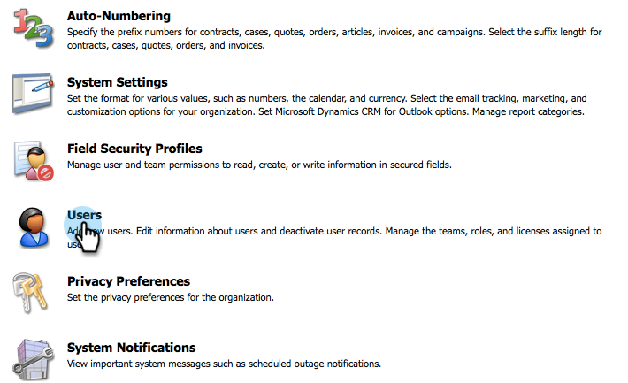

# Installieren und Konfigurieren von [!DNL Marketo Sales Insight] in [!DNL Microsoft Dynamics 2013] {#install-and-configure-marketo-sales-insight-in-microsoft-dynamics}

[!DNL Marketo Sales Insight] ist ein fantastisches Tool, mit dem Sie Ihrem Verkaufsteam einen Einblick in die Fülle der Daten geben können, die das Marketing-Team hat. So installieren und konfigurieren Sie es.

>[!PREREQUISITES]
>
>Abschließen der Marketo-Microsoft-Integration
>
>[Laden Sie die richtige Lösung ](/help/marketo/product-docs/marketo-sales-insight/msi-for-microsoft-dynamics/installing/download-the-marketo-sales-insight-solution-for-microsoft-dynamics.md) Ihre Version [!DNL Microsoft Dynamics] CRM herunter.

## Lösung importieren {#import-solution}

OK, jetzt ist es Zeit, die [!DNL Marketo Sales Insight] Lösung in [!DNL Microsoft Dynamics] zu importieren.

1. Klicken Sie unter **[!UICONTROL Microsoft Dynamics CRM]** auf **[!UICONTROL Einstellungen]**.

   

1. Klicken **[!UICONTROL unter „Einstellungen]** auf **[!UICONTROL Anpassungen]**.

   

1. Klicken Sie auf **[!UICONTROL Lösungen]**.

   

   >[!NOTE]
   >
   >Sie sollten Marketo bereits installiert und konfiguriert haben, bevor Sie fortfahren

1. Klicken Sie **[!UICONTROL Importieren]**.

   

1. Klicken Sie im neuen Fenster auf &quot;**[!UICONTROL &quot;]**.

   

1. Suchen Sie die Lösung, die Sie oben heruntergeladen haben, und wählen Sie sie aus.

   

1. Klicken Sie auf **[!UICONTROL Weiter]**.

   

1. Die Lösung wird hochgeladen. Sie können den Paketinhalt anzeigen, wenn Sie möchten. Klicken Sie auf **[!UICONTROL Weiter]**.

   

1. Lassen Sie das Kontrollkästchen aktiviert und klicken Sie auf **[!UICONTROL Importieren]**.

   

1. Sie können die Protokolldatei gerne herunterladen. Klicken Sie auf **[!UICONTROL Schließen]**.

   

1. Fantastisch! Sie sollten die Lösung jetzt sehen. Wenn er nicht da ist, aktualisieren Sie Ihren Bildschirm.

   

## Marketo und Sales Insight verbinden {#connect-marketo-and-sales-insight}

Binden wir Ihre Marketo-Instanz an [!DNL Sales Insight] in [!DNL Dynamics].

>[!NOTE]
>
>Administratorrechte erforderlich.

1. Melden Sie sich bei Marketo an und gehen Sie zum Abschnitt **[!UICONTROL Admin]** .

   

1. Klicken Sie im Abschnitt **[!UICONTROL Sales Insight]** auf **[!UICONTROL API-Konfiguration]**.

   

1. Kopieren Sie den **[!UICONTROL Marketo]** Host **[!UICONTROL , die API]** und die **[!UICONTROL API-Benutzer-ID]** zur Verwendung in einem späteren Schritt. Geben Sie einen **[!UICONTROL API-Geheimschlüssel]** Ihrer Wahl ein und klicken Sie auf **[!UICONTROL Speichern]**.

   >[!CAUTION]
   >
   >Verwenden Sie in Ihrem API-Geheimschlüssel kein kaufmännisches Und-Zeichen (&amp;).

   

   >[!NOTE]
   >
   >Die folgenden Felder müssen mit Marketo Insight synchronisiert werden, damit _Lead und Kontakt_ funktioniert:
   >
   >* Priorität
   >* Dringlichkeit
   >* Relative Bewertung
   >
   >Wenn eines dieser Felder fehlt, wird in Marketo eine Fehlermeldung mit dem Namen der fehlenden Felder angezeigt. Um dies zu beheben, führen Sie [dieses Verfahren](/help/marketo/product-docs/marketo-sales-insight/msi-for-microsoft-dynamics/setting-up-and-using/required-fields-for-syncing-marketo-with-dynamics.md) aus.

1. Zurück in [!DNL Microsoft Dynamics], gehen Sie zu **[!UICONTROL Einstellungen]**.

   

1. Klicken **[!UICONTROL unter „Einstellungen]** auf **[!UICONTROL Marketo API-Konfiguration]**.

   

1. Klicken Sie auf **[!UICONTROL Neu]**.

   

1. Geben Sie die Informationen ein, die Sie zuvor aus Marketo übernommen haben, und klicken Sie auf **[!UICONTROL Speichern]**.

   

## Benutzerzugriff festlegen {#set-user-access}

Schließlich können Sie bestimmten Benutzern Zugriff auf [!DNL Marketo Sales Insight] gewähren.

1. Navigieren Sie zu **[!UICONTROL Einstellungen]**.

   

1. Klicken Sie auf **[!UICONTROL Benutzer]**.

   

1. Wählen Sie die Benutzer aus, denen Sie Zugriff auf Sales Insight gewähren möchten, und klicken Sie auf **[!UICONTROL Rollen verwalten]**.

   

1. Wählen Sie die Rolle **[!UICONTROL Marketo Sales Insight]** aus und klicken Sie auf **[!UICONTROL OK]**.

   

   Und Sie sollten fertig sein! Um schließlich zu testen, melden Sie sich bei [!DNL Dynamics] als Benutzer an, der Zugriff auf [!DNL Marketo Sales Insight] hat, und sehen Sie sich einen Lead oder Kontakt an.

   

Jetzt haben Sie die [!DNL Marketo Sales Insight] für Ihr Vertriebsteam freigeschaltet.

>[!MORELIKETHIS]
>
>[Einrichten von Sternen und Flammen für Lead-/Kontakt-Datensätze](/help/marketo/product-docs/marketo-sales-insight/msi-for-microsoft-dynamics/setting-up-and-using/setting-up-stars-and-flames-for-lead-contact-records.md)
