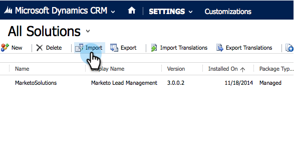

# Installieren und Konfigurieren von Marketo Sales Insight in Microsoft Dynamics 2013 {#install-and-configure-marketo-sales-insight-in-microsoft-dynamics}

Marketo Sales Insight ist ein fantastisches Tool, um Ihrem Vertriebsteam ein &quot;Fenster&quot; zu den umfangreichen Daten des Marketingteams zu geben. So installieren und konfigurieren Sie es.

>[!PREREQUISITES]
>
>Füllen Sie die [Marketing-Microsoft-Integration](http://docs.marketo.com/x/EIA2) aus.
>
>[Laden Sie die richtige ](http://docs.marketo.com/x/LoJo) Lösung für Ihre Version von Microsoft Dynamics CRM herunter.

## Lösung {#import-solution} importieren

OK, jetzt ist es an der Zeit, die Marketo Sales Insight Lösung in Microsoft Dynamics zu importieren.

1. Klicken Sie unter **Microsoft Dynamics CRM** auf **Einstellungen**.

   

1. Klicken Sie unter **Einstellungen** auf **Anpassungen**.

   

1. Klicken Sie auf **Lösungen**.

   

   >[!NOTE]
   >
   >**Erinnerung**
   >
   >
   >Sie sollten Marketo bereits installiert und konfiguriert haben, bevor Sie fortfahren

1. Klicken Sie auf **Import**.

   

1. Klicken Sie im neuen Fenster auf **Durchsuchen**.

   

1. Suchen Sie die Lösung, die Sie oben heruntergeladen haben, und wählen Sie sie aus.

   

1. Klicken Sie auf **Weiter**.

   

1. Die Lösung wird hochgeladen. Sie können den Paketinhalt nach Wunsch Ansicht geben. Klicken Sie auf **Weiter**.

   

1. Vergewissern Sie sich, dass das Kontrollkästchen aktiviert ist und klicken Sie auf **Import**.

   

1. Sie können die Protokolldatei herunterladen. Klicken Sie auf **Schließen**.

   

1. Fantastisch! Du solltest die Lösung jetzt sehen. Wenn der Bildschirm nicht vorhanden ist, aktualisieren Sie ihn.

   

## Connect Marketing and Sales Insight {#connect-marketo-and-sales-insight}

Binden wir Ihre Marketo-Instanz mit Sales Insight in Dynamics zusammen.

>[!NOTE]
>
>Administratorrechte erforderlich.

1. Melden Sie sich bei Marketing an und gehen Sie zum Abschnitt **Admin**.

   

1. Klicken Sie im Abschnitt **Sales Insight** auf **API-Konfiguration bearbeiten**.

   

1. Kopieren Sie die **Marketo-Host**, **API-URL** und **API-Benutzer-ID** zur Verwendung in einem späteren Schritt. Geben Sie einen **Geheimschlüssel der API** Ihrer Wahl ein und klicken Sie auf **SAVE**.

   >[!CAUTION]
   >
   >Verwenden Sie kein kaufmännisches Und-Zeichen (&amp;) in Ihrem API-geheimen Schlüssel.

   

   >[!NOTE]
   >
   >Die folgenden Felder müssen mit Marketo synchronisiert werden, damit *Lead und Kontakt* funktionieren:
   >
   >    
   >    
   >    * Priorität
   >    * Dringlichkeit
   >    * Relative Bewertung

   >    
   >    
   >Wenn eines dieser Felder fehlt, wird in Marketo eine Fehlermeldung mit dem Namen der fehlenden Felder angezeigt. Um dies zu beheben, führen Sie [dieses Verfahren](../../../../product-docs/marketo-sales-insight/msi-for-microsoft-dynamics/setting-up-and-using/required-fields-for-syncing-marketo-with-dynamics.md) durch.

1. Zurück in Microsoft Dynamics, gehen Sie zu **Einstellungen**.

   

1. Klicken Sie unter **Einstellungen** auf **Marketing-API-Konfiguration**.

   

1. Klicken Sie auf **Neu**.

   

1. Geben Sie die Informationen ein, die Sie zuvor von Marketo erhalten haben, und klicken Sie auf **Speichern**.

   

## Benutzerzugriff einstellen {#set-user-access}

Schließlich können Sie bestimmten Benutzern Zugriff auf Marketo Sales Insight gewähren.

1. Gehen Sie zu **Einstellungen**.

   

1. Klicken Sie auf **Benutzer**.

   

1. Wählen Sie die Benutzer aus, denen Sie Zugriff auf Sales Insight gewähren möchten, und klicken Sie auf **Rollen verwalten**.

   

1. Wählen Sie die Rolle **Marketo Sales Insight** und klicken Sie auf **OK**.

   

   Und Sie sollten alle fertig sein! Melden Sie sich zum Testen bei Dynamics als Benutzer an, der Zugriff auf Marketo Sales Insight hat, und sehen Sie sich einen Interessenten oder Kontakt an.

   

Sie haben die Leistungsfähigkeit von Marketo Sales Insight für Ihr Vertriebsteam freigegeben.

>[!NOTE]
>
>**Verwandte Artikel**
>
>[Einrichten von Sternen und Flammen für Lead-/Kontaktdatensätze](http://docs.marketo.com/x/BICMAg)

