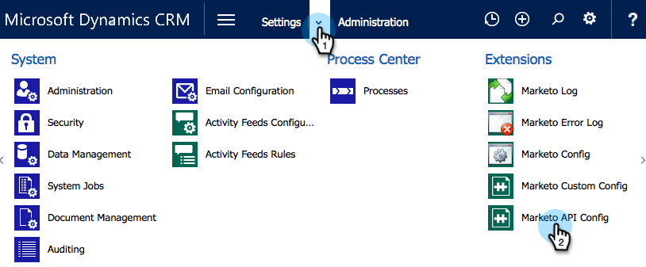

# Installieren und Konfigurieren von [!DNL Marketo Sales Insight] in [!DNL Microsoft Dynamics 365] {#install-and-configure-marketo-sales-insight-in-microsoft-dynamics}

[!DNL Marketo Sales Insight] ist ein fantastisches Tool, mit dem Sie Ihrem Verkaufsteam einen Einblick in die Fülle der Daten geben können, die das Marketing-Team hat. Installieren und konfigurieren Sie wie folgt.

>[!PREREQUISITES]
>
>Abschließen der Marketo-Microsoft-Integration
>
>[Laden Sie die richtige Lösung &#x200B;](/help/marketo/product-docs/marketo-sales-insight/msi-for-microsoft-dynamics/installing/download-the-marketo-sales-insight-solution-for-microsoft-dynamics.md) Ihre Version von [!DNL Microsoft Dynamics CRM] herunter.

## Lösung importieren {#import-solution}

1. Melden Sie sich bei [[!DNL Microsoft Office 365]](https://login.microsoftonline.com/) an.

   

1. Klicken Sie auf das Menü  und wählen Sie **CRM** aus.

   

1. Klicken Sie auf das Menü  . Wählen Sie in der Dropdown-Liste **[!DNL Settings]** und dann **[!DNL Solutions]** aus.

   

   >[!NOTE]
   >
   >Sie sollten die Marketo[Lösung bereits installiert und konfiguriert haben](/help/marketo/product-docs/crm-sync/microsoft-dynamics-sync/sync-setup/microsoft-dynamics-365-with-ropc-connection/step-1-of-4-install.md) bevor Sie fortfahren.

1. Klicken Sie **[!UICONTROL Importieren]**.

   

1. Klicken Sie im neuen Fenster auf &quot;**[!UICONTROL &quot;]**. Wählen Sie die [Marketo Sales Insight-Lösung aus, die Sie in Schritt 1 heruntergeladen &#x200B;](#msi). Klicken Sie auf **[!UICONTROL Weiter]**.

   

1. Die Lösung wird hochgeladen. Sie können den Paketinhalt anzeigen, wenn Sie möchten. Klicken Sie auf **[!UICONTROL Weiter]**.

   

1. Lassen Sie das Kontrollkästchen **[!UICONTROL aktiviert]** und klicken Sie auf **[!UICONTROL Importieren]**.

   

1. Sie können die Protokolldatei gerne herunterladen. Klicken Sie auf **[!UICONTROL Schließen]**.

   

1. Fantastisch! Sie sollten die Lösung jetzt sehen. Wenn er nicht da ist, aktualisieren Sie Ihren Bildschirm.

   

1. Klicken Sie **[!UICONTROL Alle Anpassungen veröffentlichen]**.

   

## Marketo und [!DNL Sales Insight] verbinden {#connect-marketo-and-sales-insight}

Binden wir Ihre Marketo-Instanz an [!DNL Sales Insight] in [!DNL Dynamics]. So geht&#39;s:

>[!NOTE]
>
>**Administratorberechtigungen erforderlich**

1. Melden Sie sich bei Marketo an und gehen Sie zum Abschnitt **[!UICONTROL Admin]**.

   

1. Klicken Sie im Abschnitt **[!UICONTROL Sales Insight]** auf **API-Konfiguration bearbeiten**.

   

1. Kopieren Sie den **[!UICONTROL Marketo-Host]**, die **[!UICONTROL API]**-URL und **[!UICONTROL API-Benutzer-]** ID) zur Verwendung in einem späteren Schritt. Geben Sie einen **[!UICONTROL API-Geheimschlüssel]** Ihrer Wahl ein und klicken Sie auf **[!UICONTROL Speichern]**.

   >[!CAUTION]
   >
   >Verwenden Sie in Ihrem API-Geheimschlüssel kein kaufmännisches Und-Zeichen (&amp;).

   

   >[!NOTE]
   >
   >Die folgenden Felder müssen mit Marketo synchronisiert werden, damit _Lead und Kontakt_ funktioniert: [!DNL Sales Insight]
   >
   > * Priorität
   > * Dringlichkeit
   > * Relative Bewertung
   >
   >Wenn eines dieser Felder fehlt, wird in Marketo eine Fehlermeldung mit dem Namen der fehlenden Felder angezeigt. Um dies zu beheben, führen Sie [dieses Verfahren](/help/marketo/product-docs/marketo-sales-insight/msi-for-microsoft-dynamics/setting-up-and-using/required-fields-for-syncing-marketo-with-dynamics.md) aus.

1. Zurück in [!DNL Microsoft Dynamics], klicken Sie auf das -Symbol neben [!UICONTROL Einstellungen] und wählen Sie dann **[!UICONTROL Marketo API-]** in der Dropdown-Liste.

   

1. Klicken Sie **[!UICONTROL Standardkonfiguration]**.

   

1. Geben Sie die Informationen ein, die Sie zuvor aus Marketo kopiert haben.

   

1. Klicken Sie auf das  in der rechten unteren Ecke, um die Änderungen zu speichern.

## Benutzerzugriff festlegen {#set-user-access}

Sie müssen Benutzenden Berechtigungen zum Verwenden von [!DNL Sales Insight] erteilen.

1. Klicken Sie auf das Menü  . Wählen Sie im Dropdown-Menü **[!UICONTROL Einstellungen]** und dann **[!UICONTROL Sicherheit]** aus.

   

1. Klicken Sie auf **[!UICONTROL Benutzer]**.

   

1. Wählen Sie die Benutzer aus, denen Sie Zugriff auf [!DNL Sales Insight] gewähren möchten, und klicken Sie auf **[!UICONTROL Rollen verwalten]**.

   

1. Wählen Sie die Rolle **[!UICONTROL Marketo Sales Insight]** aus und klicken Sie auf **[!UICONTROL OK]**.

   

   Und Sie sollten fertig sein! Melden Sie sich zum Testen bei [!DNL Dynamics] als Benutzer an, der Zugriff auf [!DNL Marketo Sales Insight] hat, und sehen Sie sich einen Lead oder Kontakt an.

   

Jetzt haben Sie die [!DNL Marketo Sales Insight] für Ihr Vertriebsteam freigeschaltet.

>[!MORELIKETHIS]
>
>[Einrichten von Sternen und Flammen für Lead-/Kontakt-Datensätze](/help/marketo/product-docs/marketo-sales-insight/msi-for-microsoft-dynamics/setting-up-and-using/setting-up-stars-and-flames-for-lead-contact-records.md)
