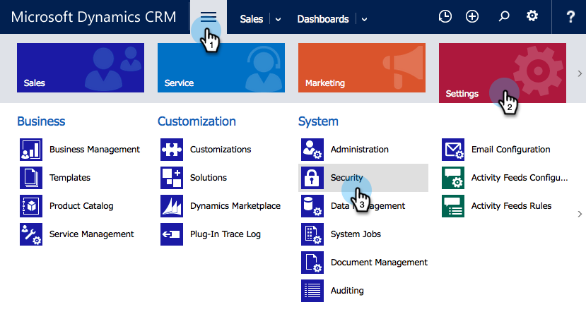

# Installieren und Konfigurieren von Marketo Sales Insight in Microsoft Dynamics 365 {#install-and-configure-marketo-sales-insight-in-microsoft-dynamics}

Marketo Sales Insight ist ein fantastisches Tool, mit dem Sie Ihrem Vertriebsteam ein &quot;Fenster&quot;in den Datenbestand des Marketing-Teams geben können. So installieren und konfigurieren Sie Folgendes:

>[!PREREQUISITES]
>
>Schließen Sie Ihre Marketo-Microsoft-Integration ab.
>
>[Die richtige Lösung herunterladen](/help/marketo/product-docs/marketo-sales-insight/msi-for-microsoft-dynamics/installing/download-the-marketo-sales-insight-solution-for-microsoft-dynamics.md) für Ihre Microsoft Dynamics CRM-Version.

## Importlösung {#import-solution}

1. Anmelden bei [Microsoft Office 365](https://login.microsoftonline.com/).

   

1. Klicken Sie auf  Menü und wählen Sie **CRM**.

   

1. Klicken Sie auf  Menü. Wählen Sie in der Dropdown-Liste **Einstellungen**, wählen Sie **Lösungen**.

   

   >[!NOTE]
   >
   >Sie sollten bereits [Marketo-Lösung installiert und konfiguriert](/help/marketo/product-docs/crm-sync/microsoft-dynamics-sync/sync-setup/microsoft-dynamics-365-with-ropc-connection/step-1-of-4-install.md) vor dem weiteren Vorgehen.

1. Klicken **Import**.

   

1. Klicken Sie im neuen Fenster auf **Durchsuchen**. Wählen Sie die [Marketo Sales Insight-Lösung, die Sie in Schritt 1 heruntergeladen haben](#msi). Klicken **Nächste**.

   

1. Die Lösung wird hochgeladen. Sie können den Paketinhalt bei Bedarf anzeigen. Klicken **Nächste**.

   

1. Vergewissern Sie sich, dass Sie das Kästchen verlassen **aktiviert** und klicken Sie auf **Import**.

   

1. Sie können die Protokolldatei herunterladen. Klicken **Schließen**.

   

1. Fantastisch Sie sollten die Lösung jetzt sehen. Wenn er nicht vorhanden ist, aktualisieren Sie den Bildschirm.

   

1. Klicken **Alle Anpassungen veröffentlichen**.

   

## Verbinden von Marketo und Sales Insight {#connect-marketo-and-sales-insight}

Verknüpfen wir Ihre Marketo-Instanz mit Sales Insight in Dynamics. Gehen Sie wie folgt vor:

>[!NOTE]
>
>**Erforderliche Administratorberechtigungen**

1. Melden Sie sich bei Marketo an und wechseln Sie zum **Admin** Abschnitt.

   

1. Unter dem **Sales Insight** Abschnitt, klicken Sie auf **API-Konfiguration bearbeiten**.

   

1. Kopieren Sie die **Marketo-Host**, **API-URL** und **API-Benutzer-ID** zur Verwendung in einem späteren Schritt. Geben Sie eine **API-Geheimschlüssel** und klicken Sie auf **Speichern**.

   >[!CAUTION]
   >
   >Verwenden Sie kein kaufmännisches Und-Zeichen (&amp;) in Ihrem API-geheimen Schlüssel.

   

   >[!NOTE]
   >
   >Die folgenden Felder müssen mit Marketo synchronisiert werden für _Lead und Kontakt_ für Sales Insight funktioniert:
   >
   > * Priorität
   > * Dringlichkeit
   > * Relative Bewertung

   >
   >Wenn eines dieser Felder fehlt, wird in Marketo eine Fehlermeldung mit dem Namen der fehlenden Felder angezeigt. Um dies zu beheben, führen Sie [dieses Verfahrens](/help/marketo/product-docs/marketo-sales-insight/msi-for-microsoft-dynamics/setting-up-and-using/required-fields-for-syncing-marketo-with-dynamics.md).

1. Klicken Sie in Microsoft Dynamics auf das  Symbol neben Einstellungen und wählen Sie **Marketo API-Konfiguration** in der Dropdown-Liste.

   

1. Klicken **Standardkonfiguration**.

   

1. Geben Sie die Informationen ein, die Sie zuvor aus Marketo kopiert haben.

   

1. Klicken Sie auf  in der rechten unteren Ecke, um die Änderungen zu speichern.

## Benutzerzugriff festlegen {#set-user-access}

Sie müssen Benutzern Berechtigungen zur Verwendung von Sales Insight erteilen.

1. Klicken Sie auf  Menü. Wählen Sie im Dropdown-Menü **Einstellungen**, wählen Sie **Sicherheit**.

   

1. Klicken **Benutzer**.

   

1. Wählen Sie die Benutzer aus, denen Sie Zugriff auf Sales Insight gewähren möchten, und klicken Sie auf **Rollen verwalten**.

   

1. Wählen Sie die **Marketo Sales Insight** Rolle und klicken Sie auf **OK**.

   

   Und du solltest fertig sein! Melden Sie sich zum Testen bei Dynamics als Benutzer an, der Zugriff auf Marketo Sales Insight hat, und sehen Sie sich einen Lead oder Kontakt an.

   

Sie haben jetzt die Möglichkeiten von Marketo Sales Insight für Ihr Vertriebsteam freigeschaltet.

>[!MORELIKETHIS]
>
>[Einrichten von Sternen und Flammen für Lead-/Kontaktdatensätze](/help/marketo/product-docs/marketo-sales-insight/msi-for-microsoft-dynamics/setting-up-and-using/setting-up-stars-and-flames-for-lead-contact-records.md)
