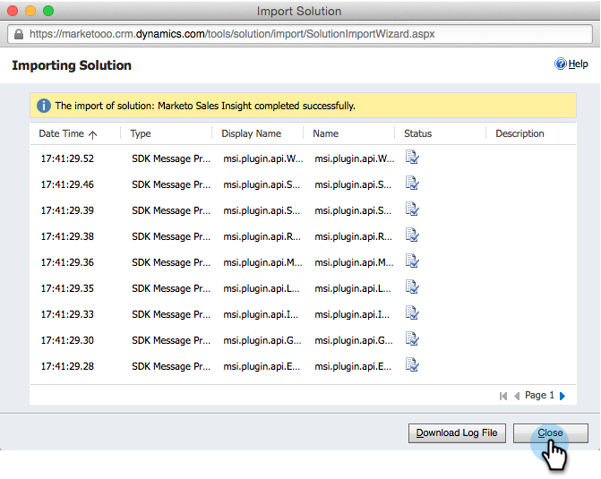

# Installieren und Konfigurieren von [!DNL Marketo Sales Insight] in [!DNL Microsoft Dynamics Online] {#install-and-configure-marketo-sales-insight-in-microsoft-dynamics-online}

[!DNL Marketo Sales Insight] ist ein fantastisches Tool, mit dem Sie Ihrem Verkaufsteam einen Einblick in die Fülle der Daten geben können, die das Marketing-Team hat. Im Folgenden wird beschrieben, wie Sie es in [!DNL Microsoft Dynamics Online] installieren und konfigurieren.

>[!PREREQUISITES]
>
>Abschließen der Marketo-Microsoft-Integration
>
>[Laden Sie die richtige Lösung &#x200B;](/help/marketo/product-docs/marketo-sales-insight/msi-for-microsoft-dynamics/installing/download-the-marketo-sales-insight-solution-for-microsoft-dynamics.md) Ihre Version von [!DNL Microsoft Dynamics CRM] herunter.

## Lösung importieren {#import-solution}

>[!NOTE]
>
>Wenn Sie die einheitliche Benutzeroberfläche verwenden, klicken Sie vor Schritt 1 unten auf das Einstellungssymbol in der oberen rechten Ecke und wählen Sie **[!UICONTROL Erweiterte Einstellungen]**.

1. Klicken Sie unter Microsoft Dynamics CRM **[!UICONTROL Einstellungen]**.

   

1. Klicken Sie unter Einstellungen auf **[!UICONTROL Anpassungen]**.

   

1. Klicken Sie auf **[!UICONTROL Lösungen]**.

   

   >[!NOTE]
   >
   >Sie sollten die Marketo-Lösung bereits installiert und konfiguriert haben, bevor Sie fortfahren.

1. Klicken Sie **[!UICONTROL Importieren]**.

   

1. Klicken Sie im neuen Fenster auf &quot;**[!UICONTROL &quot;]**.

   

1. Suchen Sie auf Ihrem Computer nach der Lösung, die Sie gerade heruntergeladen haben, und installieren Sie sie.

1. Klicken Sie auf **[!UICONTROL Weiter]**.

   

1. Die Lösung wird hochgeladen. Sie können den Paketinhalt anzeigen, wenn Sie möchten. Klicken Sie auf **[!UICONTROL Weiter]**.

   

1. Lassen Sie das Kontrollkästchen aktiviert und klicken Sie auf **[!UICONTROL Importieren]**.

   

1. Laden Sie die Protokolldatei herunter und klicken Sie dann auf **[!UICONTROL Schließen]**.

   

1. Fantastisch! Sie sollten die Lösung jetzt sehen. Wenn er nicht da ist, aktualisieren Sie Ihren Bildschirm.

   

1. Klicken Sie **[!UICONTROL Anpassung veröffentlichen]**.

   >[!NOTE]
   >
   >Stellen Sie sicher, dass Sie die Synchronisierung globaler [!DNL MS Dynamics] aktivieren.

## Marketo und [!DNL Sales Insight] verbinden {#connect-marketo-and-sales-insight}

Binden wir Ihre Marketo-Instanz an [!DNL Sales Insight] in [!DNL Dynamics]. So geht&#39;s:

>[!NOTE]
>
>**Administratorberechtigungen erforderlich**

1. Melden Sie sich bei Marketo an und gehen Sie zum Abschnitt **[!UICONTROL Admin]**.

   

1. Klicken Sie im Abschnitt [!UICONTROL Sales Insight] auf **[!UICONTROL API-Konfiguration bearbeiten]**.

   

1. Kopieren Sie den **[!UICONTROL Marketo]** Host **[!UICONTROL , die API]** und die **[!UICONTROL API-Benutzer-ID]** zur Verwendung in einem späteren Schritt. Geben Sie einen API-Geheimschlüssel Ihrer Wahl ein und klicken Sie auf **[!UICONTROL Speichern]**.

   >[!CAUTION]
   >
   >Verwenden Sie in Ihrem API-Geheimschlüssel kein kaufmännisches Und-Zeichen (&amp;).

   

   >[!NOTE]
   >
   >Die folgenden Felder müssen mit Marketo synchronisiert werden, damit _Lead und Kontakt_ funktioniert: [!DNL Sales Insight]
   >
   >* Priorität
   >* Dringlichkeit
   >* Relative Bewertung
   >
   >Wenn eines dieser Felder fehlt, wird in Marketo eine Fehlermeldung mit dem Namen der fehlenden Felder angezeigt. Um dies zu beheben, führen Sie [dieses Verfahren](/help/marketo/product-docs/marketo-sales-insight/msi-for-microsoft-dynamics/setting-up-and-using/required-fields-for-syncing-marketo-with-dynamics.md) aus.

1. Zurück in [!DNL Microsoft Dynamics], gehen Sie zu **[!UICONTROL Einstellungen]**.

   

1. Klicken **[!UICONTROL unter „Einstellungen]** auf **[!UICONTROL Marketo API-Konfiguration]**.

   

1. Klicken Sie auf **[!UICONTROL Neu]**.

   

1. Geben Sie die Informationen ein, die Sie zuvor aus Marketo übernommen haben, und klicken Sie auf **[!UICONTROL Speichern]**.

   

## Synchronisierung aktivieren {#enable-sync}

1. Klicken Sie in Marketo auf **[!UICONTROL Admin]**.

   

1. Wählen Sie unter Integration die Option **[!UICONTROL Microsoft Dynamics]** aus.

   

1. Klicken Sie auf **[!UICONTROL Synchronisierung aktivieren]**.

   

1. Klicken Sie **[!UICONTROL Bearbeiten]** neben [!UICONTROL Details zur Feldsynchronisierung].

   

1. Dadurch _(automatisch_ zuvor deaktivierte MSI-Felder ([!UICONTROL Dringlichkeit], [!UICONTROL Relativer Score] und [!UICONTROL Priorität]) ausgewählt. Klicken Sie einfach auf **[!UICONTROL Speichern]**, um mit der Synchronisierung von Daten zu beginnen.

   

## Benutzerzugriff festlegen {#set-user-access}

Schließlich müssen Sie bestimmten Benutzern Zugriff gewähren, um [!DNL Marketo Sales Insight] verwenden zu können.

1. Navigieren Sie zu **[!UICONTROL Einstellungen]**.

   

1. Navigieren Sie zu **[!UICONTROL Sicherheit]**.

   

1. Klicken Sie auf **[!UICONTROL Benutzer]**.

   

1. Wählen Sie die Benutzer aus, denen Sie [!DNL Sales Insight] Zugriff gewähren möchten, und klicken Sie auf **[!UICONTROL Rollen verwalten]**.

   

1. Wählen Sie die Rolle [!DNL Marketo Sales Insight] aus und klicken Sie auf **[!UICONTROL OK]**.

   

   Und Sie sollten fertig sein! Melden Sie sich zum Testen bei [!DNL Dynamics] als Benutzer an, der Zugriff auf [!DNL Marketo Sales Insight] hat, und sehen Sie sich einen Lead oder Kontakt an.

   

>[!MORELIKETHIS]
>
>[Einrichten von Sternen und Flammen für Lead-/Kontakt-Datensätze](/help/marketo/product-docs/marketo-sales-insight/msi-for-microsoft-dynamics/setting-up-and-using/setting-up-stars-and-flames-for-lead-contact-records.md)
