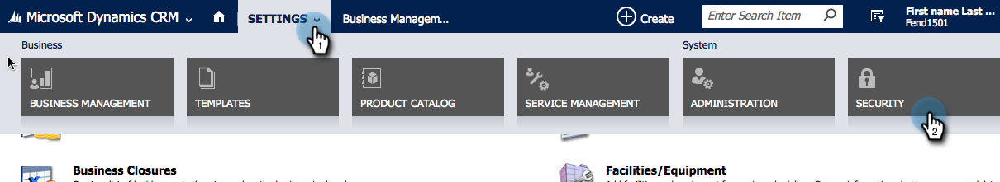

# Installieren und Konfigurieren von Marketo Sales Insight in Microsoft Dynamics Online {#install-and-configure-marketo-sales-insight-in-microsoft-dynamics-online}

Marketo Sales Insight ist ein fantastisches Tool, um Ihrem Vertriebsteam ein &quot;Fenster&quot;zu den umfangreichen Daten zu verschaffen, die das Marketing-Team hat. Hier ist, wie Sie es installieren und konfigurieren in Microsoft Dynamics Online.

>[!PREREQUISITES]
>
>Füllen Sie die [Marketing-Microsoft-Integration](http://docs.marketo.com/x/E4A2) aus.
>
>[Laden Sie die richtige ](http://docs.marketo.com/x/LoJo) Lösung für Ihre Version von Microsoft Dynamics CRM herunter.

## Lösung {#import-solution} importieren

>[!NOTE]
>
>Wenn Sie die einheitliche Oberfläche verwenden, klicken Sie vor Schritt 1 auf das Symbol Einstellungen in der oberen rechten Ecke und wählen Sie **Erweiterte Einstellungen**.

1. Klicken Sie unter Microsoft Dynamics CRM auf **Einstellungen**.

   

1. Klicken Sie unter &quot;EINSTELLUNGEN&quot;auf **Anpassungen**.

   

1. Klicken Sie auf **Lösungen**.

   

   >[!NOTE]
   >
   >**Erinnerung**
   >
   >
   >Sie sollten die Marketing-Lösung bereits installiert und konfiguriert haben, bevor Sie fortfahren.

1. Klicken Sie auf **Import**.

   

1. Klicken Sie im neuen Fenster auf **Durchsuchen**.

   

1. Suchen und installieren Sie auf Ihrem Computer die soeben heruntergeladene Lösung.
1. Klicken Sie auf **Weiter**.

   

1. Die Lösung wird hochgeladen. Sie können den Paketinhalt nach Wunsch Ansicht geben. Klicken Sie auf **Weiter**.

   

1. Vergewissern Sie sich, dass das Kontrollkästchen aktiviert ist und klicken Sie auf **Import**.

   

1. Laden Sie die Protokolldatei herunter und klicken Sie dann auf **Schließen**.

   

1. Fantastisch! Du solltest die Lösung jetzt sehen. Wenn der Bildschirm nicht vorhanden ist, aktualisieren Sie ihn.

   

1. Klicken Sie auf **Anpassung für Veröffentlichungen**.

   >[!NOTE]
   >
   >Stellen Sie sicher, dass die Synchronisierung der globalen MS Dynamics aktiviert ist.

## Connect Marketing and Sales Insight {#connect-marketo-and-sales-insight}

Binden wir Ihre Marketo-Instanz mit Sales Insight in Dynamics zusammen. So geht es:

>[!NOTE]
>
>**Administratorberechtigungen erforderlich**

1. Melden Sie sich bei Marketing an und gehen Sie zum Abschnitt **Admin **s.

   

1. Klicken Sie im Abschnitt Sales Insight auf **API-Konfiguration bearbeiten**.

   

1. Kopieren Sie die **Marketo-Host**, **API-URL** und **API-Benutzer-ID** zur Verwendung in einem späteren Schritt. Geben Sie einen geheimen API-Schlüssel Ihrer Wahl ein und klicken Sie auf **Speichern**.

   >[!CAUTION]
   >
   >Verwenden Sie kein kaufmännisches Und-Zeichen (&amp;) in Ihrem API-geheimen Schlüssel.

   

   >[!NOTE]
   >
   >Die folgenden Felder müssen mit Marketo synchronisiert werden, damit *Lead und Kontakt* funktionieren:
   >
   >    
   >    
   >    * Priorität
   >    * Dringlichkeit
   >    * Relative Bewertung

   >    
   >    
   >Wenn eines dieser Felder fehlt, wird in Marketo eine Fehlermeldung mit dem Namen der fehlenden Felder angezeigt. Um dies zu beheben, führen Sie [dieses Verfahren](../../../../product-docs/marketo-sales-insight/msi-for-microsoft-dynamics/setting-up-and-using/required-fields-for-syncing-marketo-with-dynamics.md) durch.

1. Zurück in Microsoft Dynamics, gehen Sie zu **Einstellungen**.

   

1. Klicken Sie unter **Einstellungen** auf **Marketing-API-Konfiguration**.

   

1. Klicken Sie auf **Neu**.

   

1. Geben Sie die Informationen ein, die Sie zuvor von Marketo erhalten haben, und klicken Sie auf **Speichern**.

   

## Synchronisierung aktivieren {#enable-sync}

1. Klicken Sie in Marketo auf **Admin**.

   

1. Wählen Sie unter Integration **Microsoft Dynamics**.

   

1. Klicken Sie auf **Synchronisierung aktivieren**.

   

1. Klicken Sie auf **Bearbeiten** neben &quot;Feldsynchronisierungsdetails&quot;.

   

1. Hiermit werden die zuvor deaktivierten MSI-Felder *automatisch* ausgewählt (Dringlichkeit, Relative Punktzahl und Priorität). Klicken Sie einfach auf **Speichern**, um die Daten zum Synchronisieren des Beginns zu speichern.

   

## Benutzerzugriff einstellen {#set-user-access}

Schließlich müssen Sie bestimmten Benutzern Zugriff auf Marketo Sales Insight gewähren.

1. Gehen Sie zu **Einstellungen**.

   

1. Gehen Sie zu **Sicherheit**.

   

1. Klicken Sie auf **Benutzer**.

   

1. Wählen Sie die Benutzer aus, denen Sie Zugriff auf Sales Insight gewähren möchten, und klicken Sie auf **Rollen verwalten**.

   

1. Wählen Sie die Rolle &quot;Marketo Sales Insight&quot;und klicken Sie auf **OK**.

   

   Und Sie sollten alle fertig sein! Zum Testen melden Sie sich bei Dynamics als Benutzer an, der Zugriff auf Marketing Sales Insight hat, und sehen Sie sich einen Interessenten oder Kontakt an.

   

>[!NOTE]
>
>**Verwandte Artikel**
>
>[Einrichten von Sternen und Flammen für Lead-/Kontaktdatensätze](http://docs.marketo.com/x/BICMAg)

