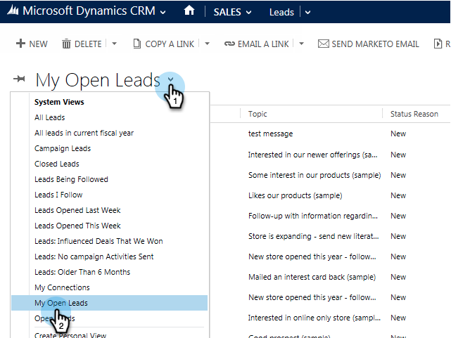

# Hinzufügen eines Leads/Kontakts zu einer Marketo-Kampagne aus [!DNL Microsoft Dynamics] {#add-a-lead-contact-to-a-marketo-campaign-from-microsoft-dynamics}

Sie können Marketo Smart-Kampagnen direkt aus [!DNL Microsoft Dynamics] heraus schnell und einfach Leads/Kontakte hinzufügen. Und so geht das.

1. Rufen Sie [!DNL Dynamics] den Bereich **[!UICONTROL Vertrieb]** auf.

   

1. Ansicht auswählen.

   

1. Einen oder mehrere Leads oder Kontakte auswählen.

   

1. Klicken Sie auf **…** und wählen Sie **[!UICONTROL Zu Marketo Campaign hinzufügen]**.

   

1. Wählen Sie die Marketo-Kampagne aus, der Sie die Leads oder Kontakte hinzufügen möchten, und klicken Sie auf **[!UICONTROL Hinzufügen]**.

   

   >[!NOTE]
   >
   >Damit die Kampagne in der Dropdown-Liste angezeigt wird, verwenden [**beim Einrichten der Kampagne den** Kampagne ist angefordert](/help/marketo/product-docs/core-marketo-concepts/smart-campaigns/using-smart-campaigns/setting-up-a-trigger-smart-campaign-for-sales-using-campaign-is-requested.md)-Trigger mit [!DNL Sales Insight] als Quelle.

Und das sind alles Leute! Sie haben jetzt die Leistungsfähigkeit von Marketo Smart-Kampagnen direkt von [!DNL Dynamics] aus in Ihren Händen.
