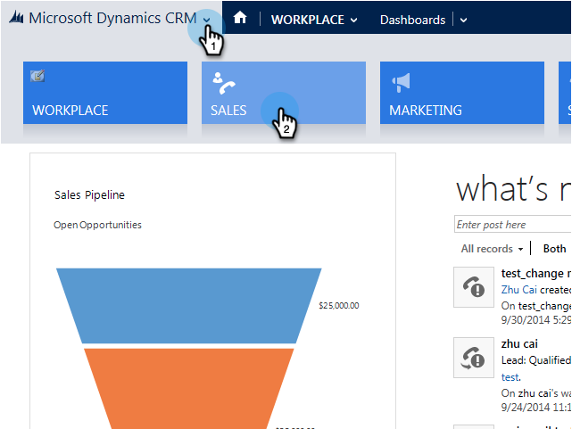

# hinzufügen eines Interessenten/Kontakts zu einer Marketing-Kampagne von Microsoft Dynamics {#add-a-lead-contact-to-a-marketo-campaign-from-microsoft-dynamics}

Mit Microsoft Dynamics können Sie schnell und einfach Leads/Kontakte zu intelligenten Kampagnen hinzufügen. So geht es.

1. In Dynamics gehen Sie zum **Verkaufsbereich** .

   

1. Wählen Sie eine Ansicht aus.

   

1. Wählen Sie einen oder mehrere Kontakte aus.

   

1. Klicken Sie auf** ...** und wählen Sie **Hinzufügen zur Marketo-Kampagne**.

   

1. Wählen Sie die Kampagne Marketo aus, der Sie die Interessenten oder Kontakte hinzufügen möchten, und klicken Sie auf **Hinzufügen**.

   

   >[!NOTE]
   >
   >Damit die Kampagne in der Dropdown-Liste angezeigt wird, verwenden Sie beim Einrichten der Kampagne den Auslöser für die [**Kampagne &quot;Angefordert** &quot;, wobei Sales Insight als Quelle dient](http://docs.marketo.com/pages/viewpage.action?pageId=7514898).

Und das sind alles Leute! Jetzt haben Sie die Kraft von Marketo cleveren Kampagnen direkt von Dynamics.
