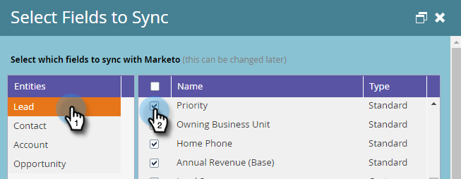

# Erforderliche Felder für die Synchronisierung von Marketo mit Dynamics {#required-fields-for-syncing-marketo-with-dynamics}

Diese Felder *müssen* mit Marketo synchronisiert werden, damit sowohl Lead als auch Contact for Sales Insight funktionieren:

* Priorität
* Dringlichkeit
* Relative Bewertung

Wenn eines dieser Felder fehlt, wird in Marketo eine Fehlermeldung mit dem Namen der fehlenden Felder angezeigt. Um dies zu beheben, überprüfen Sie in Ihrer Instanz, ob die Felder sowohl für **Lead** als auch für **Kontakt** synchronisiert sind. Wenn nicht, fügen Sie sie hinzu.

So können Sie Synchronisierungsfelder überprüfen und hinzufügen.

1. Wechseln Sie zu &quot;Admin&quot;und klicken Sie auf **Microsoft Dynamics**.

   

1. Klicken Sie in den Details zur Feldsynchronisierung auf **Bearbeiten** .

   

1. Aktivieren Sie unter Lead das Kontrollkästchen Priorität .

   

1. Scrollen Sie jetzt nach unten und aktivieren Sie das Kontrollkästchen &quot;Dringlichkeit&quot;...

   

1. ... und das Kontrollkästchen Relative Bewertung .

   

1. Aktivieren Sie als Nächstes die Kontrollkästchen für &quot;Priorität&quot;, &quot;Dringlichkeit&quot;und &quot;Relatives Ergebnis für Kontakt&quot;.

   

1. Klicken Sie auf **Speichern**.

   

>[!NOTE]
>
>Warten Sie mindestens 10 Minuten, bis eine Synchronisation ausgeführt wird, bevor Sie überprüfen, ob Sie das Problem behoben haben.

>[!MORELIKETHIS]
>
>[Einrichten von Sternen und Flammen für Lead-/Kontaktdatensätze](/help/marketo/product-docs/marketo-sales-insight/msi-for-microsoft-dynamics/setting-up-and-using/setting-up-stars-and-flames-for-lead-contact-records.md)
