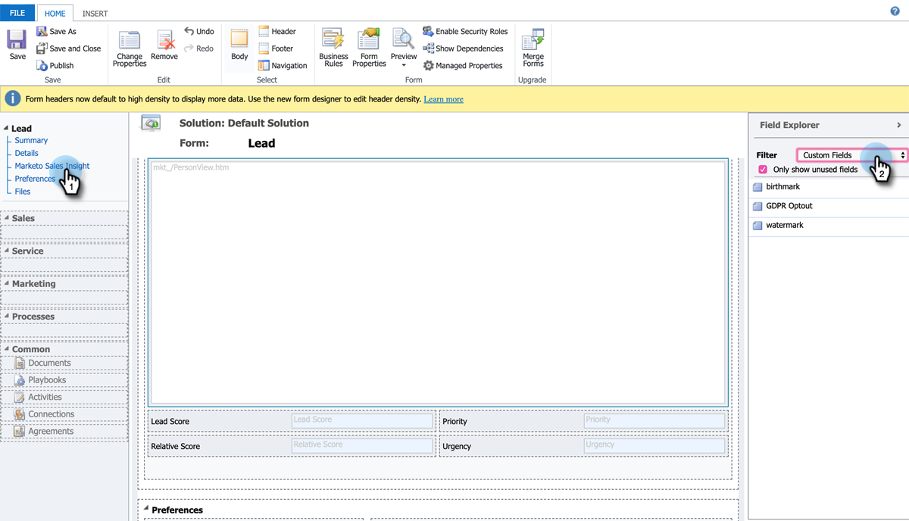

# Einrichten von Sternen und Flammen für Lead-/Kontaktdatensätze {#setting-up-stars-and-flames-for-lead-contact-records}

Sterne und Flammen in Lead-/Kontaktdatensätzen hängen von Folgendem ab: Felder für Lead-Punktzahl, relative Punktzahl, Dringlichkeit und Priorität. Diese Felder sind nach der Installation und Konfiguration der MSI-Lösung standardmäßig verfügbar. Wenn Sie keine Sterne und Flammen haben, hätte eine vorherige Einrichtung/Anpassung dazu führen können, dass sie entfernt wurden. Gehen Sie wie folgt vor, um sie hinzuzufügen.

1. Klicken Sie in Microsoft Dynamics auf das Dropdown-Menü Verkauf und wählen Sie **Einstellungen**. Klicken **Anpassungen**, dann **System anpassen**.

1. Klicken Sie im linken Bereich auf **Entitäten**.

1. Suchen und Klicken **Lead**, dann **Forms** und wählen Sie dann das Formular aus, das Sie bearbeiten möchten.

   

1. Klicken **Marketo Sales Insight** im linken Bereich. Klicken Sie im rechten Bereich auf das Dropdown-Menü Filter und wählen Sie **Benutzerdefinierte Felder**.

   

1. Ziehen Sie Folgendes per Drag-and-Drop in den Arbeitsbereich: Felder für Lead-Punktzahl, relative Punktzahl, Dringlichkeit und Priorität. Ordnen Sie sie so an, dass sie am besten für Sie funktionieren. Sie können auch jedes Feld formatieren, indem Sie darauf doppelklicken.

1. Wenn Sie fertig sind, klicken Sie auf **Speichern und schließen**.
