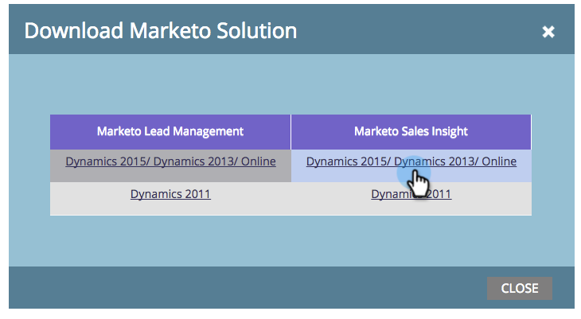

# Aktualisieren Sie die Marketing Sales Insight-Lösung für Microsoft Dynamics. {#update-the-marketo-sales-insight-solution-for-microsoft-dynamics}

Wenn eine neue Microsoft Dynamics-Lösung für Sales Insight veröffentlicht wird, können Sie das Update vom Admin-Bereich in Ihrem Konto herunterladen.

>[!NOTE]
>
>**Administratorberechtigungen erforderlich**

1. Gehen Sie zum **Admin** -Bereich.

   

1. Klicken Sie auf **Microsoft Dynamics**.

   

1. Wählen Sie Marketing- **Lösung** herunterladen.

   

1. Wählen Sie die passende Lösung für Ihre Microsoft Dynamics Version.

   

   Fantastisch! Eine ZIP-Datei der Lösung wird jetzt auf Ihr Gerät heruntergeladen.

