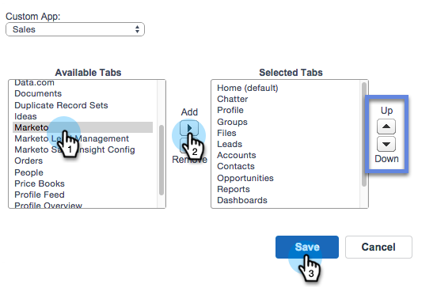

# Hinzufügen der Registerkarte &quot;Marketo&quot; zu Salesforce {#add-marketo-tab-to-salesforce}

1. Klicken Sie in Salesforce auf **+** und dann auf **Meine Registerkarten anpassen**.

   

1. Wählen Sie Marketo in der linken Liste aus. Klicken Sie dann auf **Hinzufügen**, um es zu den **ausgewählten Registerkarten“**.

   >[!TIP]
   >
   >Verwenden Sie die Pfeile **Nach** und **Nach unten**, um Ihre Registerkarten neu anzuordnen.

   

   Und hier ist Ihre Marketo-Registerkarte!

   
