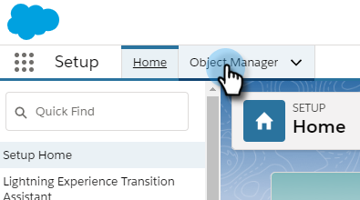

# Massenaktionen beim Salesforce-Blitzen {#bulk-actions-in-salesforce-lightning}

So richten Sie Massenaktionen in Salesforce Lightning ein.

1. Klicken Sie in Salesforce auf das Symbol &quot;Einrichtung&quot;und wählen Sie **Einrichtung** aus.

   

1. Klicken Sie auf die Registerkarte **Objektmanager**.

   

1. Suchen und wählen Sie die Bezeichnung **Lead** aus.

   

1. Klicken Sie auf **Layouts für Salesforce Classic durchsuchen**.

   

   Suchen Sie das Layout Listenansicht . Klicken Sie auf das Dropdown-Menü rechts und wählen Sie **Bearbeiten** aus.

   

1. Wählen Sie unter &quot;Benutzerdefinierte Schaltflächen&quot;die Optionen **Zu Marketo Campaign hinzufügen (Blitzen)** und **Marketo-E-Mail senden (Blitzen)** aus. Klicken Sie auf die Schaltfläche **Hinzufügen** .

   

1. Klicken Sie auf **Speichern**.

   

   In der Lead-Listen-Ansicht können Sie nun die Massen-Aktionsschaltflächen sehen.

   >[!NOTE]
   >
   >Wiederholen Sie die gleichen Schritte, um in der Ansicht &quot;Kontaktliste&quot;Massenaktionen hinzuzufügen.
