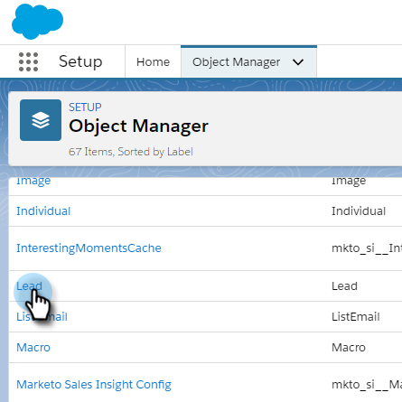

# Massenaktionen in [!DNL Salesforce Lightning] {#bulk-actions-in-salesforce-lightning}

So richten Sie Massenaktionen in [!DNL Salesforce Lightning] ein.

1. Klicken Sie [!DNL Salesforce] auf das Symbol Setup und wählen Sie **[!UICONTROL Setup]** aus.

   

1. Klicken Sie auf die **[!UICONTROL Objekt-Manager]**-Registerkarte.

   

1. Suchen Sie die Beschriftung **[!UICONTROL Lead]** und wählen Sie sie aus.

   

1. Klicken Sie **[!UICONTROL Layouts für Salesforce Classic suchen]**.

   

   Suchen des Layouts der Listenansicht. Klicken Sie auf das Dropdown-Menü rechts und wählen Sie **[!UICONTROL Bearbeiten]**.

   

1. Suchen Sie unter „Benutzerdefinierte Schaltflächen“ nach „Zu Marketo Campaign hinzufügen **[!UICONTROL und wählen Sie diese Option aus]** und **[!UICONTROL E-Mail an Marketo senden (Blitz)]**. Klicken Sie auf die Schaltfläche **[!UICONTROL Hinzufügen]**.

   

1. Klicken Sie auf **[!UICONTROL Speichern]**.

   

   Jetzt können Sie Massenaktionsschaltflächen in Ihrer Lead-Listenansicht sehen.

   >[!NOTE]
   >
   >Wiederholen Sie die gleichen Schritte, um Ihrer Kontaktlistenansicht Massenaktionen hinzuzufügen.
