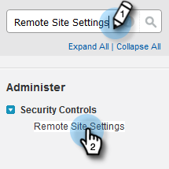

# Konfiguration für bestehende Kundschaft {#configuration-for-existing-customers}

Richten Sie die folgende Konfiguration ein, um mit der Verwendung des neuen Insights-Dashboards zu beginnen.

>[!PREREQUISITES]
>
>Stellen Sie sicher, dass Sie Ihr [!DNL Salesforce] auf die neueste Version aktualisiert haben

## Konfigurieren von [!DNL Sales Insight] in Marketo {#configure-sales-insight-in-marketo}

1. Öffnen Sie eine neue Registerkarte in Ihrem Browser, um die [!DNL Marketo Sales Insights] Anmeldeinformationen von Ihrem Marketo-Konto abzurufen.

1. Navigieren Sie zum Bereich **[!UICONTROL Admin]**.

   

1. Klicken Sie **[!UICONTROL Sales Insight]**.

   

1. Klicken Sie auf **[!UICONTROL Anzeigen]**, um die REST-API-Anmeldeinformationen zu füllen.

   

1. Es wird ein Bestätigungs-Popup angezeigt. Klicken Sie auf **[!UICONTROL OK]**.

## Konfigurieren von [!DNL Sales Insight] in [!DNL Salesforce] {#configure-sales-insight-in-salesforce}

1. Klicken Sie in Salesforce auf **[!UICONTROL Setup]**.

   

1. Suchen Sie nach **[!UICONTROL Remotestandorteinstellungen]** und wählen Sie sie aus.

   

1. Klicken Sie auf **[!UICONTROL Neue Remote-Site]**.

   

1. Geben Sie den [!UICONTROL Namen der Remote-Site] (dies kann z. B. „MarketoRestAPI“ sein) und die [!UICONTROL Remote-Site-URL] (Ihre API-URL aus dem Bedienfeld „REST-API-Konfiguration“ in Marketo) ein.

   

1. Klicken Sie auf **[!UICONTROL Speichern]**.

   

   Sie haben jetzt die Remote-Site-Einstellung für die Rest-API erstellt.

## Auf Marketo Sales Insight zugreifen {#access-marketo-sales-insight}

1. Kopieren Sie die Anmeldeinformationen aus dem REST-API-Bedienfeld auf [!DNL Marketo’s Sales Insight] Admin-Seite. Fügen Sie sie in den Abschnitt REST-API auf der Seite [!DNL Sales Insight]-Konfiguration von Salesforce ein.

1. Geben Sie den [!UICONTROL API-Geheimschlüssel] ein.

   
