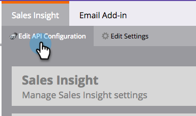

# Konfigurieren von Marketo Sales Insight in Salesforce Enterprise/Unlimited {#configure-marketo-sales-insight-in-salesforce-enterprise-unlimited}

Im Folgenden finden Sie die Schritte, die Sie zur Konfiguration von Marketo Sales Insight in Salesforce Enterprise/Unlimited Editions durchführen müssen. Fangen wir an!

>[!PREREQUISITES]
>
>* [Installieren des Marketo Sales Insight-Pakets in Salesforce AppExchange](/help/marketo/product-docs/marketo-sales-insight/msi-for-salesforce/installation/install-marketo-sales-insight-package-in-salesforce-appexchange.md)

>[!NOTE]
**Erforderliche Administratorberechtigungen**

## Konfigurieren von Sales Insight in Marketo {#configure-sales-insight-in-marketo}

1. Öffnen Sie ein neues Browserfenster, um die Marketo Sales Insight-Anmeldedaten von Ihrem Marketo-Konto abzurufen.

1. Gehen Sie zum Admin-Bereich und wählen Sie **Sales Insight** aus.

   

1. Klicken Sie auf **API-Konfiguration bearbeiten**.

   

1. Geben Sie einen API-Geheimschlüssel Ihrer Wahl ein und klicken Sie auf **Speichern**. Verwenden Sie KEIN kaufmännisches Und-Zeichen (&amp;) in Ihrem API-geheimen Schlüssel.

   

   >[!NOTE]
   Ihr API-Geheimschlüssel ist wie ein Kennwort für Ihre Organisation und sollte sicher sein.

1. Klicken Sie im Bedienfeld Rest-API-Konfiguration auf **Ansicht** , um die Anmeldeinformationen auszufüllen.

   

1. Es wird ein Bestätigungs-Popup angezeigt. Klicken Sie auf **OK**.

   

## Sales Insight in Salesforce konfigurieren {#configure-sales-insight-in-salesforce}

1. Klicken Sie in Salesforce auf **Setup**.

   

1. Suchen Sie nach &quot;Remote-Site&quot;und wählen Sie **Remote-Site-Einstellungen** aus.

   

1. Klicken Sie auf **Neue Remote-Site**.

   

1. Geben Sie den Remote-Site-Namen ein (z. B. &quot;MarketoSoapAPI&quot;). Geben Sie die Remote-Site-URL ein, die Ihre Marketo-Host-URL im Bedienfeld Soap-API-Konfiguration in Marketo ist. Klicken Sie auf **Save**. Sie haben jetzt Remote-Site-Einstellungen für die Soap-API erstellt.

   

1. Klicken Sie erneut auf **Neue Remote-Site** .

   

1. Geben Sie den Remote-Site-Namen ein (z. B. &quot;MarketoRestAPI&quot;). Geben Sie die Remote-Site-URL ein, die Ihre API-URL aus dem Bedienfeld REST-API-Konfiguration in Marketo ist. Klicken Sie auf **Save**. Sie haben jetzt Remote-Site-Einstellungen für die Rest-API erstellt.

## Einrichten von Marketo Sales Insight {#set-up-marketo-sales-insight}

1. Melden Sie sich bei Ihrer Marketo-Instanz an und klicken Sie auf **Admin**.

   

1. Klicken Sie auf **Sales Insight**.

   

1. Klicken Sie auf **API-Konfiguration bearbeiten**.

   

1. Geben Sie einen **API-Geheimschlüssel** ein und klicken Sie auf **Speichern**.

   >[!CAUTION]
   Verwenden Sie kein kaufmännisches Und-Zeichen (&amp;) in Ihrem API-geheimen Schlüssel.

   

   >[!TIP]
   Lassen Sie dieses Fenster geöffnet. Sie werden diese Informationen später in Salesforce benötigen.

1. Gehen Sie zurück zu Salesforce und klicken Sie auf **Setup**.

   

1. Suchen Sie nach &quot;Remote site&quot;und klicken Sie unter **Sicherheitskontrollen** auf **Remote Site Setting**.

   

1. Klicken Sie auf **Neue Remote-Site**.

   

1. Geben Sie **Remote Site Name** und **Remote Site URL** ein und klicken Sie dann auf **Speichern**.

   

   >[!NOTE]
   Sie wählen **Remote Site Name** (hier wird die MarketoAPI verwendet). Die **Remote-Site-URL** finden Sie im Feld Marketo-Host des Dialogfelds &quot;API-Konfiguration bearbeiten&quot;in Schritt 4.

## Seitenlayouts anpassen {#customize-page-layouts}

1. Klicken Sie auf **Setup**.

   

1. Suchen Sie nach &quot;Seitenlayout&quot;und wählen Sie **Seitenlayout** unter **Leads** aus.

   

1. Klicken Sie links auf **Visualforce-Seiten**. Ziehen Sie **Abschnitt** in das Layout unter dem Abschnitt Benutzerspezifische Links .

   

1. Geben Sie &quot;Marketo Sales Insight&quot;als **Abschnittsname** ein. Wählen Sie **1-Column** und klicken Sie auf **OK**.

   

1. Ziehen Sie **Lead** in den neuen Abschnitt.

   

   >[!TIP]
   Der Name dieses Felds ändert sich je nach Objekttyp. Wenn Sie beispielsweise das Seitenlayout für Kontakte ändern, wird &quot;Kontakt&quot;angezeigt.

1. Doppelklicken Sie auf den soeben hinzugefügten Block **Lead**.

   

1. Bearbeiten Sie die Höhe in **450** Pixel und klicken Sie auf **OK**.

   

   >[!TIP]
   Es wird empfohlen, eine Höhe von 410 Pixel für die Objekte &quot;Konten und Chancen&quot;zu verwenden.

1. Klicken Sie links auf **Felder** . Suchen Sie dann die Beschriftung **Interaktion** und ziehen Sie sie in das Layout **Marketo Sales Insight**.

   

1. Wiederholen Sie den obigen Schritt auch für diese Felder.

   <table> 
    <tbody> 
     <tr> 
      <td colspan="1">Engagement</td> 
     </tr> 
     <tr> 
      <td colspan="1" rowspan="1">
Wert für Relativergebnis
</td> 
     </tr> 
     <tr> 
      <td colspan="1" rowspan="1">
Wert für Wichtigkeit
</td> 
     </tr> 
     <tr> 
      <td colspan="1" rowspan="1">
Datum des letzten interessanten Moments
</td> 
     </tr> 
     <tr> 
      <td colspan="1" rowspan="1">
Beschreibung des letzten interessanten Moments
</td> 
     </tr> 
     <tr> 
      <td colspan="1" rowspan="1">
Quelle des letzten interessanten Moments
</td> 
     </tr> 
     <tr> 
      <td colspan="1" rowspan="1">
Typ des letzten interessanten Moments
</td> 
     </tr> 
    </tbody> 
   </table>

1. Klicken Sie zum Abschluss auf **Speichern** .

   

1. Wiederholen Sie diesen Vorgang, um Visualforce-Seitenabschnitte und Sales Insight-Felder für **Contact**, **Account** und **Opportunity** hinzuzufügen.

1. Wiederholen Sie die Schritte 5 bis 7, um die Visualforce-Seitenabschnitte für Kontakt, Konto und Chancen hinzuzufügen. Wiederholen Sie dann die Schritte 8-10, um Sales Insight-Felder für **Contact** hinzuzufügen. Speichern Sie nach jeder Änderung unbedingt.

## Benutzerdefinierte Personenfelder zuordnen {#map-custom-person-fields}

Marketo-Personenfelder müssen Salesforce-Kontaktfeldern zugeordnet werden, um sicherzustellen, dass die Konvertierung ordnungsgemäß funktioniert. So geht es.

1. Klicken Sie auf **Setup**.

   

1. Suchen Sie in der Suchleiste nach &quot;fields&quot; und klicken Sie unter **Leads** auf **Felder** .

   

1. Klicken Sie auf **Lead-Felder zuordnen**.

   

1. Klicken Sie rechts neben **Interaktion** auf das Dropdown-Menü.

   

1. Wählen Sie **Contact.Engagement** in der Liste aus.

   

1. Wiederholen Sie diese Schritte und ordnen Sie sie zu.

   <table> 
    <tbody> 
     <tr> 
      <th colspan="1" rowspan="1">Benutzerdefiniertes Feld für Marketo-Person</th> 
      <th colspan="1" rowspan="1">Salesforce Contact Custom Field</th> 
     </tr> 
     <tr> 
      <td colspan="1" rowspan="1">
Interaktion
</td> 
      <td colspan="1" rowspan="1">
Contact.Engagement
</td> 
     </tr> 
     <tr> 
      <td colspan="1" rowspan="1">
Wert für Relativergebnis
</td> 
      <td colspan="1" rowspan="1">
Contact.Relativer Score-Wert
</td> 
     </tr> 
     <tr> 
      <td colspan="1" rowspan="1">
Wert für Wichtigkeit
</td> 
      <td colspan="1" rowspan="1">
Contact.Urgency value
</td> 
     </tr> 
     <tr> 
      <td colspan="1" rowspan="1">
Datum des letzten interessanten Moments
</td> 
      <td colspan="1" rowspan="1">
Contact.Last Interest-Zeitpunkt
</td> 
     </tr> 
     <tr> 
      <td colspan="1" rowspan="1">
Beschreibung des letzten interessanten Moments
</td> 
      <td colspan="1" rowspan="1">
Contact.Last Interest Moment Desc
</td> 
     </tr> 
     <tr> 
      <td colspan="1" rowspan="1">
Quelle des letzten interessanten Moments
</td> 
      <td colspan="1" rowspan="1">
Contact.Last Interest Moment Source
</td> 
     </tr> 
     <tr> 
      <td colspan="1" rowspan="1">
Typ des letzten interessanten Moments
</td> 
      <td colspan="1" rowspan="1">
Contact.Last Interest-Moment-Typ
</td> 
     </tr> 
    </tbody> 
   </table>

1. Klicken Sie auf **Speichern** , wenn Sie fertig sind.

## Marketo Sales Insight-Konfig. {#marketo-sales-insight-config}

1. Klicken Sie auf **+** und wählen Sie dann **Marketo Sales Insight Config** aus.

   

1. Aktivieren Sie **Marketo API** aktivieren. Füllen Sie dann die [API-Konfigurationsinformationen in Marketo Admin](#set-up-marketo-sales-insight) aus. Klicken Sie auf **Save Changes** , wenn Sie fertig sind.

   

   >[!NOTE]
   Wenn der Diagnosetest fehlgeschlagen ist, müssen Sie möglicherweise [Ihrem Seitenlayout ](https://nation.marketo.com/docs/DOC-1115) weitere Felder hinzufügen.

Und das ist es! Sie sollten die Marketo Sales Insight -Felder für Leads, Kontakte, Konten und Chancen sehen können.

>[!NOTE]
Bei Konten umfasst Sales Insight alle E-Mails, jedoch nur die neuesten interessanten Momente, Web-Aktivitäten und Bewertungsänderungen.

## Auf Marketo Sales Insight zugreifen {#access-marketo-sales-insight}

1. Klicken Sie in Salesforce am Ende der Registerkartenleiste auf **+** und klicken Sie auf **Marketo Sales Insight Config**.

1. Aktivieren Sie das Kontrollkästchen **Marketo API** aktivieren .

1. Kopieren Sie die Anmeldeinformationen aus dem Bedienfeld Soap API auf der Marketo Sales Insight-Admin-Seite und fügen Sie sie in den Abschnitt Soap API der Salesforce Sales Insight-Konfigurationsseite ein.

1. Kopieren Sie die Anmeldeinformationen aus dem Bedienfeld &quot;Rest-API&quot;auf der Admin-Seite von Marketo Sales Insight und fügen Sie sie in den Abschnitt &quot;Rest-API&quot;der Salesforce Sales Insight-Konfigurationsseite ein.

   

>[!MORELIKETHIS]
* [Priorität, Dringlichkeit, relatives Ergebnis und beste Beta](/help/marketo/product-docs/marketo-sales-insight/msi-for-salesforce/features/stars-and-flames/priority-urgency-relative-score-and-best-bets.md)
* [Hinzufügen der Registerkarte &quot;Marketo Sales Insight&quot;und der Schaltflächen zu Salesforce](/help/marketo/product-docs/marketo-sales-insight/msi-for-salesforce/features/bulk-actions/add-marketo-sales-insight-tab-and-buttons-to-salesforce.md)
* [Einrichten von Sales Insight für Ihr Team](/help/marketo/product-docs/marketo-sales-insight/msi-for-salesforce/configuration/setting-up-sales-insight-for-your-team.md)

