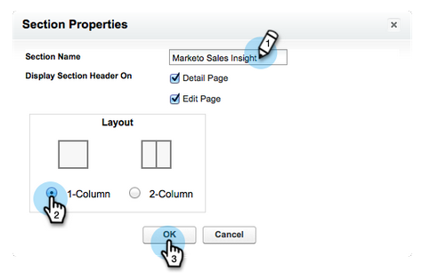

# Konfigurieren von [!DNL Marketo Sales Insight] in [!DNL Salesforce] Enterprise/Unlimited {#configure-marketo-sales-insight-in-salesforce-enterprise-unlimited}

Konfigurieren Sie Marketo Sales Insight in Salesforce Enterprise/Unlimited Editions, indem Sie die folgenden Schritte ausführen.

>[!PREREQUISITES]
>
>[install [!DNL Marketo Sales Insight] package in [!DNL Salesforce] AppExchange](/help/marketo/product-docs/marketo-sales-insight/msi-for-salesforce/installation/install-marketo-sales-insight-package-in-salesforce-appexchange.md)

>[!NOTE]
>
>**Administratorberechtigungen sind erforderlich.**

## Konfigurieren von Sales Insight in Marketo Engage {#configure-sales-insight-in-marketo}

1. Um Ihre Marketo Sales Insight-Anmeldedaten in Marketo Engage zu erhalten, gehen Sie zum Bereich **[!UICONTROL Admin]** und wählen Sie **[!UICONTROL Sales Insight]** aus.

   

1. Klicken Sie **[!UICONTROL API-Konfiguration bearbeiten]**.

   

1. Geben Sie einen beliebigen API-Geheimschlüssel ein und klicken Sie auf **[!UICONTROL Speichern]**. Verwenden Sie KEIN kaufmännisches Und-Zeichen (`&`) in Ihrem API-Geheimschlüssel.

   

   >[!NOTE]
   >
   >Ihr API-Geheimschlüssel ist wie ein Kennwort für Ihre Organisation und sollte sicher sein.

1. Klicken Sie zum Ausfüllen der Anmeldeinformationen auf **[!UICONTROL Anzeigen]** im Bedienfeld _[!UICONTROL REST-API-Konfiguration]_.

   

1. Wenn Sie ein Bestätigungsdialogfeld sehen, klicken Sie auf **[!UICONTROL OK]**.

   

   >[!TIP]
   >
   >Lassen Sie dieses Fenster offen! Sie benötigen diese Informationen später zur Konfiguration von Salesforce.

## Konfigurieren von [!DNL Sales Insight] in [!DNL Salesforce] {#configure-sales-insight-in-salesforce}

1. Klicken Sie in Salesforce auf **[!UICONTROL Setup]**.

   

1. Suchen Sie nach „Remote Site“ und wählen Sie **[!UICONTROL Remote Site Settings]**.

   

1. Klicken Sie auf **[!UICONTROL Neue Remote-Site]**.

   

1. Geben Sie den Namen der Remote-Site ein (dies kann `MarketoSoapAPI` ähneln). Geben Sie die Remote-Site-URL, d. h. Ihre Marketo-Host-URL, über das Bedienfeld _[!UICONTROL SOAP-API-Konfiguration]_ in Marketo Engage ein. Klicken Sie auf **[!UICONTROL Speichern]**. Sie haben jetzt Remote-Site-Einstellungen für die SOAP-API erstellt.

   

1. Klicken Sie erneut **[!UICONTROL Neue Remote-Site]**.

   

1. Geben Sie den Namen der Remote-Site ein (dies kann `MarketoAPI` ähneln). Geben Sie die Remote-Site-URL ein. Dies ist Ihre API-URL aus dem Bedienfeld _[!UICONTROL REST-API-Konfiguration]_ in Marketo Engage. Klicken Sie auf **[!UICONTROL Speichern]**. Sie haben jetzt Remote-Site-Einstellungen für die Rest-API erstellt.

   >[!NOTE]
   >
   >_Sie_ wählen Ihren **[!UICONTROL Remote-Standortnamen]** (`MarketoAPI` wird hier verwendet). Die **[!UICONTROL Remote-Site-URL]** finden Sie im Feld &quot;Marketo-Host“ im Dialogfeld „API-Konfiguration bearbeiten“ in Schritt 3 im Abschnitt „Konfigurieren von Sales Insight in Marketo&quot;.

## Gewähren des Profilzugriffs für Sales Insight-Benutzer auf standardmäßige Salesforce-Objekte {#grant-sales-insight-users-profile-access}

Aufgrund der Salesforce-Sicherheitsverbesserungen können AppExchange-Pakete keine Berechtigungen mehr für Standardobjekte erteilen, und der Zugriff auf die entsprechenden Salesforce-Objekte muss über das Benutzerprofil von Salesforce gewährt werden. Gehen Sie wie folgt vor, um die erforderlichen Berechtigungen zu gewähren.

1. Klicken Sie **[!UICONTROL Setup]**.

1. Suchen Sie in der Schnellsuche nach „Profile“.

1. Klicken Sie **[!UICONTROL Bearbeiten]** neben dem Profil, das Ihre Salesforce-Benutzenden verwenden.

1. Aktivieren _[!UICONTROL im Abschnitt]_ Standardobjektberechtigung“ den **[!UICONTROL Lese]**-Zugriff für die folgenden Objekte: [!UICONTROL Lead], [!UICONTROL Kontakt], [!UICONTROL Konto] und [!UICONTROL Opportunity].

1. Klicken Sie auf **[!UICONTROL Speichern]**.

## Seiten-Layouts anpassen {#customize-page-layouts}

1. Klicken Sie **[!UICONTROL Setup]**.

   

1. Suchen Sie nach „Seiten-Layout“ und wählen Sie **[!UICONTROL Seiten-Layout]** unter **[!UICONTROL Leads]**.

   

1. Klicken **[!UICONTROL links auf]** VisualForce-Seiten“. Ziehen Sie **[!UICONTROL Abschnitt]** in das Layout unter dem Abschnitt _[!UICONTROL Benutzerdefinierte Links]_ .

   

1. Geben Sie &quot;Marketo Sales Insight&quot; als **[!UICONTROL Abschnittsname]** ein, wählen Sie **[!UICONTROL 1-Column]** und klicken Sie auf **[!UICONTROL OK]**.

   

1. Ziehen Sie **[!UICONTROL Lead]** per Drag-and-Drop in den neuen Abschnitt.

   

   >[!TIP]
   >
   >Der Name dieses Feldes ändert sich je nach Objekttyp. Wenn Sie beispielsweise das Seiten-Layout für Kontakte ändern, wird Kontakt angezeigt.

1. Doppelklicken Sie auf den **[!UICONTROL Lead]**-Block, den Sie soeben hinzugefügt haben.

   

1. Bearbeiten Sie die Höhe auf **450** Pixel und klicken Sie auf **[!UICONTROL OK]**.

   

   >[!NOTE]
   >
   >Aktivieren Sie **[!UICONTROL Bildlaufleisten anzeigen]**, wenn Sie Zugriff auf Bildlaufaktivitäten benötigen.

   >[!TIP]
   >
   >Die empfohlene Höhe für die Objekte Accounts und Opportunities beträgt 410 Pixel.

1. Klicken Sie **[!UICONTROL der linken]** auf „Felder“. Suchen Sie dann die Beschriftung **[!UICONTROL Dringlichkeit]** und ziehen Sie sie in das Layout **[!UICONTROL Marketo Sales Insight]**.

   

1. Wiederholen Sie den obigen Schritt auch für diese Felder.

   * Letzter interessanter Moment
   * Datum des letzten interessanten Moments
   * Beschreibung des letzten interessanten Moments
   * Quelle des letzten interessanten Moments
   * Typ des letzten interessanten Moments
   * Letzte Aktivität nach Verkauf
   * Letzte Interaktion nach Verkauf
   * MSI-Kontakt-ID
   * Relative Bewertung
   * Wert für Relativergebnis
   * Dringlichkeit
   * Wert für Wichtigkeit
   * In Marketo anzeigen

1. Klicken Sie **[!UICONTROL Speichern]** wenn Sie fertig sind.

   

1. Insight Wiederholen Sie die Schritte 5 bis 7, um die Seitenbereiche von VisualForce und die Felder für **[!UICONTROL Kontakt]**, **[!UICONTROL Konto]** und **[!UICONTROL Opportunity]** hinzuzufügen.

1. Wiederholen Sie die Schritte 8 bis 10, um diese Insight-Felder für den Vertrieb (**[!UICONTROL )]**. Denken Sie daran, alle Änderungen zu speichern.

   * Letzter interessanter Moment
   * Datum des letzten interessanten Moments
   * [!UICONTROL Beschreibung des letzten interessanten Moments]
   * [!UICONTROL Last Interesting Moment Source]
   * [!UICONTROL Typ des letzten interessanten Moments]
   * [!UICONTROL Letzte Marketo-Aktivität nach Vertrieb]
   * [!UICONTROL Letzte Marketo-Interaktion nach Vertrieb]
   * [!UICONTROL MKTO Lead Score]
   * [!UICONTROL Relative Punktzahl]
   * [!UICONTROL Relativer Score-Wert]
   * [!UICONTROL Sales Insight] - Öffnet die Seite mit der vollständigen Kontaktliste
   * [!UICONTROL Dringlichkeit]
   * [!UICONTROL Dringlichkeitswert]

## Benutzerdefinierte Personenfelder zuordnen {#map-custom-person-fields}

Personenfelder für Marketo müssen den Salesforce-Kontaktfeldern zugeordnet werden, um sicherzustellen, dass die Konvertierung ordnungsgemäß funktioniert. Führen Sie die folgenden Schritte aus, um sie zuzuordnen.

1. Klicken Sie **[!UICONTROL Setup]**.

   

1. Suchen Sie in der Suchleiste nach „fields“ und klicken Sie unter **[!UICONTROL Leads]** auf **[!UICONTROL Fields]**.

   

1. Klicken Sie **[!UICONTROL Lead-Felder zuordnen]**.

   

1. Klicken Sie auf das Dropdown-Menü auf der rechten Seite für **[!UICONTROL Interaktion]**.

   

1. Wählen **[!UICONTROL Kontakt.Interaktion]** in der Liste aus.

   

1. Wiederholen Sie diese Felder und ordnen Sie sie ebenfalls zu.

   | Benutzerdefiniertes Feld für Marketo-Person | Benutzerdefiniertes Salesforce-Kontaktfeld |
   |--- |--- |
   | `Engagement` | `Contact.Engagement` |
   | `Relative Score Value` | `Contact.Relative Score Value` |
   | `Urgency Value` | `Contact.Urgency Value` |
   | `Last Interesting Moment Date` | `Contact.Last Interesting Moment Date` |
   | `Last Interesting Moment Desc` | `Contact.Last Interesting Moment Desc` |
   | `Last Interesting Moment Source` | `Contact.Last Interesting Moment Source` |
   | `Last Interesting Moment Type` | `Contact.Last Interesting Moment Type` |

1. Klicken **[!UICONTROL abschließend]** Speichern“.

## Registerkarte Marketo Sales Insight-Konfiguration {#marketo-sales-insight-configuration-tab}

1. Klicken Sie in Salesforce auf das **+** am Ende der Registerkartenleiste und dann auf **[!UICONTROL Marketo Sales Insight Config]**.

1. Kopieren Sie die Anmeldeinformationen aus dem SOAP-API-Bedienfeld in der Admin-Seite von Marketo [0} Sales Insight und fügen Sie sie im Abschnitt SOAP-API der Seite ](/help/marketo/product-docs/marketo-sales-insight/msi-for-salesforce/configuration/configure-marketo-sales-insight-in-salesforce-professional-edition.md#set-up-marketo-sales-insight){target="_blank"} [!DNL Salesforce] ein.[!DNL Sales Insight]

1. Kopieren Sie die Anmeldeinformationen aus dem REST-API-Bedienfeld in der Admin-[ von Marketo Sales Insight und fügen Sie sie im Abschnitt REST-API der Seite ](/help/marketo/product-docs/marketo-sales-insight/msi-for-salesforce/configuration/configure-marketo-sales-insight-in-salesforce-professional-edition.md#set-up-marketo-sales-insight){target="_blank"} [!DNL Salesforce] ein.[!DNL Sales Insight]

   

Sie sollten die Marketo Sales Insight-Felder für Leads, Kontakte, Konten und Opportunities sehen können.

>[!NOTE]
>
>Wenn der Diagnosetest fehlgeschlagen ist, kann [ Problem möglicherweise durch Hinzufügen weiterer Felder ](https://nation.marketo.com:443/t5/knowledgebase/how-to-repair-marketo-sales-insight-setup-configuration-problems/ta-p/248218){target="_blank"} Seiten-Layout behoben werden.

>[!NOTE]
>
>Bei Accounts umfasst Sales Insight alle E-Mails, aber nur die interessantesten Momente, Web-Aktivitäten und Bewertungsänderungen.

>[!MORELIKETHIS]
>
>* [Priorität, Dringlichkeit, relative Punktzahl und Best Bets](/help/marketo/product-docs/marketo-sales-insight/msi-for-salesforce/features/stars-and-flames/priority-urgency-relative-score-and-best-bets.md)
>* [Registerkarte &quot;Marketo hinzufügen“ zu [!DNL Salesforce]](/help/marketo/product-docs/marketo-sales-insight/msi-for-salesforce/configuration/add-marketo-tab-to-salesforce.md)
>* [Hinzufügen von Sales Insight-Zugriff zu Profilen](/help/marketo/product-docs/marketo-sales-insight/msi-for-salesforce/configuration/add-sales-insight-access-to-profiles.md){target="_blank"}
