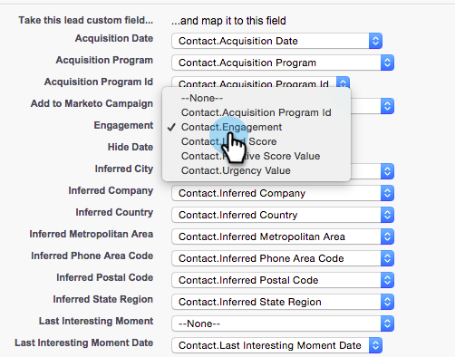

# Konfigurieren von Marketo Sales Insight in Salesforce Enterprise/Unlimited {#configure-marketo-sales-insight-in-salesforce-enterprise-unlimited}

Im Folgenden finden Sie die Schritte, die Sie zur Konfiguration von Marketo Sales Insight in Salesforce Enterprise/Unlimited Editions durchführen müssen. Fangen wir an!

>[!PREREQUISITES]
>
>* [Installieren des Marketo Sales Insight-Pakets in Salesforce AppExchange](/help/marketo/product-docs/marketo-sales-insight/msi-for-salesforce/installation/install-marketo-sales-insight-package-in-salesforce-appexchange.md)

>[!NOTE]
>
>**Erforderliche Administratorberechtigungen**

## Konfigurieren von Sales Insight in Marketo {#configure-sales-insight-in-marketo}

1. Erhalten Sie Ihre MSI-Anmeldeinformationen in Marketo. Navigieren Sie zum Admin-Bereich und wählen Sie **Sales Insight**.

   

1. Klicken **API-Konfiguration bearbeiten**.

   

1. Geben Sie einen geheimen API-Schlüssel Ihrer Wahl ein und klicken Sie auf **Speichern**. Verwenden Sie KEIN kaufmännisches Und-Zeichen (&amp;) in Ihrem API-geheimen Schlüssel.

   

   >[!NOTE]
   >
   >Ihr API-Geheimschlüssel ist wie ein Kennwort für Ihre Organisation und sollte sicher sein.

1. Klicken **Ansicht** im Bedienfeld Rest-API-Konfiguration , um die Anmeldeinformationen zu füllen.

   

1. Es wird ein Bestätigungs-Popup angezeigt. Klicken **OK**.

   

   >[!TIP]
   >
   >Lassen Sie dieses Fenster geöffnet. Sie werden diese Informationen später in Salesforce benötigen.

## Sales Insight in Salesforce konfigurieren {#configure-sales-insight-in-salesforce}

1. Klicken Sie in Salesforce auf **Einrichtung**.

   

1. Suchen Sie nach &quot;Remote-Site&quot;und wählen Sie **Remote Site Settings**.

   

1. Klicken **Neue Remote-Site**.

   

1. Geben Sie den Remote-Site-Namen ein (z. B. &quot;MarketoSoapAPI&quot;). Geben Sie die Remote-Site-URL ein, die Ihre Marketo-Host-URL im Bedienfeld Soap-API-Konfiguration in Marketo ist. Klicken **Speichern**. Sie haben jetzt Remote-Site-Einstellungen für die Soap-API erstellt.

   

1. Klicken **Neue Remote-Site** erneut.

   

1. Geben Sie den Remote-Site-Namen ein (z. B. &quot;MarketoAPI&quot;). Geben Sie die Remote-Site-URL ein, die Ihre API-URL aus dem Bedienfeld REST-API-Konfiguration in Marketo ist. Klicken **Speichern**. Sie haben jetzt Remote-Site-Einstellungen für die Rest-API erstellt.

   >[!NOTE]
   >
   >_You_ Wählen Sie Ihre **Remote Site Name** (MarketoAPI wird hier verwendet). Die **Remote Site URL** finden Sie im Feld Marketo-Host des Dialogfelds &quot;API-Konfiguration bearbeiten&quot;in Schritt 3 im Abschnitt &quot;Configure Sales Insight in Marketo&quot;.

## Seitenlayouts anpassen {#customize-page-layouts}

1. Klicken **Einrichtung**.

   

1. Suchen Sie nach &quot;Seitenlayout&quot;und wählen Sie die **Seitenlayout** under **Leads**.

   

1. Klicken **Visualforce-Seiten** auf der linken Seite. Ziehen **Abschnitt** zum Layout unter dem Abschnitt &quot;Benutzerspezifische Links&quot;.

   

1. Geben Sie &quot;Marketo Sales Insight&quot;als **Bereichsname**. Auswählen **1-Spalte** und klicken Sie auf **OK**.

   

1. Drag &amp; Drop **Lead** in den neuen Abschnitt ein.

   

   >[!TIP]
   >
   >Der Name dieses Felds ändert sich je nach Objekttyp. Wenn Sie beispielsweise das Seitenlayout für Kontakte ändern, wird &quot;Kontakt&quot;angezeigt.

1. Doppelklicken Sie auf die **Lead** -Block, den Sie gerade hinzugefügt haben.

   

1. Höhe bearbeiten auf **450** Pixel und klicken Sie auf **OK**.

   

   >[!TIP]
   >
   >Es wird empfohlen, eine Höhe von 410 Pixel für die Objekte &quot;Konten und Chancen&quot;zu verwenden.

1. Klicken Sie auf **Felder** auf der linken Seite. Suchen und ziehen Sie dann die **Interaktion** in die **Marketo Sales Insight** Layout.

   

1. Wiederholen Sie den obigen Schritt auch für diese Felder.

   <table> 
    <tbody> 
     <tr> 
      <td colspan="1">Engagement</td> 
     </tr> 
     <tr> 
      <td colspan="1" rowspan="1">
Wert für Relativergebnis
</td> 
     </tr> 
     <tr> 
      <td colspan="1" rowspan="1">
Wert für Wichtigkeit
</td> 
     </tr> 
     <tr> 
      <td colspan="1" rowspan="1">
Datum des letzten interessanten Moments
</td> 
     </tr> 
     <tr> 
      <td colspan="1" rowspan="1">
Beschreibung des letzten interessanten Moments
</td> 
     </tr> 
     <tr> 
      <td colspan="1" rowspan="1">
Quelle des letzten interessanten Moments
</td> 
     </tr> 
     <tr> 
      <td colspan="1" rowspan="1">
Typ des letzten interessanten Moments
</td> 
     </tr> 
    </tbody> 
   </table>

1. Klicken **Speichern** wenn fertig.

   

1. Wiederholen Sie diesen Vorgang, um VisualForce-Seitenabschnitte und Sales Insight-Felder für hinzuzufügen. **Kontakt**, **Konto** und **Chancen**.

1. Wiederholen Sie die Schritte 5 bis 7, um die Visualforce-Seitenabschnitte für Kontakt, Konto und Chancen hinzuzufügen. Wiederholen Sie dann die Schritte 8 bis 10, um Sales Insight-Felder für hinzuzufügen. **Kontakt**. Speichern Sie nach jeder Änderung unbedingt.

## Benutzerdefinierte Personenfelder zuordnen {#map-custom-person-fields}

Marketo-Personenfelder müssen Salesforce-Kontaktfeldern zugeordnet werden, um sicherzustellen, dass die Konvertierung ordnungsgemäß funktioniert. So geht es.

1. Klicken **Einrichtung**.

   

1. Suchen Sie in der Suchleiste nach &quot;fields&quot;und klicken Sie auf **Felder** under **Leads**.

   

1. Klicken **Lead-Felder zuordnen**.

   

1. Klicken Sie auf das Dropdown-Menü rechts für **Interaktion**.

   

1. Auswählen **Contact.Engagement** in der Liste.

   

1. Wiederholen Sie diese Schritte und ordnen Sie sie zu.

   <table> 
    <tbody> 
     <tr> 
      <th colspan="1" rowspan="1">Benutzerdefiniertes Feld für Marketo-Person</th> 
      <th colspan="1" rowspan="1">Salesforce Contact Custom Field</th> 
     </tr> 
     <tr> 
      <td colspan="1" rowspan="1">
Interaktion
</td> 
      <td colspan="1" rowspan="1">
Contact.Engagement
</td> 
     </tr> 
     <tr> 
      <td colspan="1" rowspan="1">
Wert für Relativergebnis
</td> 
      <td colspan="1" rowspan="1">
Contact.Relativer Score-Wert
</td> 
     </tr> 
     <tr> 
      <td colspan="1" rowspan="1">
Wert für Wichtigkeit
</td> 
      <td colspan="1" rowspan="1">
Contact.Urgency value
</td> 
     </tr> 
     <tr> 
      <td colspan="1" rowspan="1">
Datum des letzten interessanten Moments
</td> 
      <td colspan="1" rowspan="1">
Contact.Last Interest-Zeitpunkt
</td> 
     </tr> 
     <tr> 
      <td colspan="1" rowspan="1">
Beschreibung des letzten interessanten Moments
</td> 
      <td colspan="1" rowspan="1">
Contact.Last Interest Moment Desc
</td> 
     </tr> 
     <tr> 
      <td colspan="1" rowspan="1">
Quelle des letzten interessanten Moments
</td> 
      <td colspan="1" rowspan="1">
Contact.Last Interest Moment Source
</td> 
     </tr> 
     <tr> 
      <td colspan="1" rowspan="1">
Typ des letzten interessanten Moments
</td> 
      <td colspan="1" rowspan="1">
Contact.Last Interest-Moment-Typ
</td> 
     </tr> 
    </tbody> 
   </table>

1. Klicken **Speichern** wenn Sie fertig sind.

## Marketo Sales Insight-Konfig. {#marketo-sales-insight-config}

1. Klicken **+** und wählen Sie **Marketo Sales Insight-Konfiguration**.

   

1. Überprüfen **Marketo-API aktivieren**. Füllen Sie dann die [API-Konfigurationsinformationen in Marketo Admin](#set-up-marketo-sales-insight). Klicken **Änderungen speichern** wenn Sie fertig sind.

   

   >[!NOTE]
   >
   >Wenn der Diagnosetest fehlgeschlagen ist, müssen Sie möglicherweise [Hinzufügen von mehr Feldern zum Seitenlayout](https://nation.marketo.com/docs/DOC-1115).

Und das ist es! Sie sollten die Marketo Sales Insight -Felder für Leads, Kontakte, Konten und Chancen sehen können.

>[!NOTE]
>
>Bei Konten umfasst Sales Insight alle E-Mails, jedoch nur die neuesten interessanten Momente, Web-Aktivitäten und Bewertungsänderungen.

## Auf Marketo Sales Insight zugreifen {#access-marketo-sales-insight}

1. Klicken Sie in Salesforce auf die **+** Klicken Sie am Ende der Registerkartenleiste auf **Marketo Sales Insight-Konfiguration**.

1. Wählen Sie die **Marketo-API aktivieren** aktivieren.

1. Kopieren Sie die Anmeldeinformationen aus dem Bedienfeld Soap API auf der Marketo Sales Insight-Admin-Seite und fügen Sie sie in den Abschnitt Soap API der Salesforce Sales Insight-Konfigurationsseite ein.

1. Kopieren Sie die Anmeldeinformationen aus dem Bedienfeld &quot;Rest-API&quot;auf der Admin-Seite von Marketo Sales Insight und fügen Sie sie in den Abschnitt &quot;Rest-API&quot;der Salesforce Sales Insight-Konfigurationsseite ein.

   

>[!MORELIKETHIS]
>
>* [Priorität, Dringlichkeit, relatives Ergebnis und beste Beta](/help/marketo/product-docs/marketo-sales-insight/msi-for-salesforce/features/stars-and-flames/priority-urgency-relative-score-and-best-bets.md)
>* [Hinzufügen der Marketo-Registerkarte zu Salesforce](/help/marketo/product-docs/marketo-sales-insight/msi-for-salesforce/configuration/add-marketo-tab-to-salesforce.md)
>* [Einrichten von Sales Insight für Ihr Team](/help/marketo/product-docs/marketo-sales-insight/msi-for-salesforce/configuration/setting-up-sales-insight-for-your-team.md)

