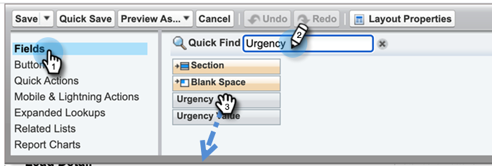

# Konfigurieren von Marketo Sales Insight in Salesforce Enterprise/Unlimited {#configure-marketo-sales-insight-in-salesforce-enterprise-unlimited}

Konfigurieren Sie Marketo Sales Insight in Salesforce Enterprise/Unlimited-Editionen, indem Sie die folgenden Schritte ausführen.

>[!PREREQUISITES]
>
>[Installieren des Marketo Sales Insight-Pakets in Salesforce AppExchange](/help/marketo/product-docs/marketo-sales-insight/msi-for-salesforce/installation/install-marketo-sales-insight-package-in-salesforce-appexchange.md)

>[!NOTE]
>
>**Es sind Administratorberechtigungen erforderlich.**

## Sales Insight in Marketo Engage konfigurieren {#configure-sales-insight-in-marketo}

1. Um Ihre Marketo Sales Insight-Anmeldeinformationen in Marketo Engage zu erhalten, wechseln Sie zum Bereich **[!UICONTROL Admin]** und wählen Sie **[!UICONTROL Sales Insight]** aus.

   

1. Klicken Sie auf **[!UICONTROL API-Konfiguration bearbeiten]**.

   

1. Geben Sie einen API-Geheimschlüssel Ihrer Wahl ein und klicken Sie auf **[!UICONTROL Speichern]**. Verwenden Sie KEIN kaufmännisches Und-Zeichen (`&`) in Ihrem API-geheimen Schlüssel.

   

   >[!NOTE]
   >
   >Ihr API-geheimer Schlüssel ist wie ein Kennwort für Ihre Organisation und sollte sicher sein.

1. Um die Anmeldeinformationen auszufüllen, klicken Sie im Bedienfeld _[!UICONTROL Rest-API-Konfiguration]_ auf **[!UICONTROL Ansicht]** .

   

1. Wenn ein Bestätigungsdialogfeld angezeigt wird, klicken Sie auf **[!UICONTROL OK]**.

   

   >[!TIP]
   >
   >Lassen Sie dieses Fenster geöffnet. Sie benötigen diese Informationen später für die Salesforce-Konfiguration.

## Sales Insight in Salesforce konfigurieren {#configure-sales-insight-in-salesforce}

1. Klicken Sie in Salesforce auf **[!UICONTROL Einrichtung]**.

   

1. Suchen Sie nach &quot;Remote-Site&quot;und wählen Sie **[!UICONTROL Remote-Site-Einstellungen]**.

   

1. Klicken Sie auf **[!UICONTROL Neue Remote-Site]**.

   

1. Geben Sie den Remote-Site-Namen ein (dieser kann in etwa `MarketoSoapAPI` ähneln). Geben Sie die Remote-Site-URL ein, d. h. Ihre Marketo-Host-URL aus dem Bereich _[!UICONTROL Soap-API-Konfiguration]_ in Marketo Engage. Klicken Sie auf **[!UICONTROL Speichern]**. Sie haben jetzt Remote-Site-Einstellungen für die Soap-API erstellt.

   

1. Klicken Sie erneut auf **[!UICONTROL Neue Remote-Site]** .

   

1. Geben Sie den Remote-Site-Namen ein (dieser kann in etwa `MarketoAPI` ähneln). Geben Sie die Remote-Site-URL ein, die Ihre API-URL aus dem Bedienfeld _[!UICONTROL Rest-API-Konfiguration]_ im Marketo Engage ist. Klicken Sie auf **[!UICONTROL Speichern]**. Sie haben jetzt Remote-Site-Einstellungen für die Rest-API erstellt.

   >[!NOTE]
   >
   >_Sie_ wählen Ihren **[!UICONTROL Remote Site-Namen]** (`MarketoAPI` wird hier verwendet). Die **[!UICONTROL Remote-Site-URL]** finden Sie im Feld Marketo-Host des Dialogfelds &quot;API-Konfiguration bearbeiten&quot;in Schritt 3 im Abschnitt &quot;Configure Sales Insight in Marketo&quot;.

## Gewähren Sie Benutzern von Sales Insight Profilzugriff auf standardmäßige Salesforce-Objekte. {#grant-sales-insight-users-profile-access}

Aufgrund von Salesforce-Sicherheitsverbesserungen können AppExchange-Packages keine Berechtigung mehr für Standardobjekte erteilen. Der Zugriff auf die entsprechenden Salesforce-Objekte aus dem Salesforce-Benutzerprofil muss gewährt werden. Gehen Sie wie folgt vor, um die erforderlichen Berechtigungen zu gewähren.

1. Klicken Sie auf **[!UICONTROL Einrichten]**.

1. Suchen Sie &quot;Profile&quot; in Schnellsuche.

1. Klicken Sie neben dem Profil, das Ihre Salesforce-Benutzer verwenden, auf **[!UICONTROL Bearbeiten]** .

1. Aktivieren Sie im Abschnitt _[!UICONTROL Standardobjektberechtigungen]_ den Zugriff auf **[!UICONTROL Gelesen]** für die folgenden Objekte: [!UICONTROL Lead], [!UICONTROL Kontakt], [!UICONTROL Konto] und [!UICONTROL Chancen].

1. Klicken Sie auf **[!UICONTROL Speichern]**.

## Seitenlayouts anpassen {#customize-page-layouts}

1. Klicken Sie auf **[!UICONTROL Einrichten]**.

   

1. Suchen Sie nach &quot;Seitenlayout&quot;und wählen Sie das **[!UICONTROL Seitenlayout]** unter **[!UICONTROL Leads]** aus.

   

1. Klicken Sie links auf **[!UICONTROL Visualforce-Seiten]** . Ziehen Sie **[!UICONTROL Abschnitt]** in das Layout unter dem Abschnitt _[!UICONTROL Benutzerspezifische Links]_ .

   

1. Geben Sie &quot;Marketo Sales Insight&quot;als **[!UICONTROL Abschnittsnamen]** ein, wählen Sie **[!UICONTROL 1-Column]** und klicken Sie auf **[!UICONTROL OK]**.

   

1. Ziehen Sie **[!UICONTROL Lead]** in den neuen Abschnitt.

   

   >[!TIP]
   >
   >Der Name dieses Felds ändert sich je nach Objekttyp. Wenn Sie beispielsweise das Seitenlayout für Kontakte ändern, wird &quot;Kontakt&quot;angezeigt.

1. Doppelklicken Sie auf den soeben hinzugefügten Block **[!UICONTROL Lead]** .

   

1. Bearbeiten Sie die Höhe auf **450** Pixel und klicken Sie auf **[!UICONTROL OK]**.

   

   >[!NOTE]
   >
   >Aktivieren Sie die Option **[!UICONTROL Bildlaufleisten anzeigen]** , wenn Sie Zugriff auf Bildlaufaktivitäten benötigen.

   >[!TIP]
   >
   >Die empfohlene Höhe für die Objekte Konten und Chancen beträgt 410 Pixel.

1. Klicken Sie links auf **[!UICONTROL Felder]** . Suchen Sie dann die Beschriftung **[!UICONTROL Urgency]** und ziehen Sie sie in das Layout **[!UICONTROL Marketo Sales Insight]** .

   

1. Wiederholen Sie den obigen Schritt auch für diese Felder.

   * Letzter interessanter Moment
   * Datum des letzten interessanten Moments
   * Beschreibung des letzten interessanten Moments
   * Quelle des letzten interessanten Moments
   * Typ des letzten interessanten Moments
   * Letzte Aktivität nach Vertrieb
   * Letzte Interaktion durch Verkäufe
   * MSI-Kontaktkennung
   * Relative Bewertung
   * Wert für Relativergebnis
   * Dringlichkeit
   * Wert für Wichtigkeit
   * In Marketo anzeigen

1. Klicken Sie abschließend auf **[!UICONTROL Speichern]** .

   

1. Wiederholen Sie die Schritte 5 bis 7, um visuelle Force-Seitenabschnitte und Sales Insight-Felder für **[!UICONTROL Kontakt]**, **[!UICONTROL Konto]** und **[!UICONTROL Chancen]** hinzuzufügen.

1. Wiederholen Sie die Schritte 8-10, um diese Sales Insight-Felder für **[!UICONTROL Kontakt]** hinzuzufügen. Achten Sie darauf, alle Änderungen zu speichern.

   * Letzter interessanter Moment
   * Datum des letzten interessanten Moments
   * [!UICONTROL Letzter interessanter Moment Desc]
   * [!UICONTROL Letzter interessanter Moment Source]
   * [!UICONTROL Letzter interessanter Moment-Typ]
   * [!UICONTROL Letzte Marketo-Aktivität nach Vertrieb]
   * [!UICONTROL Letzte Marketo-Interaktion durch Vertrieb]
   * [!UICONTROL MKTO-Lead-Score]
   * [!UICONTROL Relativer Score]
   * [!UICONTROL Relativer Score-Wert]
   * [!UICONTROL Sales Insight] - Öffnet die Kontaktseite der vollständigen Liste
   * [!UICONTROL Urgency]
   * [!UICONTROL Dringlichkeitswert]

## Benutzerdefinierte Personenfelder zuordnen {#map-custom-person-fields}

Marketo-Personenfelder müssen Salesforce-Kontaktfeldern zugeordnet werden, um sicherzustellen, dass die Konvertierung ordnungsgemäß funktioniert. Führen Sie diese Schritte aus, um sie zuzuordnen.

1. Klicken Sie auf **[!UICONTROL Einrichten]**.

   

1. Suchen Sie in der Suchleiste nach &quot;fields&quot;und klicken Sie unter **[!UICONTROL Leads]** auf **[!UICONTROL Fields]** .

   

1. Klicken Sie auf **[!UICONTROL Lead-Felder zuordnen]**.

   

1. Klicken Sie rechts neben **[!UICONTROL Interaktion]** auf das Dropdown-Menü.

   

1. Wählen Sie **[!UICONTROL Contact.Engagement]** in der Liste aus.

   

1. Wiederholen Sie diese Schritte und ordnen Sie sie zu.

   | Benutzerdefiniertes Feld für Marketo-Person | Salesforce Contact Custom Field |
   |--- |--- |
   | `Engagement` | `Contact.Engagement` |
   | `Relative Score Value` | `Contact.Relative Score Value` |
   | `Urgency Value` | `Contact.Urgency Value` |
   | `Last Interesting Moment Date` | `Contact.Last Interesting Moment Date` |
   | `Last Interesting Moment Desc` | `Contact.Last Interesting Moment Desc` |
   | `Last Interesting Moment Source` | `Contact.Last Interesting Moment Source` |
   | `Last Interesting Moment Type` | `Contact.Last Interesting Moment Type` |

1. Klicken Sie auf **[!UICONTROL Speichern]** , wenn Sie fertig sind.

## Marketo Sales Insight-Konfigurationsregisterkarte {#marketo-sales-insight-configuration-tab}

1. Klicken Sie in Salesforce auf das Pluszeichen &quot;**+**&quot;am Ende der Registerkartenleiste und klicken Sie auf &quot;**[!UICONTROL Marketo Sales Insight Config]**&quot;.

1. Kopieren Sie die Anmeldeinformationen aus dem Bedienfeld &quot;Soap API&quot;auf der Seite [Marketo Sales Insight-Admin](/help/marketo/product-docs/marketo-sales-insight/msi-for-salesforce/configuration/configure-marketo-sales-insight-in-salesforce-professional-edition.md#set-up-marketo-sales-insight){target="_blank"} und fügen Sie sie in den Abschnitt &quot;Soap API&quot;auf der Seite &quot;Salesforce Sales Insight-Konfiguration&quot;ein.

1. Kopieren Sie die Anmeldeinformationen aus dem Bedienfeld &quot;Rest-API&quot;auf der Seite [Marketo Sales Insight-Admin-Seite](/help/marketo/product-docs/marketo-sales-insight/msi-for-salesforce/configuration/configure-marketo-sales-insight-in-salesforce-professional-edition.md#set-up-marketo-sales-insight){target="_blank"} und fügen Sie sie in den Abschnitt &quot;Rest-API&quot;der Seite Salesforce Sales Insight-Konfiguration ein.

   

Sie sollten die Marketo Sales Insight -Felder für Leads, Kontakte, Konten und Chancen sehen können.

>[!NOTE]
>
>Wenn der Diagnosetest fehlgeschlagen ist, kann das Problem durch das Hinzufügen von [weiteren Feldern zum Seitenlayout](https://nation.marketo.com:443/t5/knowledgebase/how-to-repair-marketo-sales-insight-setup-configuration-problems/ta-p/248218){target="_blank"} behoben werden.

>[!NOTE]
>
>Bei Konten umfasst Sales Insight alle E-Mails, jedoch nur die neuesten interessanten Momente, Web-Aktivitäten und Bewertungsänderungen.

>[!MORELIKETHIS]
>
>* [Priorität, Dringlichkeit, relatives Ergebnis und beste Einsätze](/help/marketo/product-docs/marketo-sales-insight/msi-for-salesforce/features/stars-and-flames/priority-urgency-relative-score-and-best-bets.md)
>* [Hinzufügen der Registerkarte &quot;Marketo&quot;zu Salesforce](/help/marketo/product-docs/marketo-sales-insight/msi-for-salesforce/configuration/add-marketo-tab-to-salesforce.md)
>* [Hinzufügen von Sales Insight-Zugriff zu Profilen](/help/marketo/product-docs/marketo-sales-insight/msi-for-salesforce/configuration/add-sales-insight-access-to-profiles.md){target="_blank"}
