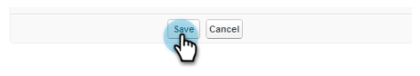

# Konfigurieren von Marketo Sales Insight in Salesforce Professional Edition {#configure-marketo-sales-insight-in-salesforce-professional-edition}

Hier finden Sie die Schritte, die Sie zur Konfiguration von Marketo Sales Insight in Salesforce Professional Edition unternehmen müssen. Fangen wir an!

>[!PREREQUISITES]
>
>[Installieren Sie Marketo in Ihrer Salesforce Professional Edition](http://docs.marketo.com/display/docs/professional+edition)
>
>[Installieren des Marketo Sales Insight-Pakets in Salesforce AppExchange](../../../../product-docs/marketo-sales-insight/msi-for-salesforce/installation/install-marketo-sales-insight-package-in-salesforce-appexchange.md)

>[!NOTE]
>
>**Administratorberechtigungen erforderlich**

## Sales Insight in Marketing konfigurieren {#configure-sales-insight-in-marketo}

1. Öffnen Sie ein neues Browserfenster, um die Anmeldeinformationen von MarketingTo Sales Insight von Ihrem Marketing-Konto abzurufen.
1. Gehen Sie zum Admin-Bereich und wählen Sie **Sales Insight**.

   

1. Klicken Sie auf API-Konfiguration **bearbeiten**.

   

1. Geben Sie einen geheimen API-Schlüssel Ihrer Wahl ein und klicken Sie auf **Speichern**. Verwenden Sie KEIN kaufmännisches Und (&amp;) im geheimen Schlüssel Ihrer API.

   

   >[!NOTE]
   >
   >Ihr geheimer API-Schlüssel ist wie ein Kennwort für Ihr Unternehmen und sollte sicher sein.

1. Klicken Sie im Bedienfeld &quot;Rest-API-Konfiguration&quot;auf **Ansicht** , um die Anmeldeinformationen auszufüllen.

   

1. Es wird ein Bestätigungs-Popup angezeigt. Klicken Sie auf **OK**.

   

## Sales Insight in Salesforce konfigurieren {#configure-sales-insight-in-salesforce}

1. Klicken Sie in Salesforce auf **Setup**.

   

1. Suchen Sie nach &quot;Remote-Site&quot;und wählen Sie **Remote-Site-Einstellungen**.

   

1. Klicken Sie auf **Neue Remote-Site**.

   

1. Geben Sie den Remote-Site-Namen ein (z. B. &quot;MarketoSoapAPI&quot;). Geben Sie die Remote-Site-URL ein, d. h. Ihre MarketingTo-Host-URL aus dem Bedienfeld &quot;Soap-API-Konfiguration&quot;in Marketing. Klicken Sie auf **Speichern**. Sie haben jetzt Remote-Site-Einstellungen für die Soap-API erstellt.

   

1. Klicken Sie erneut auf **Neue Remote-Site** .

   

1. Geben Sie den Remote-Site-Namen ein (z. B. &quot;MarketoRestAPI&quot;). Geben Sie die Remote-Site-URL ein, die Ihre API-URL aus dem Bedienfeld &quot;Rest-API-Konfiguration&quot;in Marketing ist. Klicken Sie auf **Speichern**. Sie haben jetzt Einstellungen für die Remote-Site für die Rest-API erstellt.

## Einrichten von MarketingTo Sales Insight {#set-up-marketo-sales-insight}

1. Melden Sie sich bei Ihrer Marketing-Instanz an und klicken Sie auf **Admin**.

   

1. Klicken Sie auf** Sales Insight**.

   

1. Klicken Sie auf API-Konfiguration **bearbeiten**.

   

1. Geben Sie einen geheimen **API-Schlüssel** ein und klicken Sie auf **Speichern**.

   >[!CAUTION]
   >
   >Verwenden Sie kein kaufmännisches Und-Zeichen (&amp;) in Ihrem API-geheimen Schlüssel.

   

   >[!TIP]
   >
   >Lassen Sie dieses Fenster geöffnet. Sie benötigen diese Informationen später in Salesforce.

1. Gehen Sie zurück zu Salesforce und klicken Sie auf **Setup**.

   

1. Suchen Sie nach &quot;Remote-Site&quot;und klicken Sie unter &quot; **Sicherheitseinstellungen&quot;auf** Remote-Site-Einstellung ****.

   

1. Klicken Sie auf **Neue Remote-Site**.

   

1. Geben Sie **Remote-Site-Namen** und **Remote-Site-URL** ein und klicken Sie dann auf **Speichern**.

   

   >[!NOTE]
   >
   >Sie wählen Ihren **Remote-Site-Namen** aus (hier wird MarketoAPI verwendet). Die **Remote-Site-URL** befindet sich in Schritt 4 im Feld &quot;Marketo-Host&quot;des Dialogfelds &quot;API-Konfiguration bearbeiten&quot;.

## Seitenlayouts anpassen {#customize-page-layouts}

1. Klicken Sie auf **Setup**.

   

1. Suchen Sie nach &quot;Seitenlayout&quot;und wählen Sie das **Seitenlayout** unter &quot; **Interessenten**&quot;aus.

   

1. Klicken Sie auf **Visualforce-Seiten **links. Ziehen Sie **Abschnitt** in das Layout unter dem Abschnitt Benutzerspezifische Links.

   

1. Geben Sie als **Abschnittsnamen**&quot;Marketing to Sales Insight&quot;ein. Wählen Sie **1-Spalte** und klicken Sie auf **OK**.

   

1. Ziehen Sie **Interessenten** per Drag &amp; Drop in den neuen Abschnitt.

   

   >[!TIP]
   >
   >Der Name dieses Felds ändert sich je nach Objekttyp. Wenn Sie z. B. das Seitenlayout für Kontakte ändern, wird &quot;Kontakt&quot;angezeigt.

1. Klicken Sie mit der Dublette auf den soeben hinzugefügten **Interessentenblock** .

   

1. Bearbeiten Sie die Höhe auf **450** Pixel und klicken Sie auf **OK**.

   

   >[!TIP]
   >
   >Für die Objekte &quot;Konten und Chancen&quot;wird eine Höhe von 410 Pixel empfohlen.

1. Klicken Sie auf **Felder **links. Suchen Sie dann nach der **Interaktionsbeschriftung** und ziehen Sie sie in das Layout **Marketing to Sales Insight** .

   

1. Wiederholen Sie den obigen Schritt auch für diese Felder.

<table> 
 <tbody> 
  <tr> 
   <td colspan="1">Interaktion</td> 
  </tr> 
  <tr> 
   <td colspan="1" rowspan="1">
relativer Score-Wert
</td> 
  </tr> 
  <tr> 
   <td colspan="1" rowspan="1">
Dringlichkeitswert
</td> 
  </tr> 
  <tr> 
   <td colspan="1" rowspan="1">
Datum des letzten interessanten Moments
</td> 
  </tr> 
  <tr> 
   <td colspan="1" rowspan="1">
Letzter interessanter Moment Desc
</td> 
  </tr> 
  <tr> 
   <td colspan="1" rowspan="1">
Letzter interessanter Moment Quelle
</td> 
  </tr> 
  <tr> 
   <td colspan="1" rowspan="1">
Letzter interessanter Moment-Typ
</td> 
  </tr> 
 </tbody> 
</table>

1. Klicken Sie abschließend auf **Speichern** .

   

1. Wiederholen Sie diesen Vorgang, um Visualforce-Seitenabschnitte und Sales Insight-Felder für **Kontakt**, **Konto** und **Möglichkeiten** hinzuzufügen.
1. Wiederholen Sie die Schritte 5 bis 7, um Visualforce-Seitenabschnitte für Kontakt, Konto und Chancen hinzuzufügen. Wiederholen Sie dann die Schritte 8-10, um Sales Insight-Felder für **Kontakt** hinzuzufügen. Achten Sie darauf, nach jeder Änderung zu speichern.

## Benutzerdefinierte Benutzerfelder zuordnen {#map-custom-person-fields}

Marketo-Personenfelder müssen Salesforce-Kontaktfeldern zugeordnet werden, um sicherzustellen, dass die Konvertierung ordnungsgemäß funktioniert. So geht es.

1. Klicken Sie auf **Setup**.

   

1. Suchen Sie in der Suchleiste nach &quot;Feldern&quot;und klicken Sie auf **Felder** unter **Interessenten**.

   

1. Klicken Sie auf **Lead-Felder** zuordnen.

   ** 

   **

1. Klicken Sie auf das Dropdown-Menü rechts für **Interaktion**.

   

1. Wählen Sie **Kontakt.Interaktion **in der Liste aus.

   

1. Wiederholen Sie diese Schritte und ordnen Sie sie auch zu.

<table> 
 <tbody> 
  <tr> 
   <th colspan="1" rowspan="1">Benutzerdefiniertes Feld "markieren"</th> 
   <th colspan="1" rowspan="1">Salesforce - Benutzerdefiniertes Feld kontaktieren</th> 
  </tr> 
  <tr> 
   <td colspan="1" rowspan="1">
Interaktion
</td> 
   <td colspan="1" rowspan="1">
Contact.Engagement
</td> 
  </tr> 
  <tr> 
   <td colspan="1" rowspan="1">
relativer Score-Wert
</td> 
   <td colspan="1" rowspan="1">
Contact.Relativer Score-Wert
</td> 
  </tr> 
  <tr> 
   <td colspan="1" rowspan="1">
Dringlichkeitswert
</td> 
   <td colspan="1" rowspan="1">
Contact.Ursprünglicher Wert
</td> 
  </tr> 
  <tr> 
   <td colspan="1" rowspan="1">
Datum des letzten interessanten Moments
</td> 
   <td colspan="1" rowspan="1">
Contact.Last interessant moment Date
</td> 
  </tr> 
  <tr> 
   <td colspan="1" rowspan="1">
Letzter interessanter Moment Desc
</td> 
   <td colspan="1" rowspan="1">
Contact.Last interessant Moment Desc
</td> 
  </tr> 
  <tr> 
   <td colspan="1" rowspan="1">
Letzter interessanter Moment Quelle
</td> 
   <td colspan="1" rowspan="1">
Contact.Last Interest Moment Source
</td> 
  </tr> 
  <tr> 
   <td colspan="1" rowspan="1">
Letzter interessanter Moment-Typ
</td> 
   <td colspan="1" rowspan="1">
Kontakt.Letzter interessanter Moment-Typ
</td> 
  </tr> 
 </tbody> 
</table>

1. Klicken Sie auf **Speichern **nach Abschluss des Vorgangs.

   

## Marketing-Sales Insight-Konfiguration {#marketo-sales-insight-config}

1. Klicken Sie auf **+ **und wählen Sie dann **Marketo Sales Insight Config**.

   

1. Markieren Sie **Markieren-API** aktivieren. Geben Sie dann die [API-Konfigurationsinformationen in Marketing Admin](http://docs.marketo.com/display/DOCS/Configure+Marketo+Sales+Insight+in+Salesforce+Professional+Edition#ConfigureMarketoSalesInsightinSalesforceProfessionalEdition-SetupMarketoSalesInsight)ein. Klicken Sie auf **Änderungen speichern **nach Abschluss des Vorgangs.

   

   >[!NOTE]
   >
   >Wenn der Diagnosetest fehlgeschlagen ist, müssen Sie eventuell weitere Felder zum Seitenlayout [hinzufügen](http://nation.marketo.com/docs/DOC-1115).

Und das ist es! Sie sollten in der Lage sein, die Marketing Sales Insight-Felder für Interessenten, Kontakte, Konten und Chancen anzuzeigen.

>[!NOTE]
>
>Bei Konten umfasst Sales Insight alle E-Mails, jedoch nur die neuesten interessanten Momente, Web-Aktivitäten und Ergebnisänderungen.

## Zugriff auf Marketing zu Sales Insight {#access-marketo-sales-insight}

1. Klicken Sie in Salesforce auf das **+** -Zeichen am Ende der Registerkartenleiste und klicken Sie auf **MarketingTo Sales Insight Config**.
1. Aktivieren Sie das Kontrollkästchen Markieren-API **aktivieren** .
1. Kopieren Sie die Anmeldeinformationen aus dem Bedienfeld &quot;SOAP-API&quot;auf der Marketing Sales Insight-Administrationsseite und fügen Sie sie in den Abschnitt &quot;SOAP-API&quot;auf der Seite &quot;Salesforce Sales Insight-Konfiguration&quot;ein.
1. Kopieren Sie die Anmeldeinformationen aus dem Bedienfeld &quot;Rest-API&quot;auf der Marketing Sales Insight-Administrationsseite und fügen Sie sie in den Abschnitt &quot;Rest-API&quot;der Seite &quot;Salesforce Sales Insight-Konfiguration&quot;ein.

   

>[!NOTE]
>
>**Verwandte Artikel**
>
>* [Priorität, Dringlichkeit, relatives Ergebnis und beste Einsätze](../../../../product-docs/marketo-sales-insight/msi-for-salesforce/features/stars-and-flames/priority-urgency-relative-score-and-best-bets.md)
>* [hinzufügen Marketo Sales Insight-Registerkarte und Schaltflächen zu Salesforce](../../../../product-docs/marketo-sales-insight/msi-for-salesforce/features/bulk-actions/add-marketo-sales-insight-tab-and-buttons-to-salesforce.md)

>

hhh