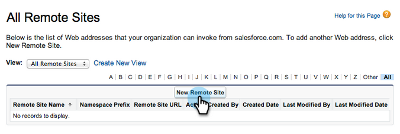
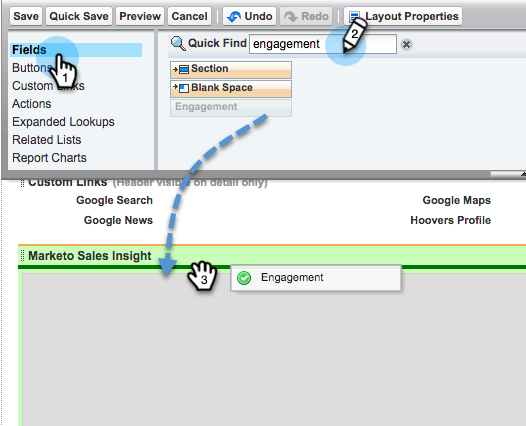

# Konfigurieren von Marketo Sales Insight in Salesforce Professional Edition {#configure-marketo-sales-insight-in-salesforce-professional-edition}

Konfigurieren Sie Marketo Sales Insight in Salesforce Professional Edition, indem Sie die folgenden Schritte ausführen.

>[!PREREQUISITES]
>
>* Installieren Sie Marketo in Ihrer Salesforce Professional Edition.
>
>* [Installieren des Marketo Sales Insight-Pakets in Salesforce AppExchange](/help/marketo/product-docs/marketo-sales-insight/msi-for-salesforce/installation/install-marketo-sales-insight-package-in-salesforce-appexchange.md){target="_blank"}

>[!NOTE]
>
>**Administratorberechtigungen sind erforderlich.**

## Sales Insight in Marketo Engage konfigurieren {#configure-sales-insight-in-marketo}

1. Um die Marketo Sales Insight-Anmeldedaten von Ihrem Marketo-Konto abzurufen, öffnen Sie ein neues Browserfenster.

1. Navigieren Sie zu **[!UICONTROL Admin]** Bereich und wählen Sie **[!UICONTROL Sales Insight]**.

   

1. Klicks **[!UICONTROL API-Konfiguration bearbeiten]**.

   

1. Geben Sie einen geheimen API-Schlüssel Ihrer Wahl ein und klicken Sie auf **[!UICONTROL Speichern]**. Verwenden Sie KEIN Und-Zeichen (`&`) in Ihrem API-geheimen Schlüssel.

   

   >[!NOTE]
   >
   >Ihr API-geheimer Schlüssel ist wie ein Kennwort für Ihre Organisation und sollte sicher sein.

1. Um die Anmeldeinformationen einzutragen, klicken Sie auf **[!UICONTROL Ansicht]** im _[!UICONTROL Rest-API-Konfiguration]_ Bedienfeld.

   

1. Wenn ein Bestätigungsdialogfeld angezeigt wird, klicken Sie auf **[!UICONTROL OK]**.

   

## Sales Insight in Salesforce konfigurieren {#configure-sales-insight-in-salesforce}

1. Klicken Sie in Salesforce auf **[!UICONTROL Einrichtung]**.

   

1. Suchen Sie nach &quot;Remote-Site&quot;und wählen Sie **[!UICONTROL Remote Site Settings]**.

   

1. Klicks **[!UICONTROL Neue Remote-Site]**.

   

1. Geben Sie den Remote-Site-Namen ein (dieser kann in etwa so aussehen wie `MarketoSoapAPI`). Geben Sie die Remote-Site-URL ein, die Ihre Marketo-Host-URL im Bedienfeld Soap-API-Konfiguration unter Marketo Engage ist. Klicken Sie auf **[!UICONTROL Speichern]**. Sie haben jetzt Remote-Site-Einstellungen für die Soap-API erstellt.

   

1. Klicks **[!UICONTROL Neue Remote-Site]** erneut.

   

1. Geben Sie den Remote-Site-Namen ein (z. B. &quot;MarketoRestAPI&quot;). Geben Sie die Remote-Site-URL ein, die Ihre API-URL aus dem Bedienfeld REST-API-Konfiguration in Marketo ist. Klicken Sie auf **[!UICONTROL Speichern]**. Sie haben jetzt Remote-Site-Einstellungen für die Rest-API erstellt.

## Gewähren Sie Benutzern von Sales Insight Profilzugriff auf standardmäßige Salesforce-Objekte. {#grant-sales-insight-users-profile-access}

Aufgrund von Salesforce-Sicherheitsverbesserungen können AppExchange-Packages keine Berechtigung mehr für Standardobjekte erteilen. Der Zugriff auf die entsprechenden Salesforce-Objekte aus dem Salesforce-Benutzerprofil muss gewährt werden. Erteilen Sie die erforderlichen Berechtigungen, indem Sie die folgenden Schritte ausführen.

1. Klicks **[!UICONTROL Einrichtung]**.

1. Suchen Sie &quot;Profile&quot; in Schnellsuche.

1. Klicks **[!UICONTROL Bearbeiten]** neben dem Profil, das Ihre Salesforce-Benutzer verwenden.

1. Aktivieren Sie im Bereich &quot;Standardobjektberechtigungen&quot;Lesezugriff für die folgenden Objekte: Lead, Kontakt, Konto und Chancen.

1. Klicken Sie auf **[!UICONTROL Speichern]**.

## Seitenlayouts anpassen {#customize-page-layouts}

1. Klicks **[!UICONTROL Einrichtung]**.

   

1. Suchen Sie nach &quot;Seitenlayout&quot;und wählen Sie die **[!UICONTROL Seitenlayout]** under **[!UICONTROL Leads]**.

   

1. Klicks **[!UICONTROL Visualforce-Seiten]** auf der linken Seite. Ziehen **[!UICONTROL Abschnitt]** zum Layout unter dem Abschnitt &quot;Benutzerspezifische Links&quot;.

   

1. Geben Sie &quot;Marketo Sales Insight&quot;als **[!UICONTROL Bereichsname]**. Auswählen **[!UICONTROL 1-Spalte]** und klicken **[!UICONTROL OK]**.

   

1. Drag &amp; Drop **Lead** in den neuen Abschnitt ein.

   

   >[!TIP]
   >
   >Der Name dieses Felds ändert sich je nach Objekttyp. Wenn Sie beispielsweise das Seitenlayout für Kontakte ändern, wird &quot;Kontakt&quot;angezeigt.

1. Doppelklicken Sie auf die **[!UICONTROL Lead]** -Block, den Sie gerade hinzugefügt haben.

   

1. Bearbeiten Sie die Höhe auf 450 Pixel und klicken Sie auf **[!UICONTROL OK]**.

   

   >[!NOTE]
   >
   >Überprüfen **[!UICONTROL Bildlaufleisten anzeigen]** , wenn Sie Zugriff auf Bildlaufaktivitäten benötigen.

   >[!TIP]
   >
   >Die empfohlene Höhe für die Objekte Konten und Chancen beträgt 410 Pixel.

1. Klicks **[!UICONTROL Felder]** auf der linken Seite. Suchen und ziehen Sie dann die **[!UICONTROL Interaktion]** in die **[!UICONTROL Marketo Sales Insight]** Layout.

   

1. Wiederholen Sie den obigen Schritt für die folgenden Felder:

   * [!UICONTROL Interaktion]
   * [!UICONTROL Relativer Score-Wert]
   * [!UICONTROL Dringlichkeitswert]
   * [!UICONTROL Letztes interessantes Datum]
   * [!UICONTROL Letzter interessanter Moment Desc]
   * [!UICONTROL Letzte interessante Moment-Quelle]
   * [!UICONTROL Letzter interessanter Moment-Typ]

1. Klicks **[!UICONTROL Speichern]** wenn fertig.

   

1. So fügen Sie Visualforce-Seitenabschnitte hinzu **[!UICONTROL Kontakt]**, **[!UICONTROL Konto]**, und **[!UICONTROL Chancen]**, wiederholen Sie die Schritte 5 bis 7.

1. Wiederholen Sie die Schritte 8 bis 10, um Sales Insight-Felder für hinzuzufügen. **[!UICONTROL Kontakt]**. Achten Sie darauf, nach jeder Änderung zu speichern.

## Benutzerdefinierte Personenfelder zuordnen {#map-custom-person-fields}

Marketo-Personenfelder müssen Salesforce-Kontaktfeldern zugeordnet werden, um sicherzustellen, dass die Konvertierung ordnungsgemäß funktioniert. Führen Sie diese Schritte aus, um sie zuzuordnen.

1. Klicks **[!UICONTROL Einrichtung]**.

   

1. Suchen Sie in der Suchleiste nach &quot;fields&quot;und klicken Sie auf **[!UICONTROL Felder]** under **[!UICONTROL Leads]**.

   

1. Klicks **[!UICONTROL Lead-Felder zuordnen]**.

   

1. Klicken Sie auf das Dropdown-Menü rechts für **[!UICONTROL Interaktion]**.

   

1. Auswählen **[!UICONTROL Contact.Engagement]** in der Liste.

   

1. Wiederholen Sie diese Schritte und ordnen Sie sie zu.

   | Benutzerdefiniertes Feld für Marketo-Person | Salesforce Contact Custom Field |
   |--- |--- |
   | `Engagement` | `Contact.Engagement` |
   | `Relative Score Value` | `Contact.Relative Score Value` |
   | `Urgency Value` | `Contact.Urgency Value` |
   | `Last Interesting Moment Date` | `Contact.Last Interesting Moment Date` |
   | `Last Interesting Moment Desc` | `Contact.Last Interesting Moment Desc` |
   | `Last Interesting Moment Source` | `Contact.Last Interesting Moment Source` |
   | `Last Interesting Moment Type` | `Contact.Last Interesting Moment Type` |

   {style="table-layout:auto"}

1. Klicken Sie abschließend auf **[!UICONTROL Speichern]**.

   

## Marketo Sales Insight-Konfigurationsregisterkarte {#marketo-sales-insight-configuration-tab}

1. Klicken Sie in Salesforce auf die **+** Klicken Sie am Ende der Registerkartenleiste auf **[!UICONTROL Marketo Sales Insight-Konfiguration]**.

1. Kopieren Sie die Anmeldeinformationen aus dem Soap-API-Bedienfeld in [Admin-Seite von Marketo Sales Insight](/help/marketo/product-docs/marketo-sales-insight/msi-for-salesforce/configuration/configure-marketo-sales-insight-in-salesforce-professional-edition.md#set-up-marketo-sales-insight){target="_blank"} und fügen Sie sie in den Abschnitt Soap-API der Salesforce Sales Insight-Konfigurationsseite ein.

1. Kopieren Sie die Anmeldeinformationen aus der **[!UICONTROL Rest-API]** Bedienfeld in [Admin-Seite von Marketo Sales Insight](/help/marketo/product-docs/marketo-sales-insight/msi-for-salesforce/configuration/configure-marketo-sales-insight-in-salesforce-professional-edition.md#set-up-marketo-sales-insight){target="_blank"} und fügen Sie sie in den Rest-API-Abschnitt der Salesforce Sales Insight-Konfigurationsseite ein.

   

Sie sollten die Marketo Sales Insight -Felder für Leads, Kontakte, Konten und Chancen sehen können.

>[!NOTE]
>
>Wenn der Diagnosetest fehlgeschlagen ist, [Hinzufügen von mehr Feldern zum Seitenlayout](https://nation.marketo.com/t5/knowledgebase/how-to-repair-marketo-sales-insight-setup-configuration-problems/ta-p/248218){target="_blank"} kann das Problem beheben.

>[!NOTE]
>
>Bei Konten umfasst Sales Insight alle E-Mails, jedoch nur die neuesten interessanten Momente, Web-Aktivitäten und Bewertungsänderungen.

>[!MORELIKETHIS]
>
>* [Priorität, Dringlichkeit, relatives Ergebnis und beste Beta](/help/marketo/product-docs/marketo-sales-insight/msi-for-salesforce/features/stars-and-flames/priority-urgency-relative-score-and-best-bets.md){target="_blank"}
>* [Hinzufügen der Marketo-Registerkarte zu Salesforce](/help/marketo/product-docs/marketo-sales-insight/msi-for-salesforce/configuration/add-marketo-tab-to-salesforce.md){target="_blank"}
>* [Hinzufügen von Sales Insight-Zugriff zu Profilen](/help/marketo/product-docs/marketo-sales-insight/msi-for-salesforce/configuration/add-sales-insight-access-to-profiles.md){target="_blank"}
