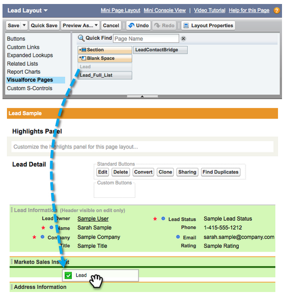

# Konfigurieren von Marketo Sales Insight in Salesforce Professional Edition {#configure-marketo-sales-insight-in-salesforce-professional-edition}

Konfigurieren Sie Marketo Sales Insight in Salesforce Professional Edition, indem Sie die folgenden Schritte ausführen.

>[!PREREQUISITES]
>
>* Installieren Sie Marketo in Ihrer Salesforce Professional Edition.
>
>* [Installieren des Marketo Sales Insight-Pakets auf der Salesforce-AppExchange](/help/marketo/product-docs/marketo-sales-insight/msi-for-salesforce/installation/install-marketo-sales-insight-package-in-salesforce-appexchange.md){target="_blank"}

>[!NOTE]
>
>**Administratorberechtigungen sind erforderlich.**

## Konfigurieren von Sales Insights in Marketo Engage {#configure-sales-insight-in-marketo}

1. Um die Anmeldeinformationen für Marketo Sales Insight von Ihrem Marketo-Konto zu erhalten, öffnen Sie ein neues Browser-Fenster.

1. Wechseln Sie zum Bereich **[!UICONTROL Admin]** und wählen Sie **[!UICONTROL Sales Insight]** aus.

   

1. Klicken Sie **[!UICONTROL API-Konfiguration bearbeiten]**.

   

1. Geben Sie einen beliebigen API-Geheimschlüssel ein und klicken Sie auf **[!UICONTROL Speichern]**. Verwenden Sie KEIN kaufmännisches Und-Zeichen (`&`) in Ihrem API-Geheimschlüssel.

   

   >[!NOTE]
   >
   >Ihr API-Geheimschlüssel ist wie ein Kennwort für Ihre Organisation und sollte sicher sein.

1. Klicken Sie zum Ausfüllen der Anmeldeinformationen auf **[!UICONTROL Anzeigen]** im Bedienfeld _[!UICONTROL REST-API-Konfiguration]_.

   

1. Wenn Sie ein Bestätigungsdialogfeld sehen, klicken Sie auf **[!UICONTROL OK]**.

   

## Konfigurieren von Sales Insights in Salesforce {#configure-sales-insight-in-salesforce}

1. Klicken Sie in Salesforce auf **[!UICONTROL Setup]**.

   

1. Suchen Sie nach „Remote Site“ und wählen Sie **[!UICONTROL Remote Site Settings]**.

   

1. Klicken Sie auf **[!UICONTROL Neue Remote-Site]**.

   

1. Geben Sie den Namen der Remote-Site ein (dies kann `MarketoSoapAPI` ähneln). Geben Sie die Remote-Site-URL, d. h. Ihre Marketo-Host-URL, über das Bedienfeld „SOAP-API-Konfiguration“ in Marketo Engage ein. Klicken Sie auf **[!UICONTROL Speichern]**. Sie haben jetzt Remote-Site-Einstellungen für die SOAP-API erstellt.

   

1. Klicken Sie erneut **[!UICONTROL Neue Remote-Site]**.

   

1. Geben Sie den Namen der Remote-Site ein (dies kann z. B. „MarketoRestAPI“ sein). Geben Sie die Remote-Site-URL ein, d. h. Ihre API-URL aus dem Bedienfeld „REST-API-Konfiguration“ in Marketo. Klicken Sie auf **[!UICONTROL Speichern]**. Sie haben jetzt Remote-Site-Einstellungen für die Rest-API erstellt.

## Gewähren des Profilzugriffs für Sales Insight-Benutzer auf standardmäßige Salesforce-Objekte {#grant-sales-insight-users-profile-access}

Aufgrund der Salesforce-Sicherheitsverbesserungen können AppExchange-Pakete keine Berechtigungen mehr für Standardobjekte erteilen, und der Zugriff auf die entsprechenden Salesforce-Objekte muss über das Benutzerprofil von Salesforce gewährt werden. Gewähren Sie die erforderlichen Berechtigungen, indem Sie die folgenden Schritte ausführen.

1. Klicken Sie **[!UICONTROL Setup]**.

1. Suchen Sie in der Schnellsuche nach „Profile“.

1. Klicken Sie **[!UICONTROL Bearbeiten]** neben dem Profil, das Ihre Salesforce-Benutzenden verwenden.

1. Aktivieren Sie im Abschnitt Standardobjektberechtigung den Lesezugriff für die folgenden Objekte: Lead, Kontakt, Konto und Opportunity.

1. Klicken Sie auf **[!UICONTROL Speichern]**.

## Seiten-Layouts anpassen {#customize-page-layouts}

1. Klicken Sie **[!UICONTROL Setup]**.

   

1. Suchen Sie nach „Seiten-Layout“ und wählen Sie **[!UICONTROL Seiten-Layout]** unter **[!UICONTROL Leads]**.

   

1. Klicken **[!UICONTROL links auf]** VisualForce-Seiten“. Ziehen Sie **[!UICONTROL Abschnitt]** in das Layout unter dem Abschnitt Benutzerdefinierte Links .

   

1. Marketo Geben Sie als „Abschnittsname“ &quot;**[!UICONTROL Sales Insight“]**. Wählen Sie **[!UICONTROL 1-Column]** und klicken Sie auf **[!UICONTROL OK]**.

   

1. Ziehen Sie **Lead** per Drag-and-Drop in den neuen Abschnitt.

   

   >[!TIP]
   >
   >Der Name dieses Feldes ändert sich je nach Objekttyp. Wenn Sie beispielsweise das Seiten-Layout für Kontakte ändern, wird Kontakt angezeigt.

1. Doppelklicken Sie auf den **[!UICONTROL Lead]**-Block, den Sie soeben hinzugefügt haben.

   

1. Bearbeiten Sie die Höhe auf 450 Pixel und klicken Sie auf **[!UICONTROL OK]**.

   

   >[!NOTE]
   >
   >Aktivieren Sie **[!UICONTROL Bildlaufleisten anzeigen]**, wenn Sie Zugriff auf Bildlaufaktivitäten benötigen.

   >[!TIP]
   >
   >Die empfohlene Höhe für die Objekte Accounts und Opportunities beträgt 410 Pixel.

1. Klicken Sie **[!UICONTROL der linken]** auf „Felder“. Suchen Sie dann die Beschriftung **[!UICONTROL Interaktion]** und ziehen Sie sie in das Layout **[!UICONTROL Marketo Sales Insight]**.

   

1. Wiederholen Sie den vorherigen Schritt für die folgenden Felder:

   * [!UICONTROL Interaktion]
   * [!UICONTROL Relativer Score-Wert]
   * [!UICONTROL Dringlichkeitswert]
   * [!UICONTROL Datum des letzten interessanten Moments]
   * [!UICONTROL Beschreibung des letzten interessanten Moments]
   * [!UICONTROL Last Interesting Moment Source]
   * [!UICONTROL Typ des letzten interessanten Moments]

1. Klicken Sie **[!UICONTROL Speichern]** wenn Sie fertig sind.

   

1. Wiederholen Sie die Schritte 5 **[!UICONTROL 7, um die Seitenabschnitte für Kontakt]**, **[!UICONTROL Konto]** und **[!UICONTROL Gelegenheit]** hinzuzufügen.

1. Wiederholen Sie die Schritte 8 bis 10, um Felder für Vertriebserkenntnisse für **[!UICONTROL Kontakt]** hinzuzufügen. Denken Sie daran, nach jeder Änderung zu speichern.

## Benutzerdefinierte Personenfelder zuordnen {#map-custom-person-fields}

Personenfelder für Marketo müssen den Salesforce-Kontaktfeldern zugeordnet werden, um sicherzustellen, dass die Konvertierung ordnungsgemäß funktioniert. Führen Sie die folgenden Schritte aus, um sie zuzuordnen.

1. Klicken Sie **[!UICONTROL Setup]**.

   

1. Suchen Sie in der Suchleiste nach „fields“ und klicken Sie unter **[!UICONTROL Leads]** auf **[!UICONTROL Fields]**.

   

1. Klicken Sie **[!UICONTROL Lead-Felder zuordnen]**.

   

1. Klicken Sie auf das Dropdown-Menü auf der rechten Seite für **[!UICONTROL Interaktion]**.

   

1. Wählen **[!UICONTROL Kontakt.Interaktion]** in der Liste aus.

   

1. Wiederholen Sie diese Felder und ordnen Sie sie auch zu.

   | Benutzerdefiniertes Feld für Marketo-Person | Benutzerdefiniertes Salesforce-Kontaktfeld |
   |--- |--- |
   | `Engagement` | `Contact.Engagement` |
   | `Relative Score Value` | `Contact.Relative Score Value` |
   | `Urgency Value` | `Contact.Urgency Value` |
   | `Last Interesting Moment Date` | `Contact.Last Interesting Moment Date` |
   | `Last Interesting Moment Desc` | `Contact.Last Interesting Moment Desc` |
   | `Last Interesting Moment Source` | `Contact.Last Interesting Moment Source` |
   | `Last Interesting Moment Type` | `Contact.Last Interesting Moment Type` |

   {style="table-layout:auto"}

1. Wenn Sie fertig sind, klicken Sie auf **[!UICONTROL Speichern]**.

   

## Registerkarte &quot;Marketo Sales Insight-Konfiguration“ {#marketo-sales-insight-configuration-tab}

1. Klicken Sie in Salesforce auf das **+** am Ende der Registerkartenleiste und dann auf **[!UICONTROL Marketo Sales Insight Config]**.

1. Kopieren Sie die Anmeldeinformationen aus dem SOAP-API-Bedienfeld in der Verwaltungsseite für Sales Insights ](/help/marketo/product-docs/marketo-sales-insight/msi-for-salesforce/configuration/configure-marketo-sales-insight-in-salesforce-professional-edition.md#set-up-marketo-sales-insight){target="_blank"} [Marketo und fügen Sie sie im Abschnitt SOAP-API der Seite Konfiguration für Salesforce Sales Insights ein.

1. Kopieren Sie die Anmeldeinformationen aus dem Bedienfeld **[!UICONTROL REST]** in der Verwaltungsseite für Sales Insight von [Marketo ](/help/marketo/product-docs/marketo-sales-insight/msi-for-salesforce/configuration/configure-marketo-sales-insight-in-salesforce-professional-edition.md#set-up-marketo-sales-insight){target="_blank"} und fügen Sie sie in den Abschnitt „REST-API“ der Konfigurationsseite für Salesforce Sales Insight ein.

   

Sie sollten die Marketo-Felder für Vertriebserkenntnisse für Leads, Kontakte, Konten und Chancen sehen können.

>[!NOTE]
>
>Wenn der Diagnosetest fehlgeschlagen ist, kann [ Problem möglicherweise durch Hinzufügen weiterer Felder ](https://nation.marketo.com/t5/knowledgebase/how-to-repair-marketo-sales-insight-setup-configuration-problems/ta-p/248218){target="_blank"} Seiten-Layout behoben werden.

>[!NOTE]
>
>Für -Konten umfasst Sales Insight alle E-Mails, aber nur die interessantesten Momente, Web-Aktivitäten und Bewertungsänderungen der letzten Zeit.

>[!MORELIKETHIS]
>
>* [Priorität, Dringlichkeit, relative Punktzahl und Best Bets](/help/marketo/product-docs/marketo-sales-insight/msi-for-salesforce/features/stars-and-flames/priority-urgency-relative-score-and-best-bets.md){target="_blank"}
>* [Registerkarte &quot;Marketo&quot; zu Salesforce hinzufügen](/help/marketo/product-docs/marketo-sales-insight/msi-for-salesforce/configuration/add-marketo-tab-to-salesforce.md){target="_blank"}
>* [Hinzufügen von Sales Insights-Zugriff zu Profilen](/help/marketo/product-docs/marketo-sales-insight/msi-for-salesforce/configuration/add-sales-insight-access-to-profiles.md){target="_blank"}
