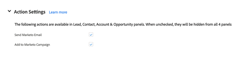

# Registerkarte &quot;Marketo Sales Insight Configuration“ in Salesforce {#marketo-sales-insight-configuration-tab-in-salesforce}

## Betriebseinstellungen {#operational-settings}

Sie müssen dies einrichten, damit Sie Sales Insights in SFDC verwenden können.

* MSI verwendet sowohl die SOAP- als auch die REST-API
* Die Seite „Sales Insight“ in Ihrem Marketo-Konto verfügt über zwei entsprechende Bedienfelder mit SOAP- und REST-API-Anmeldeinformationen, die Sie hier kopieren und einfügen können
* SOAP- und REST-APIs verfügen über separate Zeitlimits, die Sie entsprechend den Anforderungen Ihres Unternehmens festlegen können. Die maximal zulässige Zeit beträgt 120 Sekunden
* Deaktivieren des Insights-Dashboards: Sie können die REST-API-Anmeldeinformationen entfernen und nur die SOAP-API verwenden. Dadurch wird die Registerkarte Insights Dashboard in allen MSI VisualForce-Bedienfeldern deaktiviert

## MSI-Konfiguration {#msi-configuration}

Konfigurationen gelten für alle MSI-Benutzer und sind nicht profilspezifisch.

**VisualForce-Seiteneinstellungen**

* Dropdown „Aktion aktivieren“:
   * Möglichkeit, im Lead- und Kontakt-MSI-Layout die Dropdown-Liste E-Mail an Marketo senden auszublenden
   * Möglichkeit, Optionen zum Hinzufügen zu Marketo Campaign aus der Dropdown-Liste im Lead- und Kontakt-MSI-Layout auszublenden
* Anstehende Ereignisse: Möglichkeit, eingeladene Ereignisse, alle Ereignisse für Benutzer anzuzeigen oder diese Registerkarte vollständig auszublenden
* Künftige Kampagnen: Möglichkeit, alle E-Mail-Kampagnen anzuzeigen oder diese Registerkarte vollständig auszublenden
* Bevorstehende Kampagnen und Ereignisse laden: Möglichkeit, die Anzahl der REST-API-Aufrufe durch Benutzende zu reduzieren, indem Ereignisse und Kampagnen hinter einer On-Demand-Schaltfläche „Bevorstehende Elemente laden“ platziert werden
* Registerkarteneinstellungen : Alle fünf Registerkarten sind standardmäßig verfügbar. Sie können die Reihenfolge der Registerkarten im Sales Insight-Bedienfeld auswählen. Dieselbe Reihenfolge gilt für alle Layouts (Lead, Kontakt, Konto, Opportunity)

**Registerkarte &quot;Marketo Global“**

* RSS-Feed aktiviert: Nach der Aktivierung können MSI-Benutzer ihren Lead-Feed in einem RSS-Feed anzeigen (zusätzlich zum Lead-Feed in Salesforce). Der RSS-Feed kann nur funktionieren, wenn die Funktion „Token-Ablauf“ deaktiviert ist. Diese Einstellung wird auf der Admin-Seite Ihres Marketo Sales Insight gesteuert.
* Debug-Modus für vielversprechende Kontakte
* Standard ausblenden: Die hier ausgewählte Option ist die Anzahl der Tage, die ein Bester Einsatz auf der Registerkarte Beste Einsätze in Marketo ausgeblendet wird, wenn Sie auf das Symbol „Ausblenden“ klicken
* Kontaktstatusfeld: Die hier ausgewählte Option ist der Wert, der in der Statuskopfzeile auf der Registerkarte „Best Bets“ in Marketo eingetragen wird
* Live-Feed-Einstellungen: Die Option, nur Live-Feed (in Lead-, Kontakt-, Konto- und Opportunity-Bedienfeldern und auf der globalen Marketo-Seite), nur Lead-Feed (auf der globalen Marketo-Seite) oder sowohl Live- als auch Lead-Feed anzuzeigen
* Registerkarteneinstellungen : Alle fünf Registerkarten sind standardmäßig verfügbar. Sie können die Reihenfolge der Registerkarten auf der globalen Marketo-Seite festlegen

**Beschränkungen**

* Aktivität (Interessanter Moment, Web-Aktivität, E-Mail) ist standardmäßig auf 1000 festgelegt. E-Mail-Kampagnen und -Ereignisse sind standardmäßig auf 200 festgelegt
* Falls Sie Zeitüberschreitungsprobleme in Ihrer Organisation feststellen, können Sie das Limit verringern

**Aktionseinstellungen**

* Marketo-E-Mail senden: Wenn diese Option aktiviert ist, haben alle Sales Insight-Benutzer Zugriff auf den Versand von E-Mails über Lead, Kontakt, Konto, Opportunity-Bedienfelder und die Registerkarte „Best Bets“ (Massenaktionen und Inline-Interaktion)
* Zu Marketo Campaign hinzufügen: Wenn diese Option aktiviert ist, haben alle Sales Insight-Benutzer Zugriff auf das Hinzufügen zu Kampagnen über den Lead, den Kontakt, das Konto, die Bedienfelder „Opportunity“ und die Registerkarte „Best Bets“ (Massenaktionen und Inline-Interaktion)

## Support-Einstellungen {#support-settings}

Wenn Sie dieses Kontrollkästchen aktivieren, wird die Debug-Protokollierung in Ihrer Salesforce-Instanz aktiviert. Dies kann Ihnen bei der Fehlerbehebung helfen.

## Marketo Sales Insight zurücksetzen {#reset-marketo-sales-insight}

Wenn Sie dies tun, werden alle Ihre Konfigurationen in SFDC gelöscht und sie können nicht wiederhergestellt werden. Sie müssen alles erneut konfigurieren.

>[!IMPORTANT]
>
>Aktivieren Sie das Kontrollkästchen „MSI-Aktionen aktivieren“ nur, wenn Sie die Aktionsfunktionen für Sales Insights verwenden.

>[!MORELIKETHIS]
>
>[Hinzufügen von Sales Insights-Zugriff zu Profilen](/help/marketo/product-docs/marketo-sales-insight/msi-for-salesforce/configuration/add-sales-insight-access-to-profiles.md){target="_blank"}
