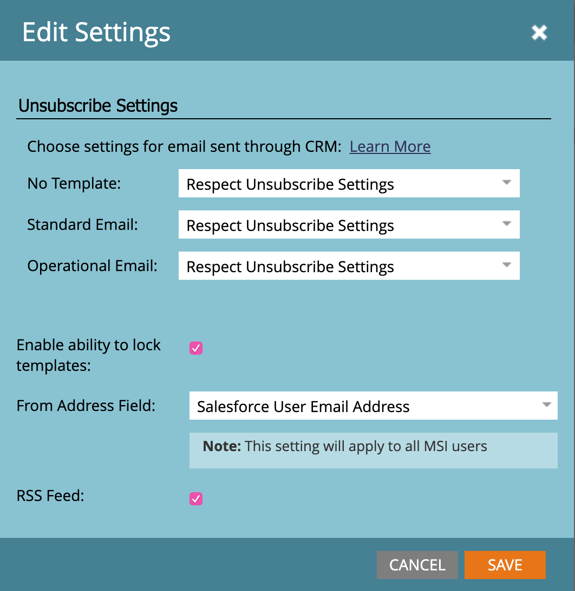

# [!DNL Sales Insight] für Marketo-Administratoren {#sales-insight-page-for-marketo-admins}

Marketo-Administratoren verfügen über bestimmte Berechtigungen in [!DNL Sales Insight]. Erfahren Sie unten, was sie sind.

## SOAP-API-Konfiguration {#soap-api-configuration}

Diese Anmeldeinformationen werden verwendet, um Ihr [!DNL Salesforce]-Konto mit Ihrer Marketo-Instanz zu verbinden und MSI in [!DNL Salesforce] zu verwenden.

## REST-API-Konfiguration {#rest-api-configuration}

Diese Anmeldeinformationen werden verwendet, um Ihr [!DNL Salesforce]-Konto mit Ihrer Marketo-Instanz zu verbinden und das MSI Insights-Dashboard in [!DNL Salesforce] zu verwenden.

## Einstellungen für Personenbewertung {#person-score-settings}

* **[!UICONTROL Sterne]**: Sterne stehen für den Gesamtwert aller Leads im Vergleich zu anderen Leads.
* **[!UICONTROL Flammen]**: Flammen stellen eine Dringlichkeit dar - wie sehr sich die Bewertung eines Leads in letzter Zeit geändert hat.

Standardmäßig verwendet [!DNL Marketo Sales Insight] das Feld Lead-Bewertung zur Berechnung von Sternen und Flammen. Wenn Sie jedoch ein anderes Feld auswählen möchten, sehen Sie folgendes:

1. Klicken Sie im **[!UICONTROL Admin]**-Bereich von Marketo auf **[!UICONTROL Sales Insight]**.

   

1. Klicken [!UICONTROL &#x200B; unter „Lead]Bewertungseinstellungen“ auf **[!UICONTROL Bearbeiten]**.

   

1. Wählen Sie das Feld aus, das Sie für Sterne verwenden möchten.

   

1. Wählen Sie das Feld aus, das Sie für Flammen verwenden möchten.

   

1. Klicken Sie auf **[!UICONTROL Speichern]**. Die Neuberechnung von Sales insight wird einige Zeit in Anspruch nehmen. Sie können Ihr CRM später überprüfen, um die Sterne und Flammen zu sehen.

   

   >[!TIP]
   >
   >Wenn Sie noch keine benutzerdefinierten Bewertungsfelder haben, sehen Sie hier, wie Sie [erstellen](/help/marketo/product-docs/administration/field-management/create-a-custom-field-in-marketo.md).

   >[!MORELIKETHIS]
   >
   >[Sterne und Flammen](/help/marketo/product-docs/marketo-sales-insight/msi-for-salesforce/features/stars-and-flames/customize-stars-and-flames.md)

## Einstellungen {#settings}

**Abmeldeeinstellungen:**

Sie können aus den folgenden Abmeldeeinstellungen für „Keine Vorlage, &quot;[!UICONTROL Standard-E-Mails] und [!UICONTROL Operative E-Mails“ &#x200B;]

* [!UICONTROL Respektieren Sie die Abmeldeeinstellung]
* [!UICONTROL Respektieren Sie die Abmeldeeinstellungen, wenn mehr als 1 Empfänger vorhanden ist]
* [!UICONTROL Respektieren Sie die Abmeldeeinstellungen, wenn mehr als 5 Empfänger]
* [!UICONTROL Abmeldeeinstellungen ignorieren]

**Sperren von Vorlagen aktivieren:**

Wenn diese Option aktiviert ist, können MSI-Benutzer beim Senden von E-Mails über [!DNL Salesforce] keine Vorlagen bearbeiten

**RSS-Feed aktivieren:**

Wenn diese Option aktiviert ist, können MSI-Benutzer ihren Lead-Feed in einem RSS-Feed anzeigen (zusätzlich zum Lead-Feed in [!DNL Salesforce]). RSS-Feed kann nur funktionieren, wenn die Funktion &quot;[!UICONTROL Token-]&quot; deaktiviert ist.

**Token-Ablauf:**

Der Ablauf von Token wird im Feature Manager gesteuert. Um ihn aktivieren/deaktivieren zu lassen, wenden Sie sich an den [Marketo-Support](https://nation.marketo.com/t5/Support/ct-p/Support). Wenn diese Option aktiviert ist, laufen alle Marketo-Token innerhalb von 10 Minuten ab. Wenn deaktiviert, laufen Marketo-Token nicht ab.

Token, die vor der Aktivierung der Token-Gültigkeit generiert wurden, müssen nicht über eine Ablaufzeit verfügen, um sie zu validieren, sodass sie nicht ablaufen, selbst wenn die Funktion derzeit aktiviert ist.

Token, die nach der Aktivierung der Token-Gültigkeit generiert werden, haben eine Ablaufzeit von 10 Minuten, sodass sie auch nach der Deaktivierung der Funktion in 10 Minuten ablaufen.

Das Token-Verhalten basiert auf dem Zeitpunkt, zu dem es generiert wurde (wenn die Token-Ablauf-Funktion aktiviert/deaktiviert wurde, anstatt auf dem aktuellen Funktionsstatus).
