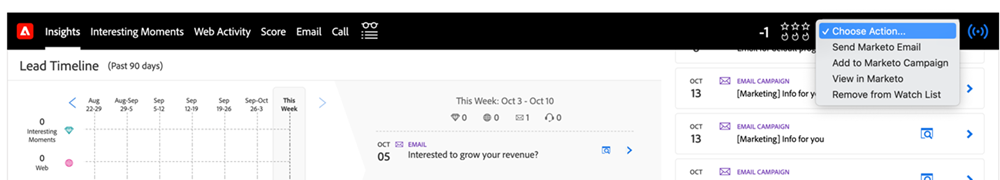
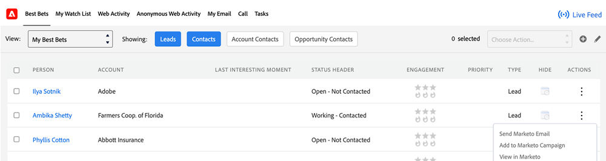

# Auswählen einer Aktion in Sales Insight {#choose-an-action-in-sales-insight}

Die folgenden Aktionen sind in der Dropdown-Liste Sales Insight in Salesforce Classic und Lightning verfügbar:

* Marketo-E-Mail senden
* Zu Marketo-Kampagne hinzufügen
* Zu Merkliste hinzufügen

Auf jede dieser Funktionen kann wie folgt zugegriffen werden:

**Seitenlayout mit einzelner Aktion**

* Lead-Layout-Bedienfeld: Einzelaktion und kann über ein Benutzerprofil gesteuert werden
* Bedienfeld &quot;Kontaktlayout&quot;: Einzelaktion und kann vom Benutzerprofil gesteuert werden
* Schaltfläche &quot;Lead-Layout&quot;: Einzelaktion, die nicht vom Benutzerprofil gesteuert werden kann
* Schaltfläche &quot;Kontaktlayout&quot;: Einzelaktion, die nicht vom Benutzerprofil gesteuert werden kann

  

**Seitenlayout mit Gruppenaktion**

* Bedienfeld &quot;Kontolayout&quot;: Gruppenaktion und kann vom Benutzerprofil gesteuert werden
* Bereich für Opportunity-Layout: Gruppenaktion und kann vom Benutzerprofil gesteuert werden

  

**Registerkarte &quot;Beste Einsätze&quot;**

* Registerkarte &quot;Best Bets-Massenaktionen&quot;: Gruppenaktion und kann vom Benutzerprofil gesteuert werden

  

* Registerkarte &quot;Best-Bets-Inline-Aktionen&quot;: Einzelaktion und kann vom Benutzerprofil gesteuert werden

  

**Listenansicht mit Massenaktion**

* Lead-Listenansicht: Massenaktion und kann nicht über das Benutzerprofil gesteuert werden
* Kontaktlistenansicht: Massenaktion und kann nicht über das Benutzerprofil gesteuert werden

  
