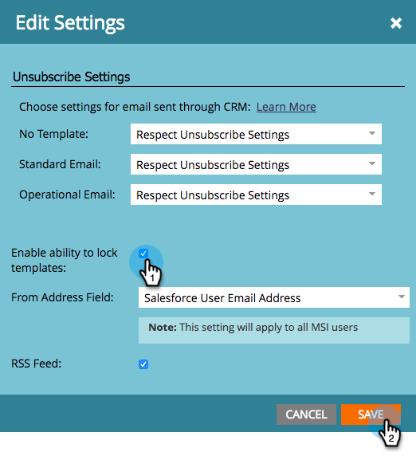

# Vertriebsvorlage sperren {#lock-sales-template}

Um zu verhindern, dass CRM-Benutzer Verkaufsvorlagen bearbeiten, können Administratoren Vorlagen sperren, sodass Benutzer Vorlagen einzeln über den E-Mail-Editor sperren können.

>[!CAUTION]
>
>Diese Funktion funktioniert nur für Salesforce und ist nicht mit Microsoft Dynamics oder anderen CRMs kompatibel. Vorlagen, auf die über die Outlook- oder Gmail-Plug-ins zugegriffen wird, werden nicht gesperrt, da der Editor nicht von Marketo gesteuert wird.

## Vorlage sperren aktivieren {#enable-lock-template}

>[!NOTE]
>
>**Erforderliche Administratorberechtigungen**

1. Navigieren Sie zu **Admin** Klicken Sie auf **Sales Insight**.

   

1. under **Einstellungen** klicken **Bearbeiten**.

   

1. Überprüfen **Aktivieren der Möglichkeit, Vorlagen zu sperren**. Klicks **Speichern**.

   

>[!NOTE]
>
>Standardmäßig ist dieses Kontrollkästchen aktiviert und die Möglichkeit zum Sperren von Vorlagen ist aktiviert. Wenn Sie diese Option deaktivieren, wird die Funktion &quot;Vorlage sperren&quot;im E-Mail-Editor deaktiviert.

>[!NOTE]
>
>Wenn Sie diese Einstellung als Administrator ändern, **not** vorhandene Vorlagen rückwirkend zu beeinflussen, d. h. sie werden nicht automatisch gesperrt.

## Vorlage im E-Mail-Editor sperren {#lock-template-in-the-email-editor}

1. Wählen Sie die E-Mail aus, die Sie sperren möchten, und klicken Sie auf **Entwurf bearbeiten**.

   

1. Klicken Sie im E-Mail-Editor auf **E-Mail-Einstellungen**.

   

1. Überprüfen **In Marketo Sales Insight veröffentlichen** , wenn es noch nicht aktiviert ist. Sie können jetzt deaktivieren **Bearbeitung von E-Mails durch CRM-Benutzer zulassen** , um die Vorlage zu sperren. Klicks **Speichern**.

   

   >[!NOTE]
   >
   >Standardmäßig ist dieses Kontrollkästchen aktiviert und CRM-Benutzer können E-Mails bearbeiten.
