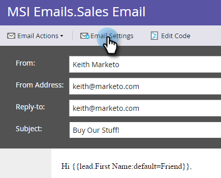
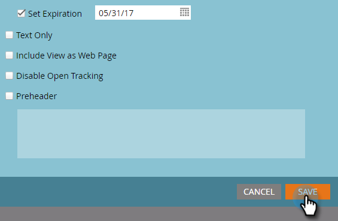

# Veröffentlichen einer E-Mail in [!DNL Sales Insight] {#publish-an-email-to-sales-insight}

Aktivieren Sie die Einstellung In [!DNL Sales Insight] veröffentlichen , um Ihrem Verkaufs-Team eine E-Mail sowohl in [!DNL Sales Insight] als auch im [!DNL Outlook]- und Gmail-Add-in zur Verfügung zu stellen. Sie können auch ein Ablaufdatum angeben.

1. Suchen Sie Ihre E-Mail, wählen Sie sie aus und klicken Sie auf **[!UICONTROL Entwurf bearbeiten]**.

   

1. Klicken Sie nach dem Öffnen des Editors auf **[!UICONTROL E-Mail-Einstellungen]**.

   

1. Aktivieren **[!UICONTROL In Marketo Sales Insight veröffentlichen]**.

   

1. Um ein Ablaufdatum (optional) festzulegen, aktivieren Sie **[!UICONTROL Ablaufdatum festlegen]** und wählen Sie ein Datum aus.

   

   >[!NOTE]
   >
   >Um 23:59 Uhr (CST) am Ablaufdatum (wenn Sie eines festlegen) verschwindet die von Ihnen zur Verfügung gestellte E-Mail von [!DNL Sales Insight] sowie allen zugehörigen Add-Ins. Natürlich wird es in Marketo weiterhin zugänglich sein.

1. Klicken Sie auf **[!DNL Save]**.

   

Gute Arbeit! Jetzt wissen Sie, wie Sie E-Mails für Ihr Verkaufs-Team verfügbar machen können, um sie auf CRM-Seite zu senden und die verfügbare Zeit bei Bedarf zu begrenzen.

>[!NOTE]
>
>[Meine Token](/help/marketo/product-docs/core-marketo-concepts/programs/tokens/understanding-my-tokens-in-a-program.md) werden beim Senden einer E-Mail von [!DNL Sales Insight] entweder auf [!DNL Microsoft Dynamics] oder [!DNL Salesforce] nicht aufgelöst. Nur Standard-Token werden ausgefüllt (Lead, Unternehmen usw.). Die Standardwerte für Token funktionieren jedoch.

>[!TIP]
>
>Vergessen Sie nicht, diese E-Mail zu genehmigen, damit die Änderungen wirksam werden. Erfahren Sie, wie Sie [E-Mail genehmigen](/help/marketo/product-docs/email-marketing/general/creating-an-email/approve-an-email.md).
