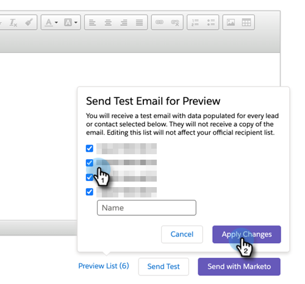

# Senden einer Test-E-Mail {#send-a-test-email}

Bevor Sie eine E-Mail senden, können Sie das E-Mail-Format und die Token testen, indem Sie sich selbst eine Test-E-Mail an eine beliebige E-Mail-Adresse senden.

1. Navigieren Sie [!DNL Salesforce] eines Leads oder Kontakts zum [!DNL Sales Insight].

1. Klicken Sie auf **[!UICONTROL Marketo-E-Mail senden]**.

1. Klicken Sie **[!UICONTROL Testempfängerinnen und Testempfänger bearbeiten]**.

1. Sie können einen oder mehrere Leads aus der Liste auswählen, um zu sehen, wie sie für sie gerendert werden. Klicken Sie abschließend **[!UICONTROL Apply Changes]**.

   

   >[!NOTE]
   >
   >Zur Erinnerung: Wenn Sie diese Leads auswählen **nicht** senden Sie ihnen den E-Mail-Test, sehen Sie _, wie die E-Mail für sie aussieht_. Wenn Sie vier Leads auswählen, erhalten Sie vier verschiedene Test-E-Mails.

1. Klicken Sie **[!UICONTROL Test senden]**.

Sie erhalten eine E-Mail mit Token-Werten, die für die von Ihnen ausgewählten Leads ausgefüllt sind.

>[!NOTE]
>
>Keine Sorge. Sie bleiben auch nach dem Versand der Test-E-Mail auf der  &quot;Marketo-E-Mail senden, damit Sie die von Ihnen erstellte E-Mail nicht verlieren.
