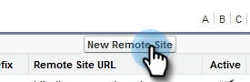

# Konfiguration für bestehende Kunden {#configuration-for-existing-customers}

Bitte richten Sie die folgende Konfiguration ein, um mit dem neuen Insight-Dashboard zu beginnen.

>[!PREREQUISITES]
>
>Bitte stellen Sie sicher, dass Sie Ihr Salesforce-Paket auf die neueste Version aktualisiert haben

## Sales Insight in Marketo konfigurieren{#configure-sales-insight-in-marketo}

1. Öffnen Sie eine neue Registerkarte in Ihrem Browser, um die Anmeldeinformationen von Marketing to Sales Insights von Ihrem Marketing-Konto abzurufen.
1. Gehen Sie zum Bereich **Admin**.

   

1. Klicken Sie auf **Sales Insight**.

   

1. Klicken Sie auf **Ansicht**, um die Rest-API-Anmeldeinformationen auszufüllen.

   

1. Sie sehen ein Bestätigungs-Popup. Klicken Sie auf **OK**.

## Sales Insight in Salesforce {#configure-sales-insight-in-salesforce} konfigurieren

1. Klicken Sie in Salesforce auf **Setup**.

   

1. Suchen Sie nach **Remote-Site-Einstellungen** und wählen Sie sie aus.

   

1. Klicken Sie auf **Neue Remote-Site**.

   

1. Geben Sie den Remote-Site-Namen (z. B. &quot;MarketoRestAPI&quot;) und die Remote-Site-URL (Ihre API-URL aus dem Rest-API-Konfigurationsbedienfeld in Marketo) ein.

   

1. Klicken Sie auf **Speichern**.

   

   Sie haben jetzt die Remote-Site-Einstellung für die Rest-API erstellt.

## Zugriff auf Marketing zu Sales Insight {#access-marketo-sales-insight}

1. Kopieren Sie die Anmeldeinformationen aus dem Bedienfeld &quot;Rest-API&quot;auf der Admin-Seite von Marketing Sales Insight. Fügen Sie sie im Abschnitt Rest-API auf der Seite Sales Insight-Konfiguration von Salesforce ein.
1. Geben Sie den geheimen API-Schlüssel ein.

   

