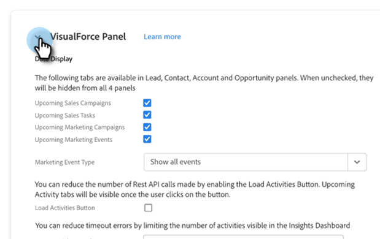

# Dynamic Chat-Integration {#dynamic-chat-integration}

Erfahren Sie mehr über die Dynamic Chat-Integration mit Sales Insight.

>[!PREREQUISITES]
>
>* Ihr Sales Insight SFDC-Paket muss version sein. [1.9 oder höher](/help/marketo/product-docs/marketo-sales-insight/msi-for-salesforce/upgrading/upgrading-your-msi-package.md){target="_blank"}
>
>* Sie müssen über die [Dynamic Chat-Integration](/help/marketo/product-docs/demand-generation/dynamic-chat/dynamic-chat-overview.md){target="_blank"} einrichten

## Registerkarte &quot;Marketo Sales Insight-Konfiguration&quot; {#marketo-sales-insight-configuration-tab}

Gehen Sie wie folgt vor, um die Dynamic Chat-Integration zu aktivieren.

1. Melden Sie sich bei Ihrem Salesforce-Konto an, klicken Sie auf das Pluszeichen am Ende der Registerkartenleiste und klicken Sie auf **Marketo Sales Insight-Konfiguration**.

1. Klicken Sie auf , um den Bereich &quot;Visualforce&quot;zu entfernen.

   

1. Wählen Sie die **Dynamic Chat-Daten aktivieren** aktivieren.

   

## Funktionsübersicht {#feature-overview}

Die folgenden Dynamic Chat-Aktivitäten können von Sales Insight-Benutzern genutzt werden.

Interagiertes Dialogfeld: Angemeldet und in Sales Insight ausgefüllt, wenn ein Besucher auf einen Chat klickt und mit dem Dialogfeld interagiert.

* Dialogname
* Seiten-URL
* Status (Initiiert/Dropped/Abgeschlossen)

Geplante Ernennung: Wird in Marketo angemeldet und in Sales Insight ausgefüllt, wenn ein Besucher einen Termin erfolgreich über den Chatbot festlegt.

* Dialogname
* Agentin oder Agent
* Seiten-URL
* Geplant am (Datum und Zeitstempel einfügen)
* Status (Geplant, Neu geplant, Abgebrochen)

Erreichtes Ziel: Wird in Marketo angemeldet und in Sales Insight ausgefüllt, wenn ein Besucher in einem beliebigen Dialogfluss ein Ziel erreicht.

* Dialogname
* Zielname
* Seiten-URL

Interagiert mit Dokument: Wird in Marketo angemeldet und in Sales Insight ausgefüllt, wenn ein Besucher mit einem Dokument interagiert, das über den Chatbot freigegeben wurde.

* Dialogname
* Dokument
* Status

Chat-Aktivitäten sind im Insights-Dashboard verfügbar.

In den Bedienfeldern &quot;Lead&quot;und &quot;Kontakt&quot;ist eine Registerkarte &quot;Chat&quot;verfügbar. Sie enthält die Spalten Aktivitätstyp, Dialogfeldname und Datum .

Sie können mehr über einen Aktivitätstyp erfahren, indem Sie darauf klicken.

Die Bedienfelder &quot;Konto&quot;und &quot;Chancen&quot;umfassen ebenfalls die Spalten &quot;Name&quot;, &quot;Aktivitätstyp&quot;, &quot;Dialogfeldname&quot;und &quot;Datum&quot;.

Der Tab Chat ist auch in Ihrer Registerkarte Global Marketo enthalten. Es umfasst drei Aktivitätstypen (Dialog interagieren, Terminplanung, Ziel erreicht) sowie die folgenden Spalten:

* Person
* Konto
* Aktivitätstyp (Dialogfeld &quot;Interagiert&quot;, Terminplanung, Ziel erreicht)
* Dialogname
* Datums- und Uhrzeitstempel

Erfahren Sie mehr über einen Aktivitätstyp, indem Sie darauf klicken.

>[!NOTE]
>
>Wenn das Kontrollkästchen &quot;Dynamic Chat-Daten aktivieren&quot;deaktiviert ist, werden die folgenden Funktionen deaktiviert:
>
>* Zeile mit Chat-Aktivitäten im Insights-Dashboard (Smart-Raster- und Wochenlistenansicht)
>* Registerkarte &quot;Chat&quot;in den Bedienfeldern &quot;Lead&quot;, &quot;Kontakt&quot;, &quot;Konto&quot;und &quot;Chancen&quot;
>* Registerkarte &quot;Chat&quot;auf der Registerkarte &quot;Globale Marketo&quot;
>
>Es ist nicht möglich, nur eine dieser Funktionen zu deaktivieren.

