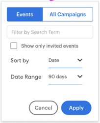

# Übersicht über die Funktionen des Insights-Dashboards {#insights-dashboard-feature-overview}

Erfahren Sie mehr über die in Ihrem [!DNL Sales Insights]-Dashboard verfügbaren Funktionen.

>[!PREREQUISITES]
>
>Sie müssen über das neueste MSI SFDC-Paket und [Konfiguration](/help/marketo/product-docs/marketo-sales-insight/msi-for-salesforce/configuration/configuration-for-existing-customers.md) verfügen.

## Kontakt-Layout {#contact-layout}

**Interaktionsgeschwindigkeitsraster**

* Dieses intelligente Raster enthält interessante Momente, E-Mail- und Web-Aktivitäten in den letzten 90 Tagen
* Benutzer können die Aktivität &quot;[!UICONTROL &#x200B; Konto anzeigen] auswählen. Dadurch werden alle interessanten Momente, E-Mail- und Web-Aktivitäten auf Kontoebene in der Kontaktansicht überlagert.
* Benutzer können eine bestimmte Woche markieren, um die Aktivitäten innerhalb dieser Woche anzuzeigen
* Standardansicht: Aktuelle Woche ist ausgewählt

**Interaktionsaufschlüsselung und Zusammenfassung**

* Aufschlüsselung der Aktivitätskarten für interessante Momente, E-Mail- und Web-Aktivitäten
* Aktivitätskarte „Interessante Momente“ - Enthält die Option Abonnieren .
* E-Mail-Aktivitätskarte - Enthält die Option Vorschau .
* Web-Aktivitätskarte - Beinhaltet die Möglichkeit, auf einen Link zu klicken
* In der Leiste mit der wöchentlichen Zusammenfassung werden interessante Momente, E-Mail- und Web-Aktivitäten für diese Woche angezeigt. Jedes Symbol kann angeklickt werden und als Filter verwendet werden, um eine bestimmte Aktivität anzuzeigen
* Standardansicht: Dies ist eine Liste der Aktivitäten der aktuellen Ansicht

**Kommende E-Mail-Kampagnen und -Ereignisse**

Registerkarte E-Mail-Kampagnen :

* Umfasst Kampagnen, die Teil von E-Mail-Programmen sind oder für die nächsten 90 Tage geplant sind
* Nicht spezifisch für Kontakt/Lead (d. h. die Kampagnenliste ist eine allgemeine Liste aller in der Marketo-Instanz geplanten E-Mail-Kampagnen). Die Liste der Kampagnen in allen Lead-, Kontakt-, Konto- und Opportunity-Bereichen ist identisch
* Wenn die Kampagnenwiederholung so ausgeführt wird, dass sie in den nächsten 90 Tagen mehr als dreimal ausgeführt wird, werden zu einem bestimmten Zeitpunkt nur die nächsten drei Ausführungen angezeigt (ähnlich dem Verhalten in Marketo)
* Die Karte „Aktivitätsdetails“ in diesem Abschnitt hat eine Vorschauoption. Wenn der Fluss mehrere Schritte zum Senden von E-Mails enthält, können alle E-Mails in der Vorschau angezeigt werden. Wenn im Schritt E-Mail senden mehrere „E-Mail-Auswahlmöglichkeiten“ vorhanden sind, ist die Standardoption für die Vorschau verfügbar
* Zu den Filtern gehören [!UICONTROL Suche] und [!UICONTROL Datumsbereich].

Registerkarte Ereignis:

* Enthält Veranstaltungsprogramme, die für die nächsten 90 Tage geplant sind
* Verwenden Sie die Filteroption, um alle Ereignisse/eingeladenen Ereignisse anzuzeigen (basierend auf den Admin-Einstellungen).
* Wenn Sie Eingeladene Ereignisse auswählen, werden Ereignisse angezeigt, zu denen ein bestimmter Kontakt eingeladen wurde, zusammen mit dem Mitgliedsstatus
* Wenn Sie Alle Ereignisse auswählen, wird eine Liste der in den nächsten 90 Tagen geplanten Ereignisse angezeigt
* Die Karte „Aktivitätsdetails“ in diesem Abschnitt verfügt über eine Vorschauoption
* Der Filter umfasst &quot;[!UICONTROL Suche]&quot;, [!UICONTROL Nur eingeladene Ereignisse anzeigen] und [!UICONTROL Datumsbereich]&quot;

## Lead-Layout {#lead-layout}

**Interaktionsgeschwindigkeitsraster**

* Dieses intelligente Raster enthält interessante Momente, E-Mail- und Web-Aktivitäten in den letzten 90 Tagen
* Benutzer können eine bestimmte Woche markieren, um die Aktivitäten innerhalb dieser Woche anzuzeigen
* Standardansicht: Aktuelle Woche ist ausgewählt
* Die Funktion [!UICONTROL Kontoaktivität anzeigen] ist für Leads nicht verfügbar, da sie zu keinem Konto in [!DNL Salesforce] gehört, bis sie in einen Kontakt konvertiert wird

**Interaktionsaufschlüsselung und Zusammenfassung**

* Aufschlüsselung der Aktivitätskarten für interessante Momente, E-Mail- und Web-Aktivitäten
* Aktivitätskarte „Interessante Momente“ - Enthält die Option Abonnieren .
* E-Mail-Aktivitätskarte - Enthält die Option Vorschau .
* Web-Aktivitätskarte - Beinhaltet die Möglichkeit, auf einen Link zu klicken
* In der Leiste mit der wöchentlichen Zusammenfassung werden interessante Momente, E-Mail- und Web-Aktivitäten für diese Woche angezeigt. Jedes Symbol kann angeklickt werden und als Filter verwendet werden, um eine bestimmte Aktivität anzuzeigen
* Standardansicht: Dies ist eine Liste der Aktivitäten der aktuellen Ansicht

**Kommende E-Mail-Kampagnen und -Ereignisse:**

Registerkarte E-Mail-Kampagnen :

* Umfasst Kampagnen, die Teil von E-Mail-Programmen sind oder für die nächsten 90 Tage geplant sind
* Nicht spezifisch für Kontakt/Lead (d. h. die Kampagnenliste ist eine allgemeine Liste aller in der Marketo-Instanz geplanten E-Mail-Kampagnen). Die Liste der Kampagnen in allen Lead-, Kontakt-, Konto- und Opportunity-Bereichen ist identisch
* Wenn die Kampagnenwiederholung so ausgeführt wird, dass sie in den nächsten 90 Tagen mehr als dreimal ausgeführt wird, werden zu einem bestimmten Zeitpunkt nur die nächsten drei Ausführungen angezeigt (ähnlich dem Verhalten in Marketo)
* Die Karte „Aktivitätsdetails“ in diesem Abschnitt hat eine Vorschauoption. Wenn der Fluss mehrere Schritte zum Senden von E-Mails enthält, können alle E-Mails in der Vorschau angezeigt werden. Wenn im Schritt E-Mail senden mehrere „E-Mail-Auswahlmöglichkeiten“ vorhanden sind, ist die Standardoption für die Vorschau verfügbar
* Zu den Filtern gehören [!UICONTROL Suche] und [!UICONTROL Datumsbereich].

Registerkarte Ereignis:

* Enthält Veranstaltungsprogramme, die für die nächsten 90 Tage geplant sind
* Verwenden Sie die Filteroption, um alle Ereignisse/eingeladenen Ereignisse anzuzeigen (basierend auf den Admin-Einstellungen).
* Wenn Sie Eingeladene Ereignisse auswählen, werden Ereignisse angezeigt, zu denen ein bestimmter Kontakt eingeladen wurde, zusammen mit dem Mitgliedsstatus
* Wenn Sie Alle Ereignisse auswählen, wird eine Liste der in den nächsten 90 Tagen geplanten Ereignisse angezeigt
* Die Karte „Aktivitätsdetails“ in diesem Abschnitt verfügt über eine Vorschauoption
* Der Filter umfasst &quot;[!UICONTROL Suche]&quot;, [!UICONTROL Nur eingeladene Ereignisse anzeigen] und [!UICONTROL Datumsbereich]&quot;

## Konto-Layout {#account-layout}

**Interaktionsgeschwindigkeitsraster**

* Dieses intelligente Raster enthält interessante Momente, E-Mail- und Web-Aktivitäten in den letzten 90 Tagen für alle Kontakte im Konto
* Benutzer können eine bestimmte Woche markieren, um die Aktivitäten innerhalb dieser Woche anzuzeigen
* Standardansicht: Aktuelle Woche ist ausgewählt

**Interaktionsaufschlüsselung und Zusammenfassung**

* Aufschlüsselung der Aktivitätskarten für interessante Momente, E-Mail- und Web-Aktivitäten, einschließlich Kontaktname
* Aktivitätskarte „Interessante Momente“ - Enthält die Option Abonnieren .
* E-Mail-Aktivitätskarte - Enthält die Option Vorschau .
* Web-Aktivitätskarte - Beinhaltet die Möglichkeit, auf einen Link zu klicken
* In der Leiste mit der wöchentlichen Zusammenfassung werden interessante Momente, E-Mail- und Web-Aktivitäten für diese Woche angezeigt. Jedes Symbol kann angeklickt werden und als Filter verwendet werden, um eine bestimmte Aktivität anzuzeigen
* Standardansicht: Dies ist eine Liste der Aktivitäten der aktuellen Ansicht

**Kommende E-Mail-Kampagnen und -Ereignisse**

Registerkarte E-Mail-Kampagnen :

* Umfasst Kampagnen, die Teil von E-Mail-Programmen sind oder für die nächsten 90 Tage geplant sind
* Nicht spezifisch für Kontakt/Lead (d. h. die Kampagnenliste ist eine allgemeine Liste aller in der Marketo-Instanz geplanten E-Mail-Kampagnen). Die Liste der Kampagnen in allen Lead-, Kontakt-, Konto- und Opportunity-Bereichen ist identisch
* Wenn die Kampagnenwiederholung so ausgeführt wird, dass sie in den nächsten 90 Tagen mehr als dreimal ausgeführt wird, werden zu einem bestimmten Zeitpunkt nur die nächsten drei Ausführungen angezeigt (ähnlich dem Verhalten in Marketo)
* Die Karte „Aktivitätsdetails“ in diesem Abschnitt hat eine Vorschauoption. Wenn der Fluss mehrere Schritte zum Senden von E-Mails enthält, können alle E-Mails in der Vorschau angezeigt werden. Wenn im Schritt E-Mail senden mehrere „E-Mail-Auswahlmöglichkeiten“ vorhanden sind, ist die Standardoption für die Vorschau verfügbar
* Zu den Filtern gehören [!UICONTROL Suche] und [!UICONTROL Datumsbereich].

Registerkarte Ereignis:

* Enthält Veranstaltungsprogramme, die für die nächsten 90 Tage geplant sind
* Verwenden Sie die Filteroption, um alle Ereignisse/eingeladenen Ereignisse anzuzeigen (basierend auf den Admin-Einstellungen).
* Wenn Sie Eingeladene Ereignisse auswählen, werden Ereignisse angezeigt, zu denen ein bestimmter Kontakt eingeladen wurde, zusammen mit dem Mitgliedsstatus
* Wenn Sie Alle Ereignisse auswählen, wird eine Liste der in den nächsten 90 Tagen geplanten Ereignisse angezeigt
* Die Karte „Aktivitätsdetails“ in diesem Abschnitt verfügt über eine Vorschauoption
* Der Filter umfasst &quot;[!UICONTROL Suche]&quot;, [!UICONTROL Nur eingeladene Ereignisse anzeigen] und [!UICONTROL Datumsbereich]&quot;

## Opportunity-Layout {#opportunity-layout}

**Interaktionsgeschwindigkeitsraster**

* Dieses intelligente Raster enthält für alle Kontakte in der Opportunity die interessanten Momente, E-Mail- und Web-Aktivitäten der letzten 90 Tage
* Benutzer können eine bestimmte Woche markieren, um die Aktivitäten innerhalb dieser Woche anzuzeigen
* Standardansicht: Aktuelle Woche ist ausgewählt

**Interaktionsaufschlüsselung und Zusammenfassung**

* Aufschlüsselung der Aktivitätskarten für interessante Momente, E-Mail- und Web-Aktivitäten, einschließlich Kontaktname
* Aktivitätskarte „Interessante Momente“ - Enthält die Option Abonnieren .
* E-Mail-Aktivitätskarte - Enthält die Option Vorschau .
* Web-Aktivitätskarte - Beinhaltet die Möglichkeit, auf einen Link zu klicken
* In der Leiste mit der wöchentlichen Zusammenfassung werden interessante Momente, E-Mail- und Web-Aktivitäten für diese Woche angezeigt. Jedes Symbol kann angeklickt werden und als Filter verwendet werden, um eine bestimmte Aktivität anzuzeigen
* Standardansicht: Dies ist eine Liste der Aktivitäten der aktuellen Ansicht

**Kommende E-Mail-Kampagnen und -Ereignisse** Registerkarte „E-Mail-Kampagnen“:

* Umfasst Kampagnen, die Teil von E-Mail-Programmen sind oder für die nächsten 90 Tage geplant sind
* Nicht spezifisch für Kontakt/Lead (d. h. die Kampagnenliste ist eine allgemeine Liste aller in der Marketo-Instanz geplanten E-Mail-Kampagnen). Die Liste der Kampagnen in allen Lead-, Kontakt-, Konto- und Opportunity-Bereichen ist identisch
* Wenn die Kampagnenwiederholung so ausgeführt wird, dass sie in den nächsten 90 Tagen mehr als dreimal ausgeführt wird, werden zu einem bestimmten Zeitpunkt nur die nächsten drei Ausführungen angezeigt (ähnlich dem Verhalten in Marketo)
* Die Karte „Aktivitätsdetails“ in diesem Abschnitt hat eine Vorschauoption. Wenn der Fluss mehrere Schritte zum Senden von E-Mails enthält, können alle E-Mails in der Vorschau angezeigt werden. Wenn im Schritt E-Mail senden mehrere „E-Mail-Auswahlmöglichkeiten“ vorhanden sind, ist die Standardoption für die Vorschau verfügbar
* Zu den Filtern gehören [!UICONTROL Suche] und [!UICONTROL Datumsbereich].

Registerkarte Ereignis:

* Enthält Veranstaltungsprogramme, die für die nächsten 90 Tage geplant sind
* Verwenden Sie die Filteroption, um alle Ereignisse/eingeladenen Ereignisse anzuzeigen (basierend auf den Admin-Einstellungen).
* Wenn Sie Eingeladene Ereignisse auswählen, werden Ereignisse angezeigt, zu denen ein bestimmter Kontakt eingeladen wurde, zusammen mit dem Mitgliedsstatus
* Wenn Sie Alle Ereignisse auswählen, wird eine Liste der in den nächsten 90 Tagen geplanten Ereignisse angezeigt
* Die Karte „Aktivitätsdetails“ in diesem Abschnitt verfügt über eine Vorschauoption
* Der Filter umfasst &quot;[!UICONTROL Suche]&quot;, [!UICONTROL Nur eingeladene Ereignisse anzeigen] und [!UICONTROL Datumsbereich]&quot;

>[!NOTE]
>
>Wenn Ihr Konto oder Ihre Opportunity mehr als 800 Kontakte hat, zeigt das Dashboard keine Daten an. Sie können jedoch zu den einzelnen Kontakten gehen, um deren Einblicke und Interaktionen zu sehen. Wenn Ihr Konto mehr als 800 Kontakte hat, wird [!UICONTROL Aktivität auf Kontoebene anzeigen] deaktiviert.
