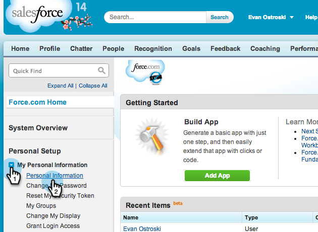

# Vorbereitung von Sales Insight für mehrsprachige Unterstützung in Salesforce {#prepare-sales-insight-for-multi-lingual-support-in-salesforce}

>[!NOTE]
>
>**Administratorberechtigungen erforderlich**

Marketo Sales Insight wird nach Sprache gespeichert. Wenn Sie also möchten, dass es für mehr als eine Sprache funktioniert, müssen Sie die Anmeldeinformationen für jede Sprache einzeln eingeben.

>[!NOTE]
>
>Sales Insight unterstützt derzeit:
>
>* englisch
>* französisch
>* deutsch

>
>
Jede andere Sprache ist standardmäßig Englisch.

1. Hinzufügen einer neuen Sprache für MarketingTo Sales Insight
1. Melden Sie sich bei Salesforce an. Klicken Sie in der Dropdown-Liste unter Ihrem Namen in der oberen rechten Ecke auf **Setup**.

   

1. Klicken Sie unter** Meine persönlichen Informationen** auf **Persönliche Informationen**.

   

1. Klicken Sie auf **Bearbeiten**.

   

1. Wählen Sie eine Sprache und klicken Sie auf **Speichern**.

   

1. Ihre Salesforce-Oberfläche ist jetzt in der ausgewählten Sprache verfügbar. Sie können auf das Symbol **+** klicken, um alle verfügbaren Registerkarten anzuzeigen.

   

1. Klicken Sie auf **Konfigurieren von MarketingTo Sales Insight **(in der ausgewählten Sprache).

   

1. Geh nach Marketo. Suchen Sie die [Marketing-to-Sales Insight **API-Konfiguration** Details](https://docs.marketo.com/pages/viewpage.action?pageId=2360368#ConfigureMarketoSalesInsightinSalesforceEnterprise/Unlimited-ConfigureMarketoSalesInsight) .

   

1. Geben Sie die API-Details aus Marketo ein und klicken Sie auf **Speichern**.

   

## Salesforce auf Englisch zurücksetzen {#change-salesforce-back-to-english}

Wenn Sie mit der Anpassung Ihrer Salesforce-Organisation fertig sind, hier erfahren Sie, wie Sie Ihre persönliche Konfiguration auf Englisch zurückgeben.

>[!NOTE]
>
>Die folgenden Screenshots sind in französischer Sprache mit Anweisungen in englischer Sprache verfügbar.  Es werden dieselben Bildschirme mit Text in der Sprache angezeigt, die Sie im vorherigen Schritt ausgewählt haben.

1. Klicken Sie unter Ihrem Namen auf Setup.

1. Klicken Sie unter **Meine persönlichen Informationen** unter &lt;a2/>Meine persönlichen Informationen **auf**.

   

1. Klicken Sie auf **Bearbeiten**.

   

1. Wählen Sie **Englisch** aus der Dropdownliste Sprache und klicken Sie auf **Speichern**.

   

   Jetzt ist Ihre Salesforce wieder auf Englisch!

