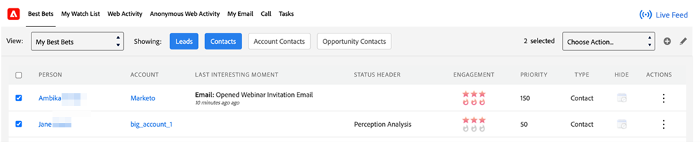

# [!DNL Best Bets] {#best-bets}

Die Registerkarte [!DNL Best Bets] enthält eine Liste aller Ihrer Hot Leads basierend auf ihrer Priorität, berechnet anhand der Dringlichkeit und des relativen Werts.

>[!CAUTION]
>
>Achten Sie darauf, 1.000 Best Bets nicht zu überschreiten, sonst könnte die Seite nicht mehr geladen werden. In diesem Fall können Sie die Filter verwenden, um die Gesamtzahl der besten Wetten einzugrenzen.

**Filteroptionen**

Sie können auf jede der folgenden Schaltflächen klicken, um [!DNL Best Bets] anzuzeigen:

* Leads: Sie können [!DNL Best Bets] für alle Leads anzeigen, die Ihnen im CRM zugewiesen wurden
* Kontakte: Sie können [!DNL Best Bets] für alle Kontakte sehen, die Ihnen im CRM zugewiesen sind
* Account-Kontakte: Sie können [!DNL Best Bets] für alle Kontakte sehen, die zu Konten gehören, die Ihnen im CRM zugewiesen sind, auch wenn der Kontakt selbst nicht Ihnen zugewiesen ist
* Opportunity-Kontakte: Sie können [!DNL Best Bets] für alle Kontakte sehen, die zu den Ihnen im CRM zugewiesenen Opportunities gehören, auch wenn der Kontakt selbst nicht Ihnen zugewiesen ist

**Zu beachtende Punkte**

Die Schaltflächen „Lead“ und „Kontakt“ sind standardmäßig ausgewählt. Sie können eine oder mehrere Filteroptionen auswählen. Mindestens eine der vier Optionen muss immer ausgewählt sein.

Sie können einen Lead oder Kontakt, dessen Eigentümer Sie nicht sind, nicht „ausblenden“.

**Inline-Interaktion**

Durch Klicken auf das Datenmenü unter der Spalte [!UICONTROL Aktionen] können Sie sich mit einem bestimmten Lead oder Kontakt in Verbindung setzen, indem Sie die folgenden Interaktionsoptionen verwenden:

* [!UICONTROL Marketo-E-Mail senden]
* [!UICONTROL Zu Marketo Campaign hinzufügen]
* [!UICONTROL In Marketo anzeigen]
* [!UICONTROL Zu Watchlist hinzufügen]

**Massenaktionen**

Sie können einen oder mehrere Leads oder Kontakte aus Ihrer [!DNL Best Bets] mithilfe des Kontrollkästchens auswählen und sie mithilfe der folgenden Interaktionsoptionen als Gruppe erreichen:

* [!UICONTROL Marketo-E-Mail senden]
* [!UICONTROL Zu Marketo Campaign hinzufügen]
* [!UICONTROL Zu Watchlist hinzufügen]

>[!NOTE]
>
>Ein Kontakt/Lead muss sich in der Standardpartition befinden, damit er zur Watchlist hinzugefügt werden kann.
